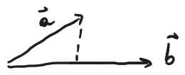
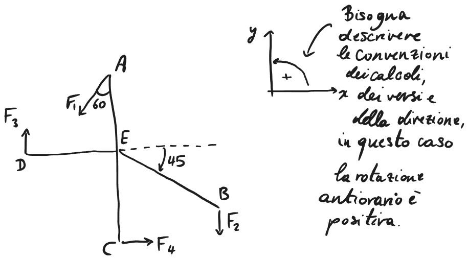
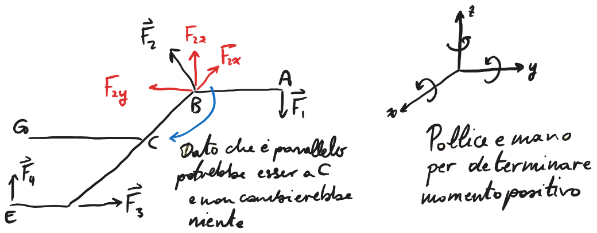
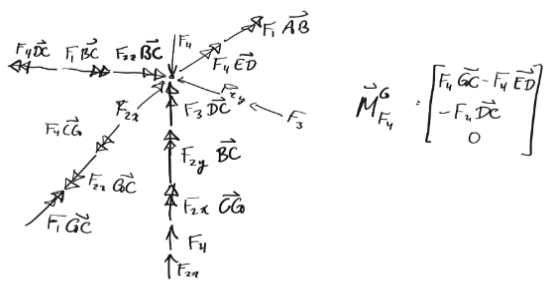
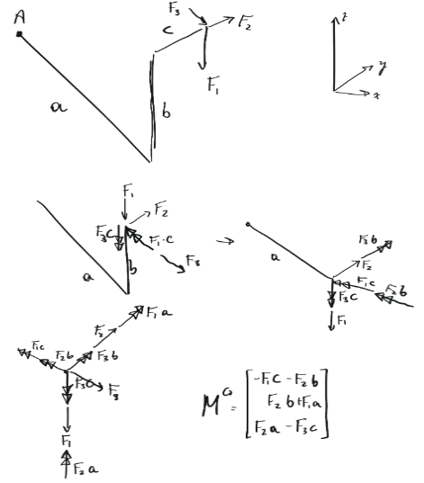
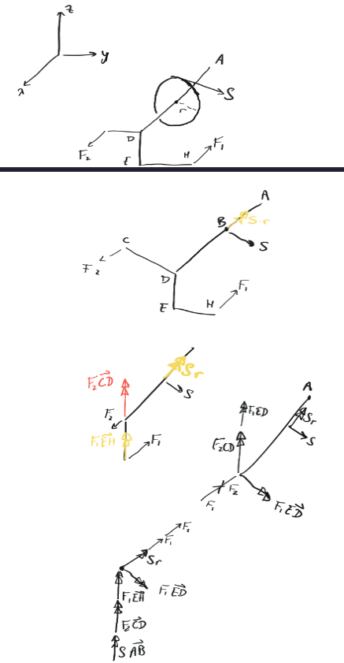

---
tags:
  - cosmac
parent: 
child: 
share: true
---

# Esercitazione 1 - Vettori e Forze

Esercitatore Lucio Pinello

## Vettori

$$\vec{a} = \begin{bmatrix}a_x\\a_y\\a_z\end{bmatrix} , \vec{b} = \begin{bmatrix}b_x\\b_y\\b_z\end{bmatrix}$$
### Prodotto Scalare

Il prodotto scala e' il prodotto membro per membro, con questo si trova la proiezione tra vettori.

<! Diagramma prodotto scalare>

### Prodotto Vettoriale

$\vec{a} \times \vec{b} = \vec{c} = det|\begin{matrix}\hat{i} & \hat{j} & \hat{k} \\ a_x & a_y & a_z\\b_x & b_y & b_z\end{matrix}|$  = $\hat{i}(a_yb_z - a_zb_y) - \hat{j}(a_zb_z - a_zb_x) + \hat{k}(a_xb_y - a_yb_x)$ 
## Momento

$\vec{M} = \vec{b}\times\vec{F} \rightarrow$ nel piano si possono avere 3 momenti, uno intorno ad ogni asse, in 2 solo intorno alle 2 assi del piano.

con F = ma

se F = 0, se l'oggetto e' gia' in moto continua, e se gia' fermo resta li.
$\sum\vec{F}$ e $\sum\vec{M}$ la somma delle forze e la somma dei momenti viene chiamata risultante in tutti e i due casi.

## Esercizio 1

<! Diagramma problema>

AE = 500mm
BE = 750 mm
CE = 250mm = DE
$F_1$ = 250N
$F_2$ = 500N
$F_3$ = 100N
$F_4$ = 300N

### Risultanti di Forze

$\sum F_x = F_4 - F_1 sin(60) = 83,5N$
$\sum F_y = F_3 - F_2 - F_1 cos(60) = 525N$
Non cambia tra E e C per le forze

### Risultanti di Momenti ($\vec{M} = \vec{b}\times\vec{F}$)

Per E)

<! Diagramma somma dei momenti>

$\sum M^E = M^E_{F_1} + M^E_{F_2} + M^E_{F_3} + M^E_{F_4} - -131,92 [Nm] \hat{k}$

Per C)

Usando un metodo piu' veloce 
Pollice $\rightarrow$ Forza
Indice $\rightarrow$ Braccio $\rightarrow$ direzione per arrivare al punto
Medio $\rightarrow$ direzione

$M^C_{F_2} = -F_3 \cdot \vec{DE}$ e' cosi perche' $\vec{EC}$ e' parallalo alla forze ma $\vec{DE}$ e' perpendicolare, il momento viene creato dalla perpendicolarita'.

## Esercizio 2
### Terzo Metodo

<! Diagramma Esercizio>

AB = 500m (y) = DE
BC = 500 (x) = CD
CG = 1000mm (y)

$F_1 =\begin{bmatrix}0&0&-250\end{bmatrix}$
$F_2 =\begin{bmatrix}-100&-100&100\end{bmatrix}$
$F_3 =\begin{bmatrix}0&250&0\end{bmatrix}$
$F_4 =\begin{bmatrix}0&0&250\end{bmatrix}$

$\sum F_x^G = F_{2x} = 100N$
$\sum F_y^G = F_3 + F_{2y} = 150N$
$\sum F_z^G = F_4+ F_1 + F_{2z} = 100N$

<! Diagramma calcolo momento>

Il terzo modo per calcolare i risultanti si fa muovendo le forze e aggiungendo al nuovo punto un momento uguale a quello che sarebbe stato generato se la forza fosse rimasta nello stesso posto. Spostando di nuovo il momenti e forze gia esistenti si spostano e nuovi momenti generati dalle forze spostate si aggiungo anche loro al nuovo punto.

<! Diagramma movimento delle forze>

Si trova il momento che sarebbe generato dalla forza lungo l'asse in cui viene messa. Facendo questo si semplificano i calcoli alle fine del problema.

<! Diagramma e calcolo alla fine del problema>

Alla destra c'e' il momento generato da $F_4$ rispetto al punto G, lungo ogni asse si trova aggiungendo ogni momento che abbiamo gia trovato e spostato lungo quella stessa asse.

Si trovano i momenti generati ad ogni passo per trovare il risultante del momento al punto designato, perche' i momenti sono persi a punti durante il tragitto delle forze, come in questo esempio $F_4$ rispetto a G perche' del momento generando momento opposto lungo alla asse $\vec{ED}$.

## Esercizio 3

<! Diagramma esercizio 2>

## Esercizio 4

<! Diagramma esercizio 4>
