# Esercitazione 3 - Reazioni Vincolari

## Reazioni Vincolari per Vincolo

<!Diagramma vincoli>
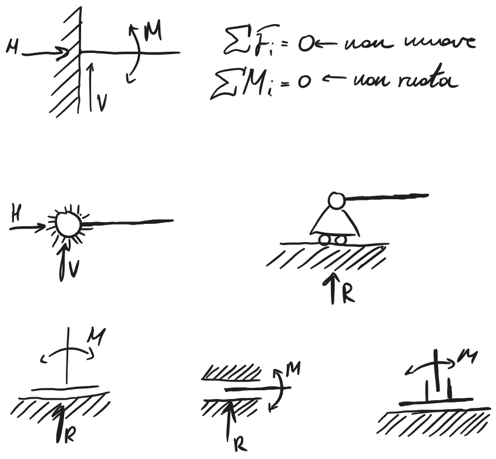

E' importante riconoscere che anche se disegniamo le frecce in una certa direzione, non si sa quale sia la direzione vera' finche' non si trova il valore del vincolo.

Per rimanere in equilibrio la somma di tutte le reazioni vincoli devono sommare a 0.
Se un vincolo e' connesso a due aste, le reazioni vincoli tutte de aste sono uguali e opposte. Se due vincoli si muovono rispetto a l'un l'altro, come per esempio due pattini, le reazioni vincolari sono uguali e opposte. 

Quando analizziamo due arte sullo stesso vincolo le reazioni devono esser uguali e opposte, invece se ci sono tre aste questa equivalenza non vale di piu' quindi bisogna assegnare i vincoli rispetto al vincolo e poi verificare che le sommatorie valgano.

<!Diagramma reazione e sommatorie>
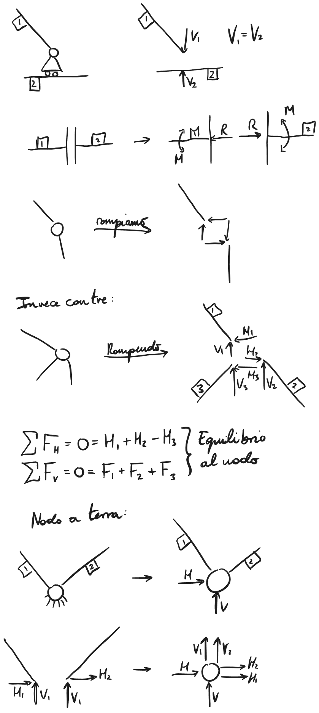

Quando un vincolo e' a terra, analizziamo prima i vincoli a terra e poi le reazioni delle aste.

### Passi per analizzare reazioni vincoli

1. Togliere i vincoli a terra
2. Spaccare i vincoli e analizzare le reazioni vincolari agli estremi delle aste individuali.
3. Se un vincolo ha piu' di 3 elementi vincolanti, bisogna analizzare il vincolo stesso per trovare le restanti reazioni vincolari.

Elementi includono:
1. Aste
2. Forze Esterne
3. Vincoli a terra
## Esercizio 1

<!Diagramma esercizio 1>
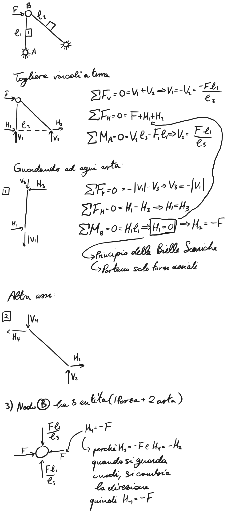
Quando guardando i nodi le direzione della reazione vene inversa perche' guardiamo la reazione sul nodo e non quella che genera.
## Esercizio 2

<!Diagramma esercizio 2>
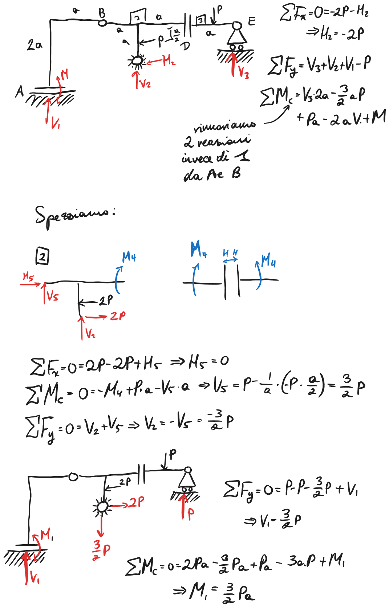
In molti casi disegniamo frecce senza sapere il segno vero, appena sappiamo il verso possiamo disegnarlo correttamente

## Esercizio 3

<!Diagramma esercizio 3>
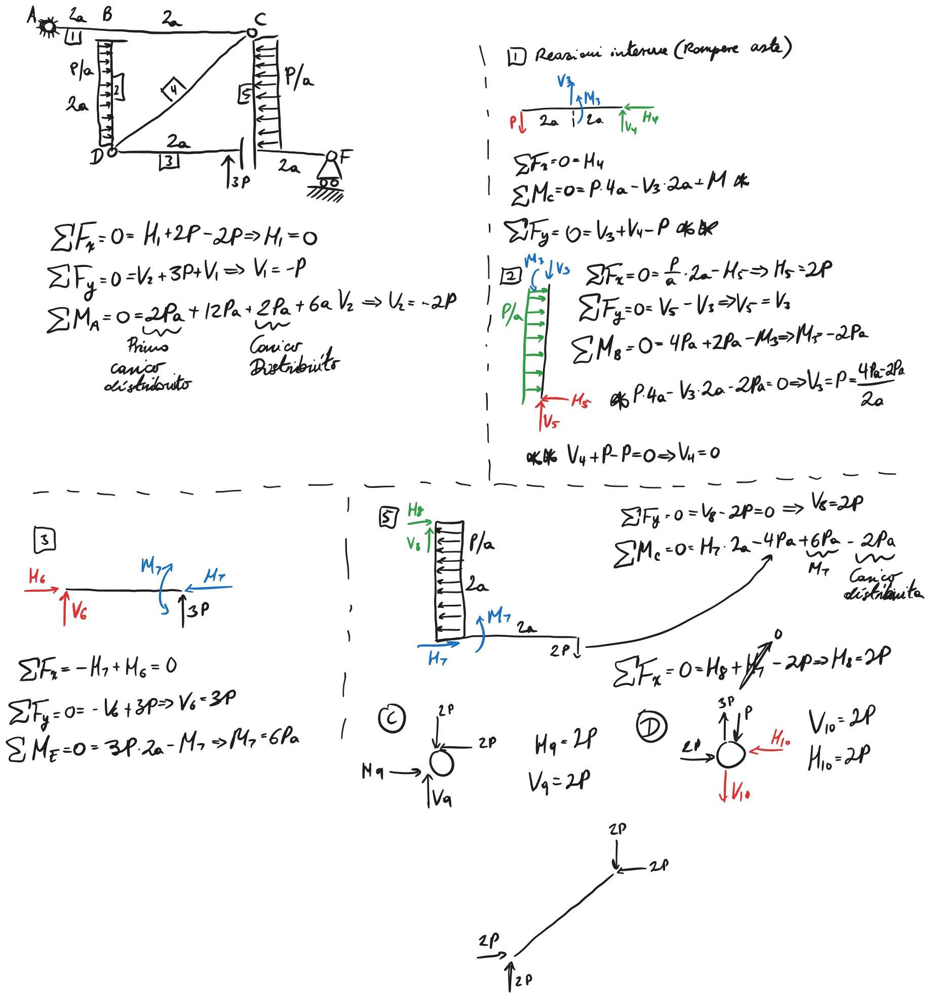

### Carica distribuite

<!Diagramma carica distribuita>
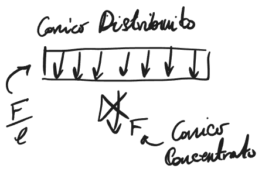

Solo per le reazioni vincoli si puo' sostituire i carichi distribuiti con forze concentrate, in ogni altro caso si fara' qualcosa che sapremo nella prossima esercitazione.

## Esercizi di Analisi Cinematica

### Esercizio 1

<!Diagramma esercizio 1>
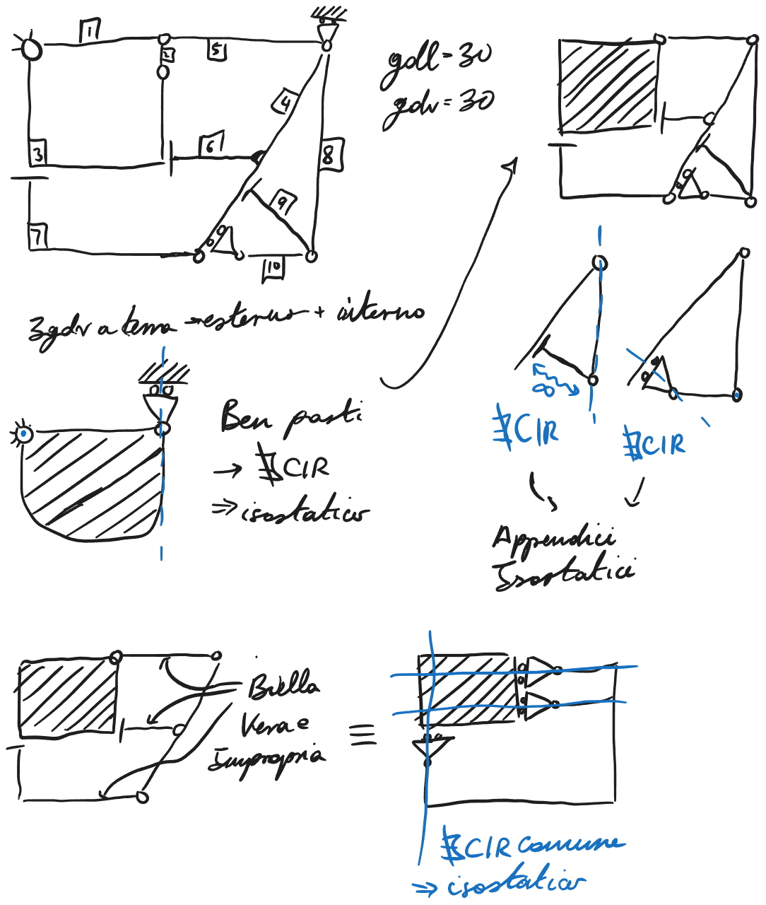
### Esercizio 2

<!Diagramma esercizio 2>
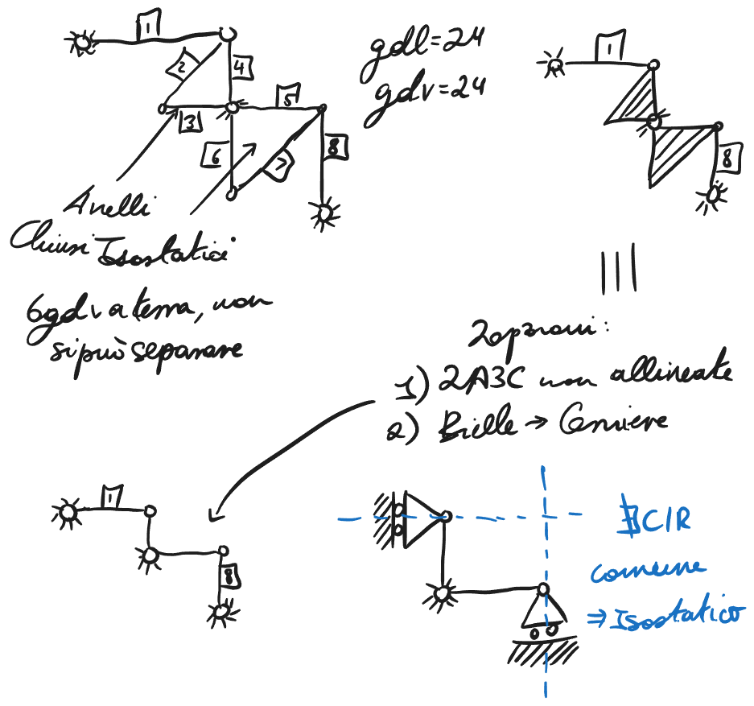
### Esercizio 3

<!Diagramma esercizio>
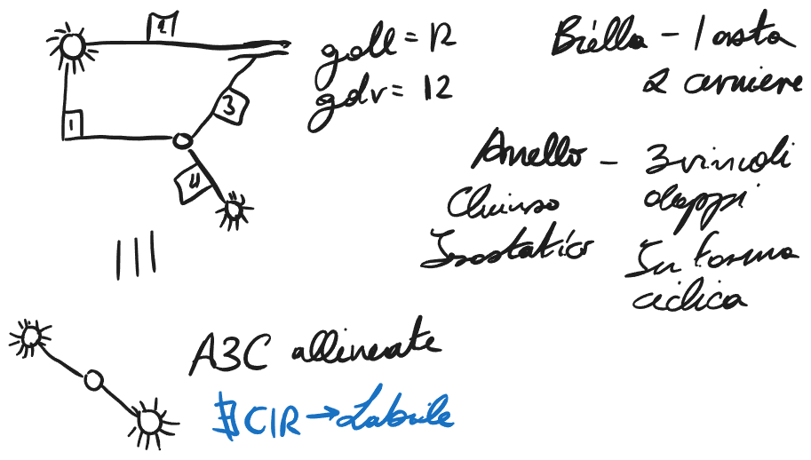

### Esercizio 4

<!Diagramma esercizio>
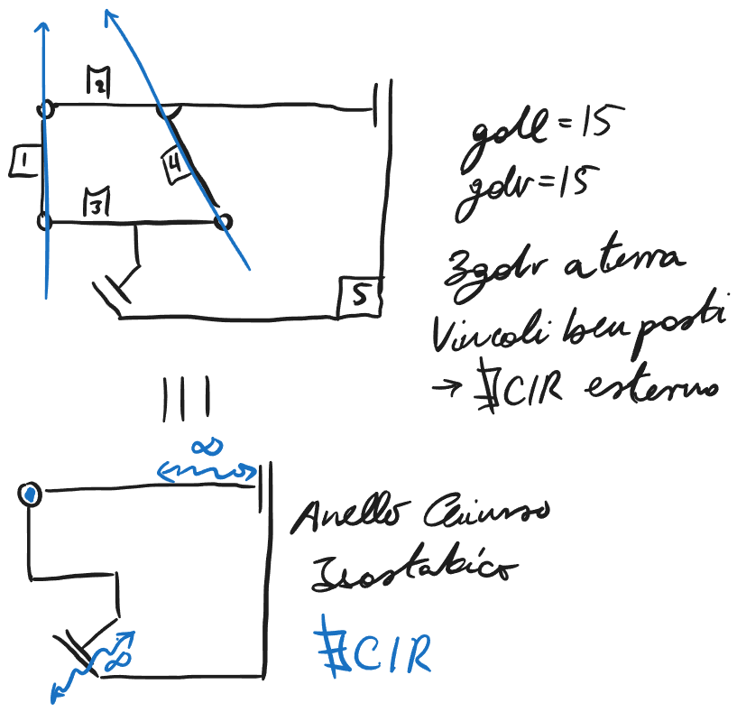
### Esercizio 5

<!Diagramma esercizio 5>
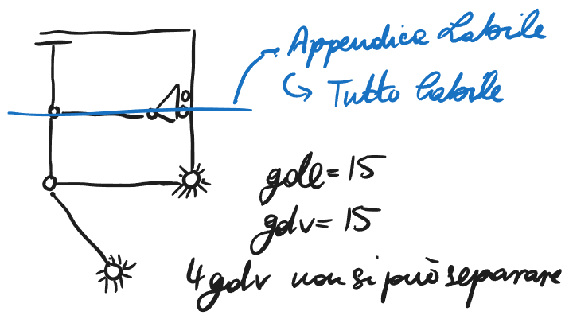
## Appunti Finali per Analisi Cinematica

Un anello chiuso isostatico e' un insieme di 3 aste e 3 vincoli a due gdv che significa che la struttura interna e' isostatica, tranne se c'e' un elemento labile all'interno come visto nell'ultimo esercizio.

