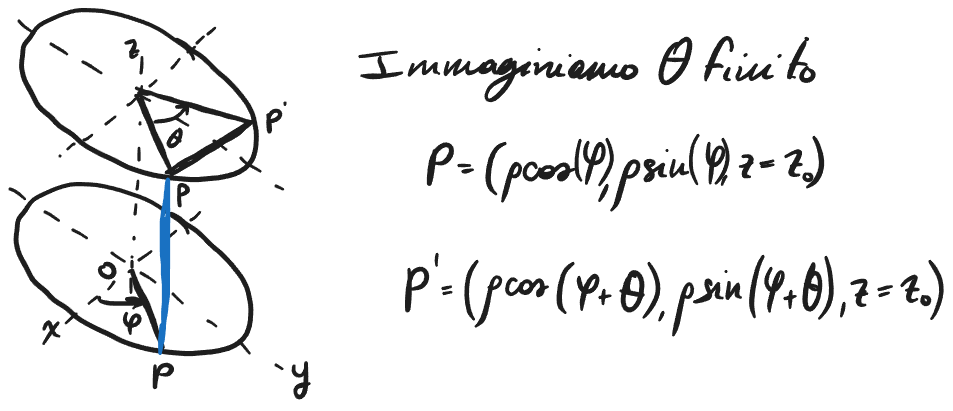
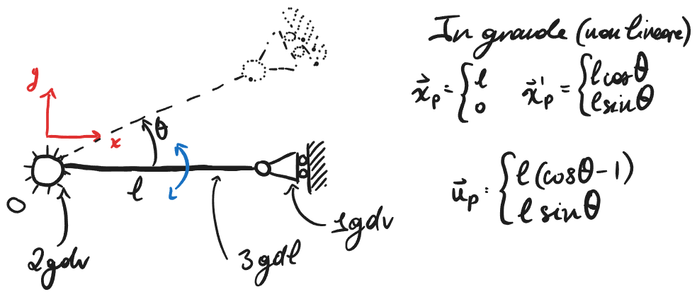
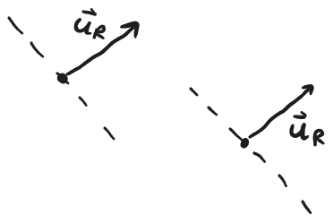
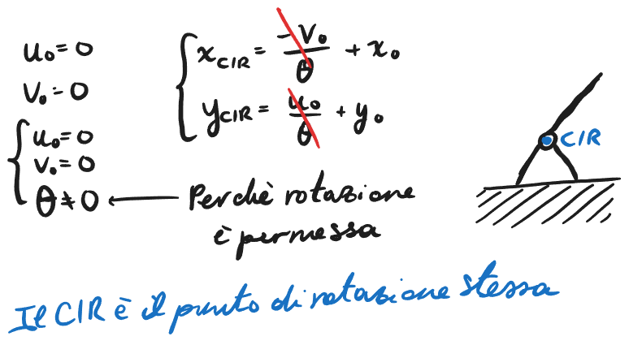
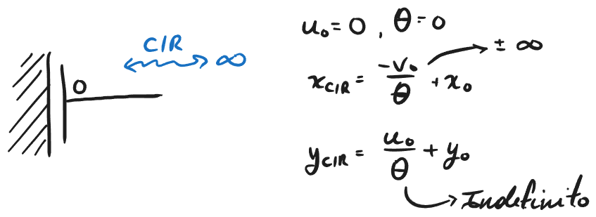
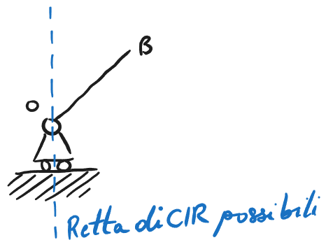

# Analisi Cinematica - Parte 2

La analisi cinematica spiega se un corpo rigido puo' o non puo' muoversi, e se un oggetto e' vincolato in maniera efficace o no.

La costruzione delle macchine studio la statica per cui la analisi cinematica e' molto importante.

E' facile capire capire se i vincoli e GdL, e' piu' difficile capire se questi vincoli sono vincolati in maniera efficace.

Lezione:

- Definizione di moti traslatori, rotatori e roto-traslatori
- Concetto di centro di istantanea rotazione

### Traslazione

Movimento tale che tutte le direzione restano parallele ad esse. Il sistema non gira.

### Rotazione

Il corpo rigido si muove tale che un punto, il centro di rotazione resta fermo, cioe' spostamento e' nullo.

### Roto-Traslazione

Combinazione di rotazioni e traslazioni che puo' quasi sempre esser semplificato ad una rotazione.

### Esempio

<!Diagramma roto-traslazione>

Questo processo si puo' fare con ogni coppia di punti, anche con differenze infinitesimi.

<b><ins>Passi</ins></b>

1. Linee AA' e BB'
2. Mediante
3. Linee perpendicolari
4. Punti di convergenza c'e' il punto di rotazione

## Traiettoria in Grande vs. Traiettoria in piccolo

Le traiettorie in piccolo, sono le linee tra punti AA' e BB' per cambi infinitesimi. Invece le traiettorie in piccolo si possono linearizzare usando cambiamenti in piccolo perche' l'errore e' minuscolo.

### Linearizzazione del moto rigido

<!Diagramma linearizzazione>

Lo spostamento e' $\hat{u} = \vec{x}' - \vec{x}$ cioe' u = $\rho[cos(\phi + \theta) - cos(\phi)]$ lungo l'asse x,  v = $\rho[sin(\phi + \theta) - sin(\phi)]$ lungo l'asse y e w = 0 lungo l'asse z. Questi sono i vettori di spostamento tra P e P'.

Non c'e' linearita' tra u,v,w e l'angolo $\theta$, perche' il cambio dipende da $cos(\theta)$ e $sin(\theta)$ che non sono lineari. Bisogna linearizzare.

Per linearizzare bisogna portare tutti i cambiamenti all'infinitesimo $d\theta$.

$d\vec{u} = \frac{\partial \vec{u}}{\partial \theta}|_{\tiny{\theta = 0}} d\theta$ 

du, dv, dw sono i componenti di spostamento di d$\hat{u}$ in piccolo (differenziale rispetto a $\theta$ come visto sopra.)

$$
\begin{equation}
\left\{
    \begin{array}{lr}
        du = \rho sin(\phi)d\theta = -yd\theta\\
        dv = \rho cos(\phi)d\theta = x d\theta\\
        dw = 0
    \end{array}
\right\} = \small{\text{C'e' linearita tra du,dv,dw e l'angolo }\theta}
\end{equation}$$
Attraverso la derivazione si arriva ad una linearizzazione dove ogni derivata dipende linearmente dalla variabile perpendicolare.

Utilizzazione la notazione vettoriale:

$\underbrace{du}_{\text{Perpendicolare a }\hat{h} \text{ e } \vec{x}} = d\theta \underbrace{\hat{k}}_{\text{Versore di z}} \times \underbrace{\vec{x}}_{\text{Vettore iniziale}}$

In generale per una rotazione attorno ad un asse generale $\vec{e_a}$ 

$d\vec{u} = d\theta\vec{e_a} \times \vec{x} = d\vec{\theta} \times \vec{x}$

### Applicazione

<!Diagramma applicazione>

GdL$_R$ = 0 percio' e' un candidato ad esser isostatico puo' muoversi ma non deve.

Lo spostamento in grande orizzontale a seguito della rotazione in grade $\theta$ <u>non</u> risulta esser compatibile con il vincolo del carello

#### In piccolo (Linearizzando)

$$\begin{equation} d\vec{u_p} = \frac{\partial\vec{u_p}}{\partial\theta}|_{\tiny{\theta = 0}} = \begin{cases} 0\:d\theta \\ l\: d\theta \end{cases} \end{equation}$$ $du$ con $dv$ perche' dato che $dv$ non e' nullo il sistema si puo' muovere in grande, questo movimento causa un cambio lungo l'asse x che non sarebbe possibile dato il valore di $du$, se tutte e due le situazioni fossero vere l'asta dovrebbe esser estensibile o la terra si dovrebbe muovere, ma dato che la terra non si muove e usiamo aste solide questo sistema non e' possibile in grande. Anche se non e' possibile in grande, **matematicamente** e' possibile in piccolo, cioe' causato da vibrazioni, questo significa che il sistema e' labile.
I moti piccoli sono un problema matematico e nella vita reale. Un sistema labile non lo vuoi, quindi bisogna mitigarli.

## Movimento rispetto ad un vincolo

#### Rotazione intorno a O

$d\vec{u_p} = d\vec{\theta} \times (P-O)$

#### Roto-traslazione rigida infinitesima

$d\vec{u_p} = d\vec{u_o} + d\vec{\theta} \times (P-O)$

6 GdL
- 3 componenti di $d\vec{u_o}$
- 3 componenti di $d\theta$

**Da questo punto in poi per gli infinitesimi non saranno scritte le d, pero' non cambia il fatto che sono infinitesimi**

## Centro di Istantanea Rotazione (CIR)

#### Roto-traslazione rigida infinitesima

$d\vec{u_p} = d\vec{u_o} + d\vec{\theta} \times (P-O)$

In forma finita (ma piccola) si scrive come: (come detto prima non scriviamo piu' le d)
$\vec{u_p} = \vec{u_o} + \vec{\theta} \times (P-O)$

La rappresentazione nel piano xy:

$u_p$ = ==$u_o$== $+$==$\theta$==$(y_P - y_o)$ 
$v_p =$ ==$v_o$== $+ \theta(x_P - x_o)$

<!Leggi in reader-mode perche' non si vede l'evidenziatore>

I 3 simboli evidenziati sono i 3 gradi di liberta', 2 di movimento e una rotazione.

Se $\theta \neq 0$, in moto piccolo esiste sempre un asse di pura rotazione che interseca il piano di moto nel CENTRO DI ISTANTANEA ROTAZIONE (CIR)

### Ricerca del CIR

Se un punto P (solidale) fosse il CIR allora le componenti di spostamento sarebbe nulle. Cioe' se P fosse CIR e ci fosse una rotazione, le componenti che rappresenterebbero il movimento sarebbero nulle.

$u_{CIR} = u_o - \theta(y_{CIR} - y_o) = 0$
$v_{CIR} = v_o + \theta(x_{CIR} - x_o) = 0$

$y_o$ e $x_o$ sono coordinate di un punto di riferimento O solidale al corpo rigido, $\theta$ e' la rotazione attorno a O. Allora per trovare le coordinate del CIR si calcolerebbero:

$x_{CIR} = \frac{-v_o}{\theta} + x_o$
$y_{CIR} = \frac{u_o}{\theta} + y_o$

Nel caso dove $\theta$ = 0, si sta descrivendo un sistema di movimento di traslazione pura, perche' CIR $\rightarrow (\infty, \infty)$ 

<!Diagramma CIR traslazione pura>

Al contrario, se non si riesce a trovare un CIR comune significa che il corpo rigido e' fermo e non si puo' muovere

### Conclusioni

- Se esiste un CIR, il corpo rigido si puo' spostare (anche se solo in quantita' infinitesime)
- Se invece non esiste un CIR, il corpo rigido non si puo' muovere.

La direzione del CIR e' molto importante.

## CIR dei Vincoli

### Incastro

<!Diagramma calcoli>

Non si può ' definire CIR per l'inastro perche' gli spostamenti sono nulli in tutti i casi.

### Cerniera

<!Diagramma calcoli>

La cerniera se stessa e' il CIR dato dal fatto che il corpo rigido puo' girare intorno alla cerniera e basta.

### Pattino

<!Diagramma calcoli>

Il pattino permette solo la traslazione pura, matematicamente e' equivalente ad una rotazione intorno ad un punto improprio all'infinito, percio' il CIR e' all'infinito nella direzione perpendicolare al piano.

### Carello

Il carello permette:
- traslazione lungo la retta di scorrimento (rotazione attorno al punto all'infinito)
- rotazione attorno al perno

Dato che sono possibile due movimenti, bisogna considerare la combinazione di piu' moti simultaneamente, cioe' la combinazione lineare di tutti i moti possibile.

<!Diagramma CIR>

Calcolando tutti i moti, la combinazione lineare genera una linea di CIR possibile che attraversa il carello e e' perpendicolare al piano di scorrimento. 

### Bipattino

<!Diagramma CIR bipattino>

Il CIR del bipattino e' la retta impropria che circola il bipattino.