---
tags:
  - cosmac
parent: 
child: 
share: true
---

# Esercitazione 2 - Analisi Cinematica

<!Diagramma traslazione pura>
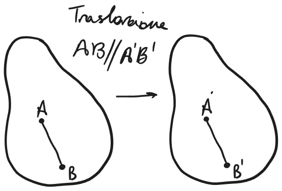{: .center }{: .center }

## CIR

<!Diagramma CIR> 
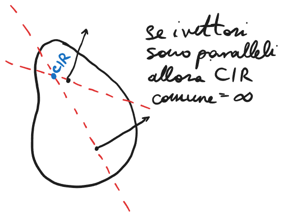{: .center }{: .center }

I vettori rappresentazione la direzione di moto dei punti, e' un moto diverso di come rappresentare quello che abbiamo visto in [CdM - Lezione 3](./CdM%20-%20Lezione%203.md#) 

### Ribasso 

Diversi vincoli hanno diversi CIR intorno a cui rotano.

<!Diagramma CIR per vincolo>
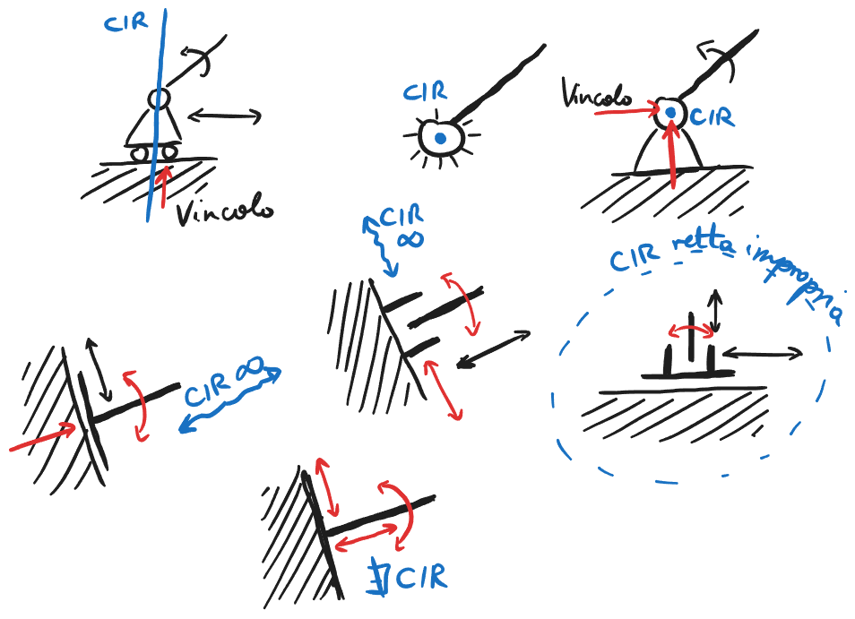{: .center }{: .center }

| Vincolo   | GdV |
| --------- | --- |
| Carello   | 1   |
| Cerniera  | 2   |
| Pattino   | 2   |
| Manicotto | 2   |
| Bipattino | 1   |
| Incastro  | 3   |

GdL$_R$ = GdL - $\sum$GdV$_{\text{eff}}$

|                                      | $\sum$GdV$_{\text{eff}}$ = GdL | $\sum$GdV$_{\text{eff}} <$ GdL |
| ------------------------------------ | ------------------------------ | ------------------------------ |
| $\sum$GdV$_{\text{eff}}$ = $\sum$GdV | Isostatico                     | Ipostatico                     |
| $\sum$GdV$_{\text{eff}}$ < $\sum$GdV | Iperstatica                    | Labile                         | 

Di solito si vuole un sistema isostatico, se il sistema ha GdL = GdV e non permette i movimenti neanche in piccolo allora e' isostatico, invece se permette i movimenti in piccolo e' detto labile.

Trovare le differenze tra un sistema isostatico e labile puo' esser facilitato se si prova a trovare il CIR comune di una sistema graficamente.

<!Diagramma CIR comune per asta>
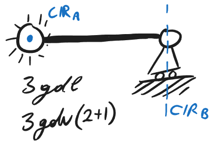{: .center }{: .center }

In questo caso il carello e la cerniera non hanno un punto dove i loro CIR possibile si incontrano, questo significa che non esiste CIR comune per il sistema, percio' dato che GdV = GdL allora e' isostatico.

<!Diagramma pattino e carello, tutti e due>
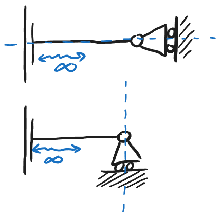{: .center }{: .center }

Nel primo esempio il pattino e il carello hanno CIR comune all'infinito, questo significa che anche se minimamente il sistema e' labile. Invece nel secondo esempio il sistema non CIR comune perche' anche se tutti e due possono avere CIR all'infinito sono in direzione diversa quindi non si incontrano, poi il pattino ha CIR all'infinito e basta quindi anche se punta verso il carello e' non incontra il CIR del carello.

<!Insiemi di carelli>
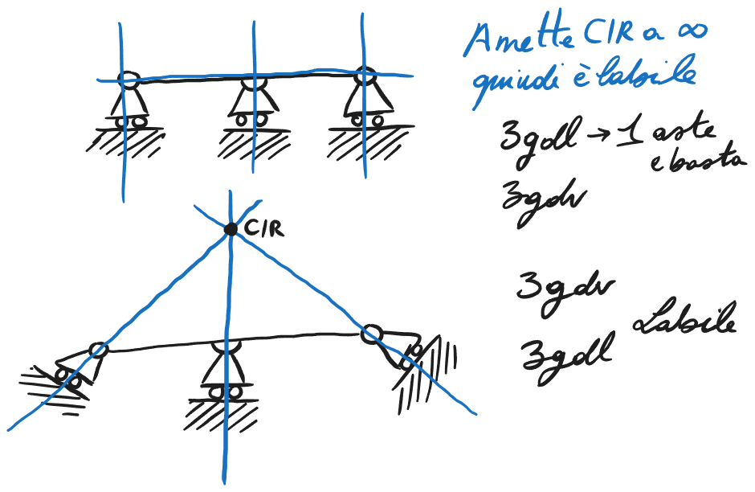{: .center }{: .center }

Insieme di 2 o piu' carelli sono labili perche' anche se e' all'infinito sono hanno CIR comune.

## Vincoli Interni

Questo e' un ripasso dei GdL e GdV per diversi vincoli
### Cerniera

<!Diagramma cerniera>
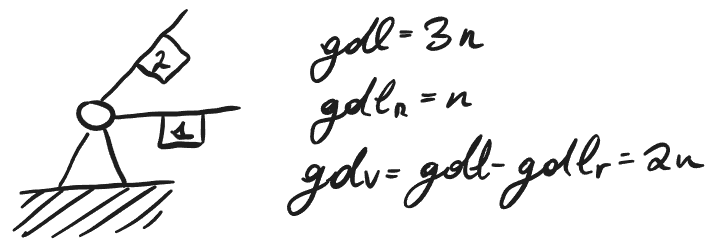{: .center }{: .center }

### Carello

<!Diagramma Carello>
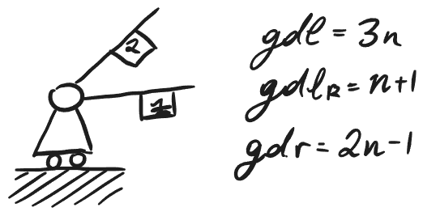{: .center }{: .center }

### Cerniera non a Terra

<!Diagramma cerniera non a terra>

### Carello su Asta

Per il carello, cosa si puo' traslare non deve esser la terra ma potrebbe esser anche una altra asta.

<!Diagramma carello su asta>
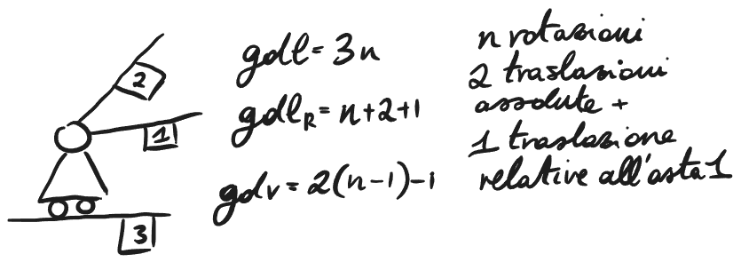{: .center }

## Equivalenze Cinematiche

In molti casi delle combinazioni di vincoli possono esser rappresentate da altri insiemi di vincoli, questa equivalenza puo' aiutare a trovare se un sistema ha un CIR comune o no.

### Biella

<!Diagramma biella>
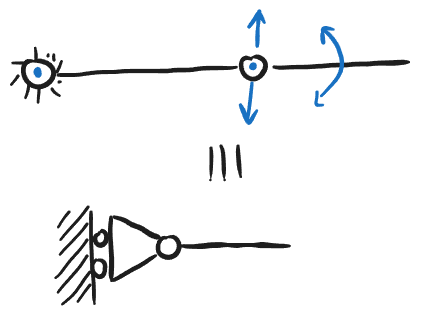{: .center }

Solo per l'analisi, si puo' muovere su e giu' e girare, all'infinitesima e' lo stesso effettivamente.

### Biella Impropria

<!Diagramma biella impropria>
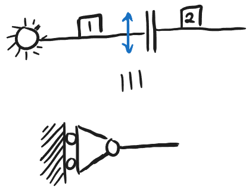{: .center }

Questa si chiama biella impropria perche' c'e' una cerniera e una cerniera impropria che e' creata dai movimenti infinitesimi possibile dal sistema.

### Altra Biella Impropria

<!Diagramma  biella impropria>
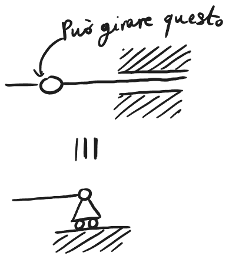{: .center }

Anche questa e' una biella impropria.

### Carello su aste singole

<!Diagramma rotazione di carelli>
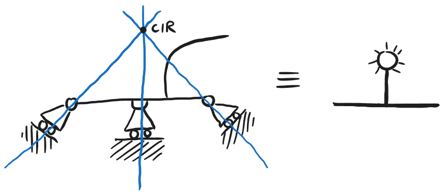{: .center }

Questo sistema puo' solo rotarsi intorno al CIR, questo e' perche' possono tutti muoversi linearmente in piccolo e percio' girare intorno al CIR.

Si puo' semplificare almeno 2 carelli ad una cerniera perche' possono rotare intorno al loro CIR.

### Altre Equivalenze

<!Diagrammi equivalenze>
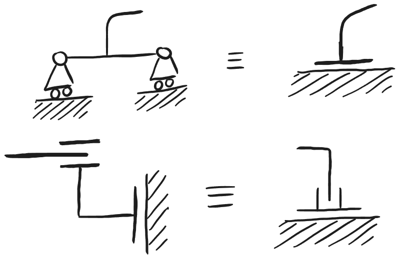{: .center }

## Strutture Notevoli

### Trave Cerniera Carello

<!Diagramma albero>
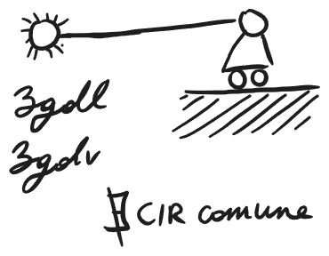{: .center }

Per questo sistema non esiste CIR comune.

### Arco a 3 Cerniere (A3C)

Un sistema A3C non e' sempre isostatico, dipende da dove sono le cerniere.

<!Diagramma A3C>
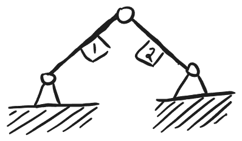{: .center }

La struttura A3C e' labile se le tre cerniere sono allineate. Perche' grazie alle equivalenze si trova che 2 cerniere sono come un carello.

<!Diagramma A3C equivalenza>
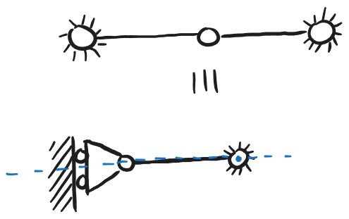{: .center }

#### Altri Esempi

<!Diagramma pattino cerniera>
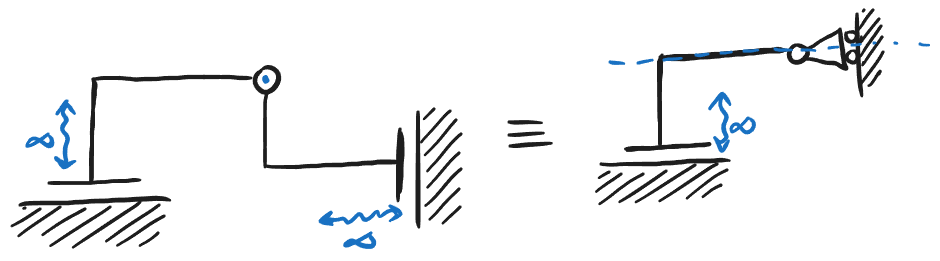{: .center }

La retta di CIR del carello non arriva mai al pattino quindi non esiste CIR.

<!Diagramma pattino e manicotto>
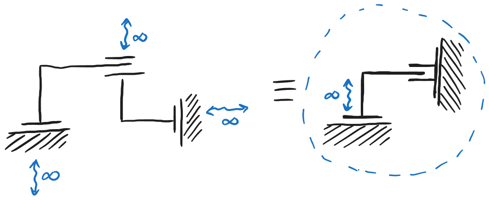{: .center }

Esiste CIR perche' la retta impropria passa per ogni punt infinito quindi ci sono 2 punti dove si incontrano.

### Quadrilatero Articolato

<!Diagramma quadrilatero articolato>
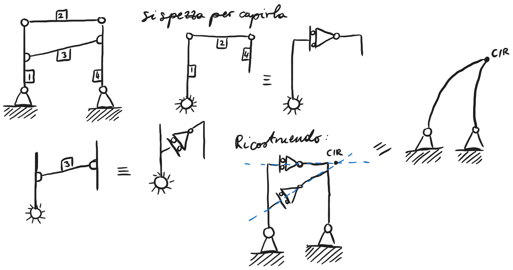{: .center }

Un quadrilatero articolato e' un sistema che ha due aste a terra e 2 aste che connettono le 2 aste. Per risolvere questa struttura si possono spezzare diverse e studiarle in modo isolato dal resto del sistema, poi si mette tutto insieme per trovare se questo sistema e' isostatico o labile.

Se il CIR di due carelli si incontra si puo' sostituire con una cerniera.
Un quadrilatero articolare e' isostatico se il CIR del A3C generato non e' tra le due cerniere invece se e' tra le due cerniere e' labile.

### Appendice Isostatico

Un appendice isostatico e' una struttura che non modifica le proprieta' della struttura.

<!Diagramma Appendice Isostatico>
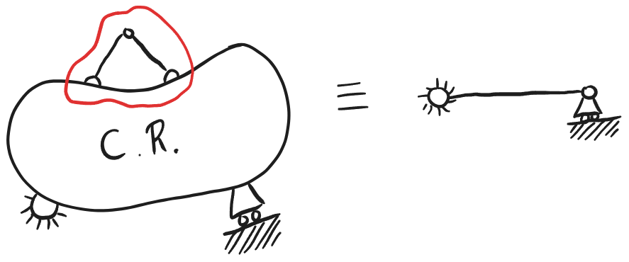{: .center }

### Anello Chiuso Isostatico

<!Diagramma anello chiuso isostatico>
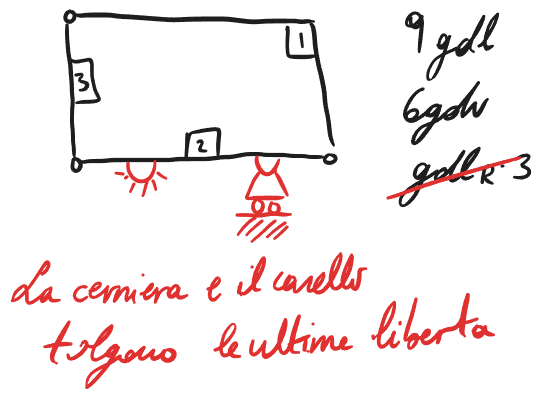{: .center }

Quando sono connessi a vincoli che tolgono 3 liberta il sistema puo' esser analizzato. Il sistema puo' esser analizzato internamente e esternamente, se ha 3 GdV esterni e solo 3, si immagina che la struttura interna sia isostatica.

Si separano i vincoli attraccati dalla struttura che non e' vincolata a terra. Se gli elementi vincoli a terra sono labili la struttura intera e' labile invece se la struttura e' isostatica si studia la struttura interna. Se la struttura interna e' labile di nuova la struttura intera e' labile invece se anche la struttura interna e' isostatica la struttura interna e' isostatica.

## Esercizi

<!Diagramma esercizio 1>
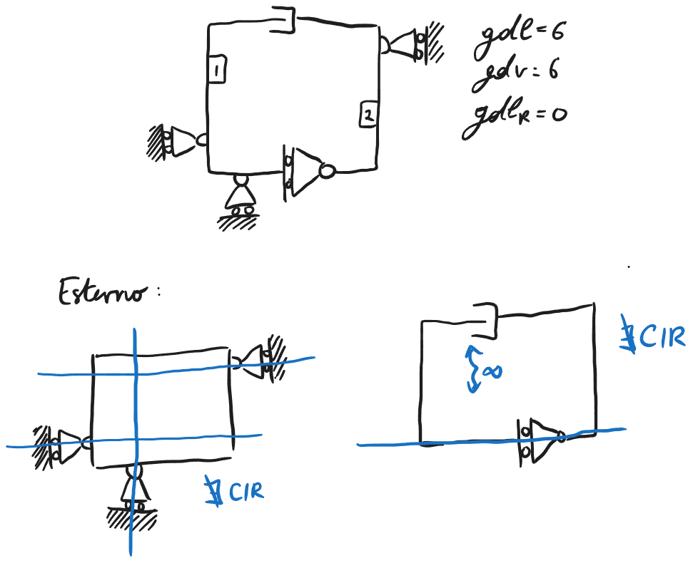{: .center }

Questo e' un quadrato articolato perche' ci sono 2 aste attaccata a terra, e ci sono 2 elementi non a terra.

<!Diagramma esercizio 2>
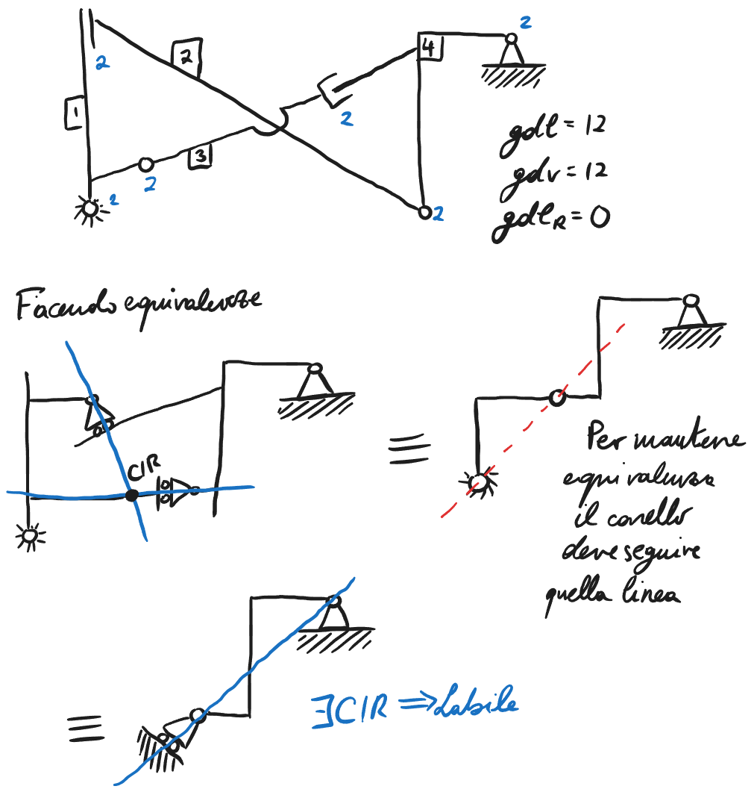{: .center }

In molti di questi esercizi si analizza la struttura interna e si trovano le equivalenze per poi analizzare la struttura intera per vedere se il sistema e' labile.

<!Diagramma esercizi 3>
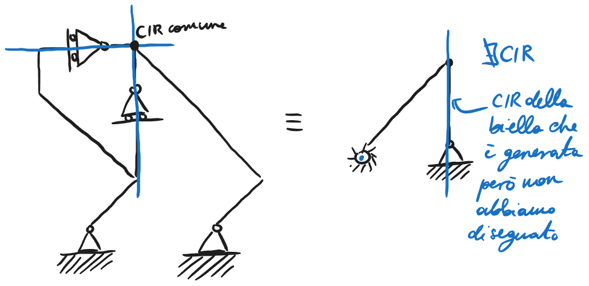{: .center }

<!Diagramma esercizi 4>

In questo caso abbiamo analizzato un appendice che era attaccato alla struttura, abbiamo trovato che non fosse isostatico, dato che serve solo una parte per trovare labile perche' tutto sia labile, abbiamo trovato che la struttura intera e' labile.

<!Diagramma esercizio 5>
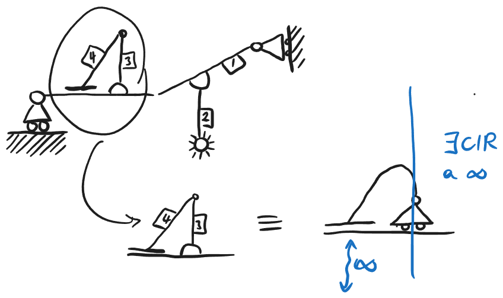{: .center }

<!Diagramma esercizio 6> 
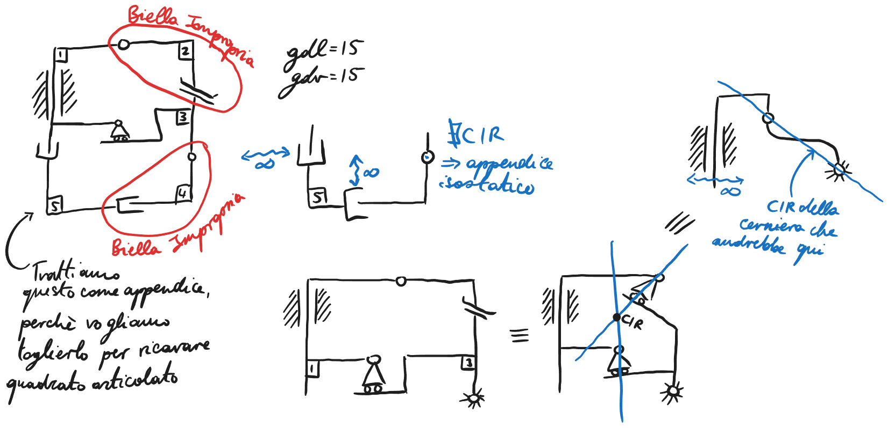{: .center }

<!Diagramma esercizio 7>
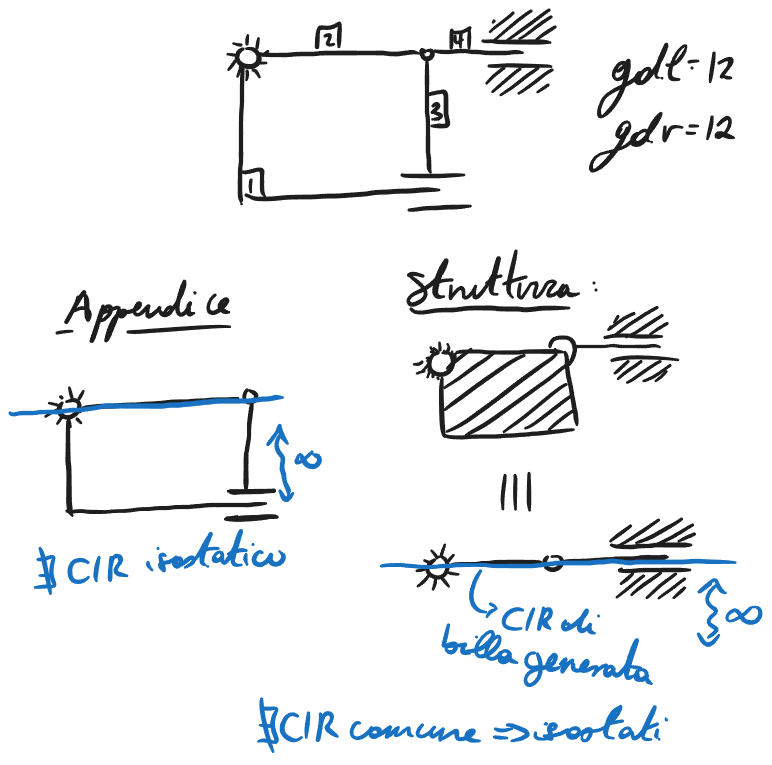{: .center }

In quest'ultimo caso dopo aver confermato che la struttura interna fosse isostatica abbiamo tratto la struttura interna come un asta, perche' i vincoli lo hanno permesso e abbiamo semplificato ad una biella impropria, percio' trovando tutto il sistema come isostatico.

### Carello su Asta

Per il carello, cosa si puo' traslare non deve esser la terra ma potrebbe esser anche una altra asta.

<!Diagramma carello su asta>
{: .center }

## Equivalenze Cinematiche

In molti casi delle combinazioni di vincoli possono esser rappresentate da altri insiemi di vincoli, questa equivalenza puo' aiutare a trovare se un sistema ha un CIR comune o no.

### Biella

<!Diagramma biella>
{: .center }

Solo per l'analisi, si puo' muovere su e giu' e girare, all'infinitesima e' lo stesso effettivamente.

### Biella Impropria

<!Diagramma biella impropria>
{: .center }

Questa si chiama biella impropria perche' c'e' una cerniera e una cerniera impropria che e' creata dai movimenti infinitesimi possibile dal sistema.

### Altra Biella Impropria

<!Diagramma  biella impropria>
{: .center }

Anche questa e' una biella impropria.

### Carello su aste singole

<!Diagramma rotazione di carelli>
{: .center }

Questo sistema puo' solo rotarsi intorno al CIR, questo e' perche' possono tutti muoversi linearmente in piccolo e percio' girare intorno al CIR.

Si puo' semplificare almeno 2 carelli ad una cerniera perche' possono rotare intorno al loro CIR.

### Altre Equivalenze

<!Diagrammi equivalenze>
{: .center }

## Strutture Notevoli

### Trave Cerniera Carello

<!Diagramma albero>
{: .center }

Per questo sistema non esiste CIR comune.

### Arco a 3 Cerniere (A3C)

Un sistema A3C non e' sempre isostatico, dipende da dove sono le cerniere.

<!Diagramma A3C>
{: .center }

La struttura A3C e' labile se le tre cerniere sono allineate. Perche' grazie alle equivalenze si trova che 2 cerniere sono come un carello.

<!Diagramma A3C equivalenza>
{: .center }

#### Altri Esempi

<!Diagramma pattino cerniera>
{: .center }

La retta di CIR del carello non arriva mai al pattino quindi non esiste CIR.

<!Diagramma pattino e manicotto>
{: .center }

Esiste CIR perche' la retta impropria passa per ogni punt infinito quindi ci sono 2 punti dove si incontrano.

### Quadrilatero Articolato

<!Diagramma quadrilatero articolato>
{: .center }

Un quadrilatero articolato e' un sistema che ha due aste a terra e 2 aste che connettono le 2 aste. Per risolvere questa struttura si possono spezzare diverse e studiarle in modo isolato dal resto del sistema, poi si mette tutto insieme per trovare se questo sistema e' isostatico o labile.

Se il CIR di due carelli si incontra si puo' sostituire con una cerniera.
Un quadrilatero articolare e' isostatico se il CIR del A3C generato non e' tra le due cerniere invece se e' tra le due cerniere e' labile.

### Appendice Isostatico

Un appendice isostatico e' una struttura che non modifica le proprieta' della struttura.

<!Diagramma Appendice Isostatico>
{: .center }

### Anello Chiuso Isostatico

<!Diagramma anello chiuso isostatico>
{: .center }

Quando sono connessi a vincoli che tolgono 3 liberta il sistema puo' esser analizzato. Il sistema puo' esser analizzato internamente e esternamente, se ha 3 GdV esterni e solo 3, si immagina che la struttura interna sia isostatica.

Si separano i vincoli attraccati dalla struttura che non e' vincolata a terra. Se gli elementi vincoli a terra sono labili la struttura intera e' labile invece se la struttura e' isostatica si studia la struttura interna. Se la struttura interna e' labile di nuova la struttura intera e' labile invece se anche la struttura interna e' isostatica la struttura interna e' isostatica.

## Esercizi

<!Diagramma esercizio 1>
{: .center }

Questo e' un quadrato articolato perche' ci sono 2 aste attaccata a terra, e ci sono 2 elementi non a terra.

<!Diagramma esercizio 2>
{: .center }

In molti di questi esercizi si analizza la struttura interna e si trovano le equivalenze per poi analizzare la struttura intera per vedere se il sistema e' labile.

<!Diagramma esercizi 3>
{: .center }

<!Diagramma esercizi 4>

In questo caso abbiamo analizzato un appendice che era attaccato alla struttura, abbiamo trovato che non fosse isostatico, dato che serve solo una parte per trovare labile perche' tutto sia labile, abbiamo trovato che la struttura intera e' labile.

<!Diagramma esercizio 5>
{: .center }

<!Diagramma esercizio 6> 
{: .center }

<!Diagramma esercizio 7>
{: .center }

In quest'ultimo caso dopo aver confermato che la struttura interna fosse isostatica abbiamo tratto la struttura interna come un asta, perche' i vincoli lo hanno permesso e abbiamo semplificato ad una biella impropria, percio' trovando tutto il sistema come isostatico.

