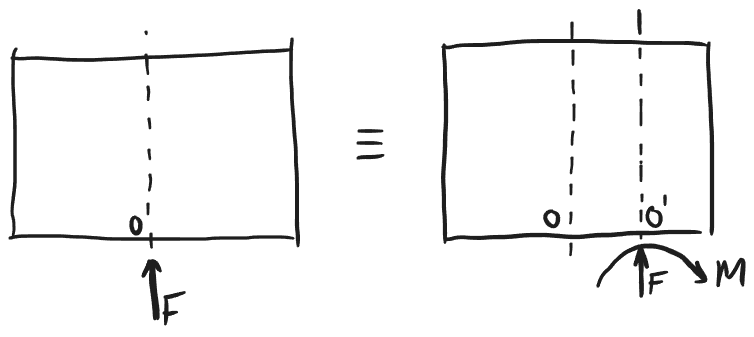
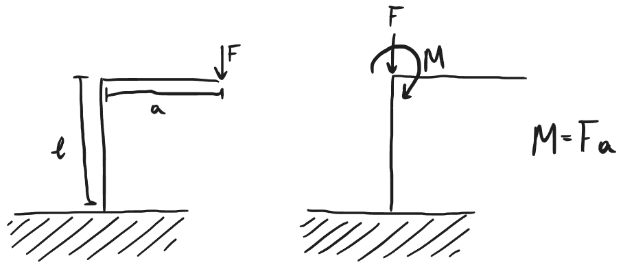
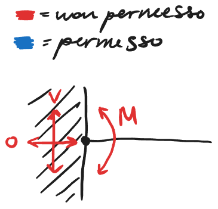
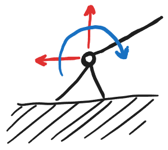
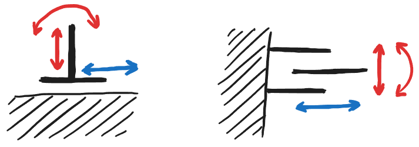
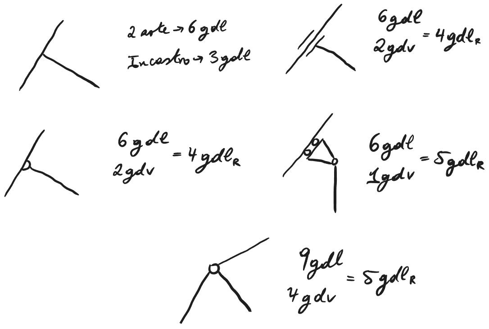
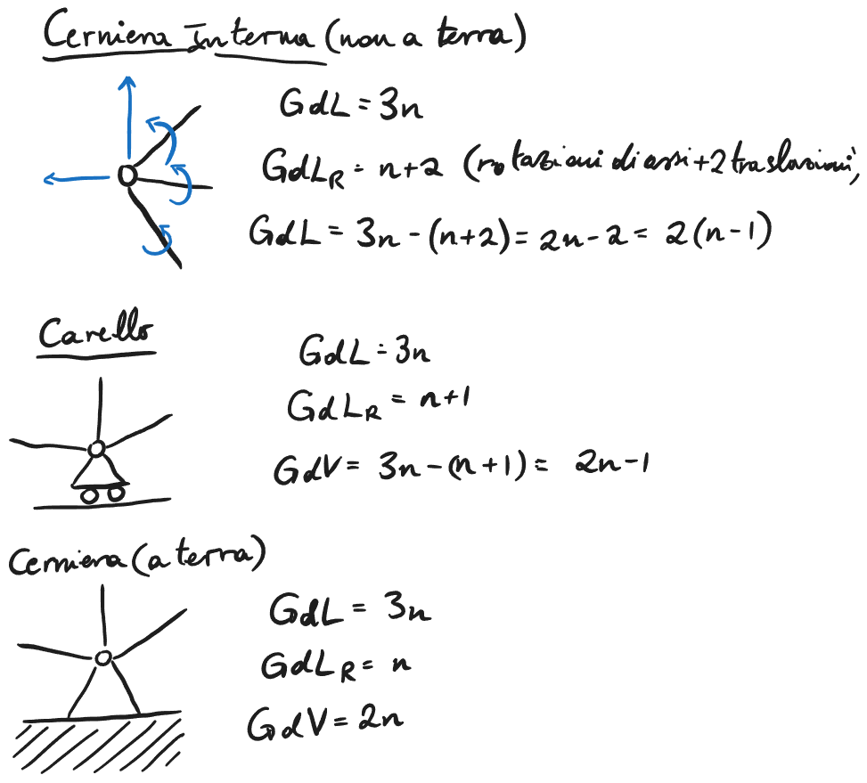

---
tags:
  - cosmac
parent: 
child: 
share: true
---

# Lezione 2 - Inizio del corso

<! Diagramma equivalenza tra sistemi>
{: .center }

In questo esempio, perche' i due sistemi siano equivalenti bisogna aggiungere un momento che cancella la rotazione intorno ad O che e' stata generata intorno ad O.

$$M'_O = M_O + (O - O') \times F$$
<! Esempio movimento forza>
{: .center }

Come imparato nella [prima esercitazione](./CdM%20-%20Esercitazione%201.md) se si vuole spostare una forza in un sistema bisogna aggiungere I momenti che sarebbero stati generati ad ogni passo tra quei due punti dalla stessa forza.

## Vincoli

Nella analisi cinematica i vincoli sono elementi aggiunti a sistemi statici che fermano certi movimenti. Ogni vincolo permette o interrompe il movimento in una combinazione diversa di traslazioni e rotazione. Lo scopo della analisi cinematica e' di vedere se un sistema e' ben vincolato e se questa configurazione di vincoli e' efficace.

### Gradi di Liberta (GdL)

I gradi di liberta sono i modi in cui un sistema si puo' muovere. I vincoli invece sono I modi in cui il moto e' bloccato.

Un oggetto bloccato sul piano ha 2 GdL e 1 vincolo traslazione, perche' puo' muoversi lungo il piano ma non via dal piano. 

Un corpo rigido e' un insieme di punti dove la distanza rimane costante.
Molti sistemi possono esser semplificati ad esser bidimensionali (vincolati al piano), e in questo sistema ci sono 3 GdL, x, y e rotazione, percio' N punti hanno 3 $\times$ N GdL.

### Tipi di Vincoli

I vincoli creano gradi di vincolo (GdV) che e' il numero di movimento che bloccano

| Tipo      | Classe   | GdV |
| --------- | -------- | --- |
| Incastro  | Triplo   | 3   |
| Cerniera  | Doppio   | 2   |
| Pattino   | Doppio   | 2   |
| Manicotto | Doppio   | 2   |
| Carello   | Semplice | 1   |
| Bipattino | Semplice | 1    |

#### Incastro

L'incastro e' il vincolo definitivo, blocca ogni movimento possibile, percio' un sistema con un incastro non si puo' muovere.

<! Diagramma incastro>
{: .center }
#### Cerniera

In una cerniera il movimento non e' permesso ma rotazione e' permessa. Questo di solito e' costruito con cuscinetti, che e' bloccato da spallamenti o anelli sieger per bloccare ogni movimento assiale. Se una cerniera non e' bloccata a terra permette i movimenti assoluti del sistema ma le aste connesse non sono si possono muovere in moti relativi.

<! Diagramma Cerniera>
{: .center }
#### Pattino e Manicotto

<! Diagramma pattino e manicotto>
{: .center }

I pattini e manicotti permettono movimenti in una sola direzione e non rotazione, la sola differenza e' la direzione di movimento rispetto al piano.

#### Carello

Il carello permette la rotazione e il movimento parallelo al piano.

<! Diagramma carello>
{: .center }
#### Bipattino

Il bipattino e' l'insieme di pattino e manicotto, 2 movimenti sono permessi e invece la rotazione e' bloccata.

<! Diagramma bipattino>
{: .center }
## Esempi di Analisi Cinematica

### Albero

<! Diagramma albero>
{: .center }

Questo e' come si rappresenta un albero nella analisi cinematica, 
### Vincoli

<! Diagrammi esempi>
{: .center }

La differenza tra i GdL e GdV sono detti i gradi di liberta rimasti (GdL$_R$). Se i GdL$_R$ = 0 il sistema e' detto isostatico o labile, dipendendo da se si puo' muovere infinitesimamente o no. Se GdL$_R$ > 0 il sistema e' detto isostatico, cioe' non tutti i movimenti sono controllati dai vincoli. Invece se GdL$_R$ < 0, il sistema e' detto iperstatico, cioe' ci sono piu' di un vincolo per movimento, a questo punto i calcoli della analisi cinematica si basano sui materiali usati e la loro resistenza a stress invece della struttura stessa.

### Gradi di Vincolo

Ogni vincolo ha il suo numero di gradi di vincolo, quindi quando si guarda ad una struttura importa vedere se quali vincoli e se i vincolo sono a terra o no.

<! Diagramma gradi di vincolo>
{: .center }
