# Lezione 4 - Ripasso e Spiegazione Analitica

Tutta questa lezione e' un ripasso, analizzo e spiegazione delle cose coperte nella [ultima esercitazione](./CdM%20-%20Esercitazione%201.md).

<!Diagramma sistemi labili e ipostatiche.>
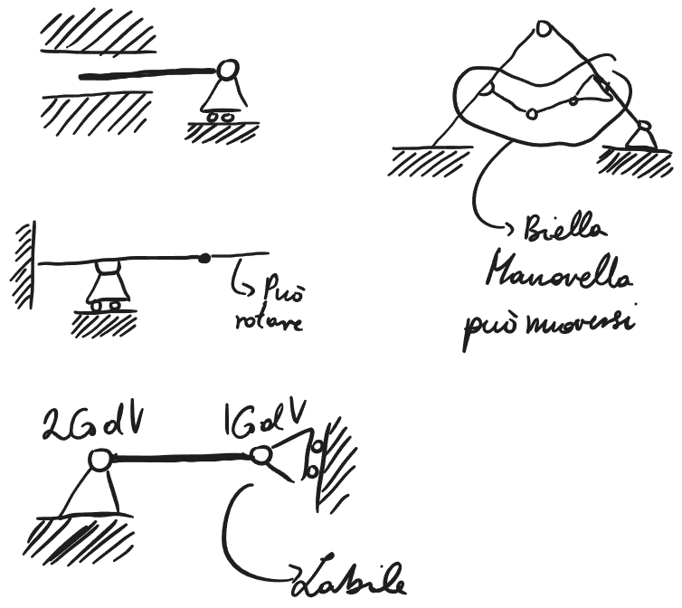{: .center }

Esistono configurazioni che ci permettono di risolvere la maggior parte dei problemi. Quello che dobbiamo fare noi e' usufruire di questa strutture notevoli per semplificare sistemi.

## Strutture Equivalenti

### Strutture Notevoli

1. Asta Cerniera'-Carello
2. Arco a Tre Cerniere
3. Quadrilatero Articolo

### Strumenti e Semplificazioni

1. Le bielle o aste di collegamento
2. Anelli chiusi isostaiche
3. Le appendici isostatiche
4. Decomposizione problema a terra e interno - solo se gdv a terra = 3
## Aste Cerniera-Carello

<!Diagramma strutture e spezzato>
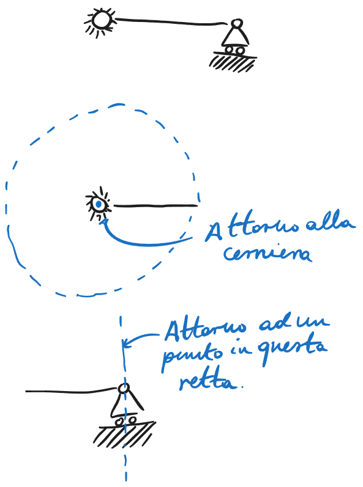{: .center }

La asta di puo' muovere intorno a punti diversi dipendendo da quale vincolo guardiamo. In realta' esistono tutti e due i vincoli quindi bisogna verificare la compatibilita'.

In questo caso non sono compatibili perche' non hanno CIR comune. I problemi arrivano se e quando hanno CIR comune, questo significa che il sistema e' labile.

Se invece il carello e' orientato in verso diverso.

<!Diagramma struttura e spezzato>
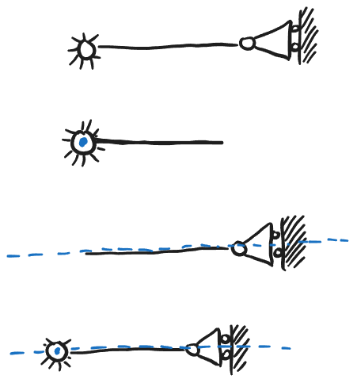{: .center }

Si trova un CIR comune alla cerniera, questo significa che sono compatibili e percio' sono compatibili.

## Bielle e Aste di Collegamento

<!Diagramma struttura>
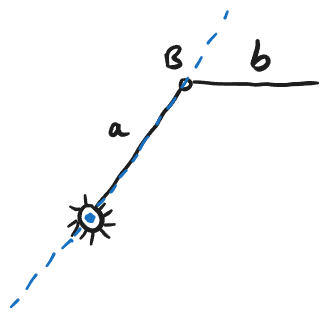{: .center }

Focalizzandosi su b in presenza di a, b si muove rispetto alla terra per virtu' di B, b si puo' muovere rispetto alla terra anche in virtu' di A. Facendo la combinazione lineare si trova che si puo' ruotare rispetto ad ogni punto lunga la stessa asse di a. 

Cinematicamente questa asse e' uguale alla asse dei CIR dei carelli, percio' si puo' sostituire con un carello.

<!Diagramma strutture con carello>
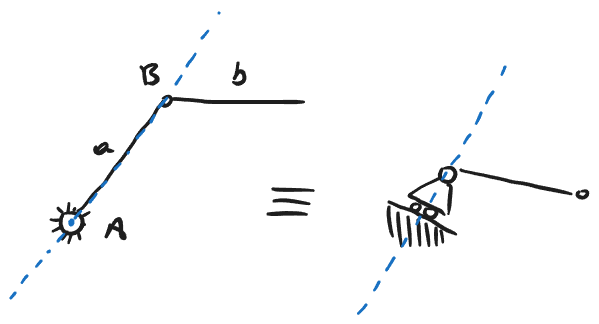{: .center }

La sostituzione e' valide sono per i piccoli movimenti, in grande non vale.

## Archi a tre Cerniere (A3C)

Le due arte hanno 6 gdv.

<!Diagramma equivalenza>
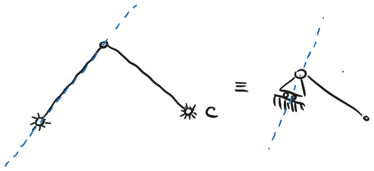{: .center }

Le strutture notevoli portano a l'un l'altro.
Le cerniere possono esser sostituite per un carello.
In questo caso, dopo l'equivalenza trova che non e' labile.

Un modo molto piu' veloce e' riconoscere che il sistema e' labile se il carello generato punta verso la cerniera rimasta, questo succede solo se le cerniere sono in una linea retta. In ogni caso dove non sono allineate e' isostatico.

### Varianti su temi:

<!Diagramma asta cerniera-carello>
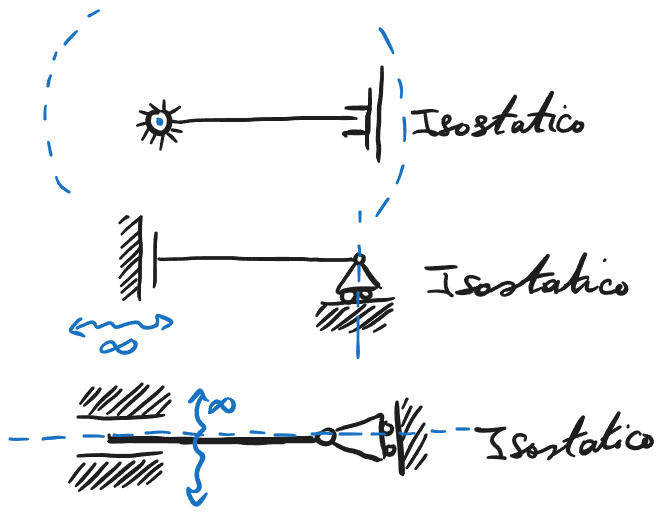{: .center }

<!Diagrammi A3C>
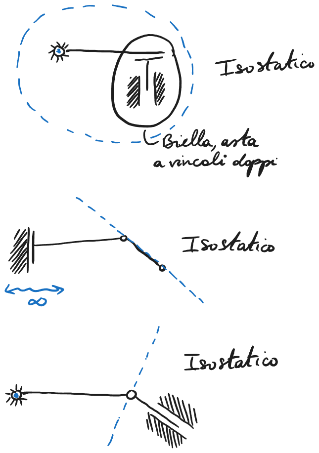{: .center }
## Quadrilatero Articolato

<!Diagramma quadrilatero>
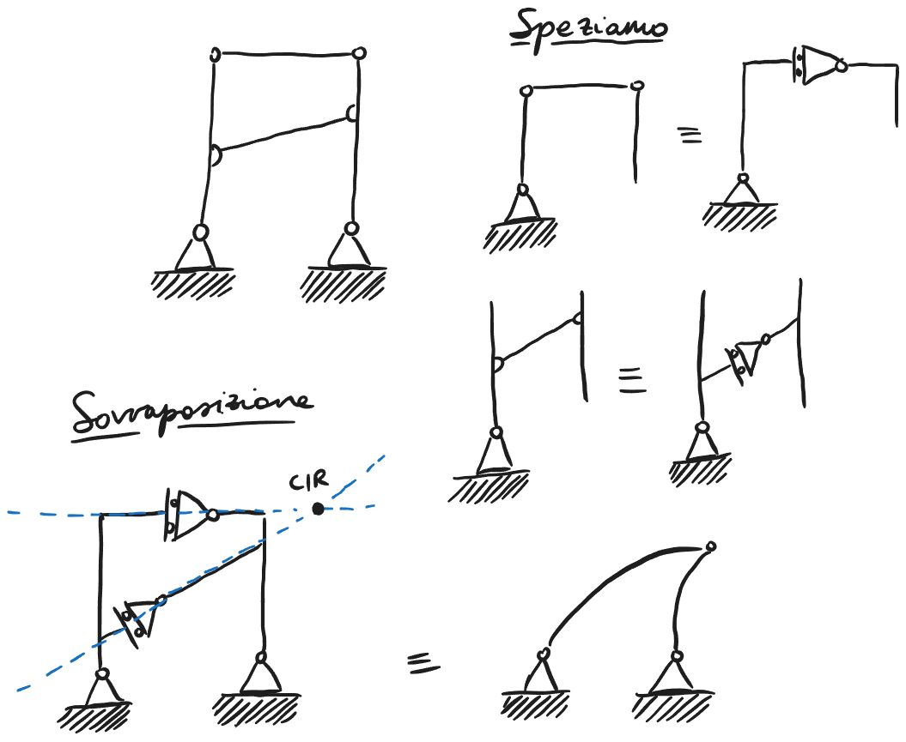{: .center }

Le aste collegate a terra tra di loro collegate da 3 bielle che sono equivalenti a 2 carelli.

La sovrapposizione delle due parti crea una sistema equivalente.
Dopo dove i carelli hanno CIR comune si puo' rimpiazzare la struttura con una cerniera.

Questa nuova struttura e' una A3C, se il CIR comune e per cio' la cerniera e' in linea con le altre cerniera, significa che la struttura, se no e' isostatica.

Altro esempio:

<!Diagramma quadrilatero>
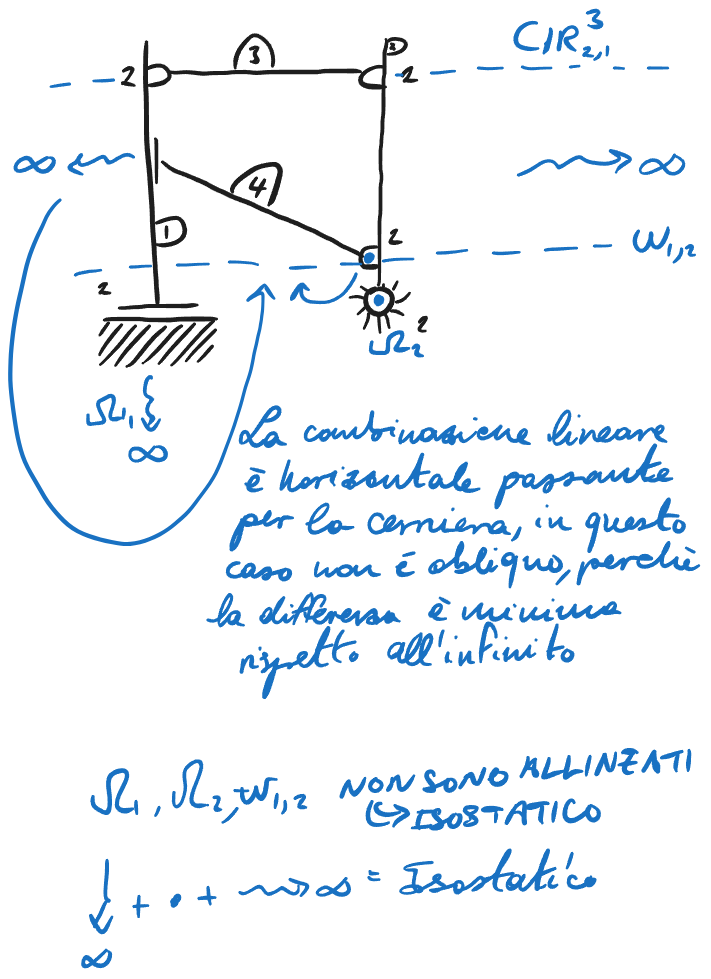{: .center }
## Appendici Isostatici
Un aggiunta e' isostaticha che non cambia le proprieta'.
## Anello Chiuso Isostatico

<!Diagramma triangolo isostatico>
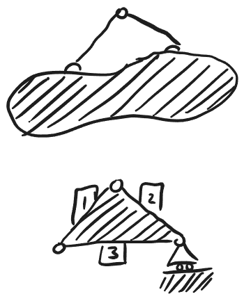{: .center }

Un triangolo isostatico e' la base di un anello chiuso isostatico, quando questo triangolo e' vincolato a terra da 3 gdv, si puo' analizzare internamente e esternamente separatamente. Se tutti e due sono isostatici allora la struttura intera e' isostatica, se invece almeno uno dei due e' labile, le struttura intera e' labile.

