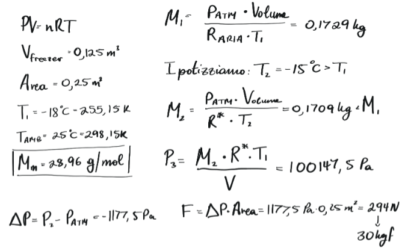
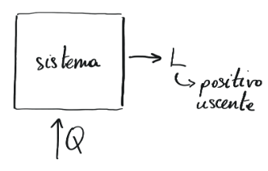
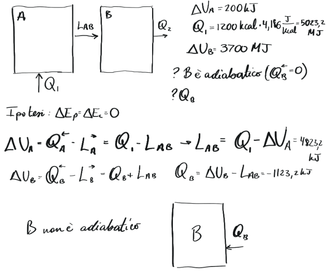

# Esercitazione 2

## Ripasso

$PV = nRT \rightarrow$ equazione di stato di gas ideali
$$R = \frac{1atm\cdot22,4L}{273,15K\cdot1mol}=0,08206 \frac{L\cdot atm}{mol\cdot K} = 8,314 \frac{J}{K\cdot mol}=8314,5 \frac{J}{kmol\cdot K}$$

$P \frac{V}{n} = RT \rightarrow Pv = RT$ con $v$ che e' il volume molare specifico

$n = \frac{M}{M_{m}}$

$\frac{PV}{M} = \frac{RT}{M_m} \longrightarrow P\underbrace{ v^* }_{ \substack{\text{Volume}\\\text{Massico}} } = R^*T$

Dopo questa esercitazione useremo solo i kg quindi useremo $v^*$ ma toglieremo * .

$$\frac{P}{\rho} = R^*T \longrightarrow v^* = \frac{1}{\rho}$$

| Gas      | $M_{m}$   | Gas      | $M_{m}$   |
| -------- | --------- | -------- | --------- |
| He       | 4 kg/mol  | H$_{2}$  | 2 kg/mol  |
| O$_{2}$  | 32 kg/mol | N$_{2}$  | 28 kg/mol |
| CO$_{2}$ | 44 kg/mol | NH$_{3}$ | 44 kg/mol |
| CH$_{4}$ | 16 kg/mol          |          |           |

## Legge di Mayer

|         | Mono  | Bi o poli lin | Poli non lin |
| ------- | ----- | ------------- | ------------ |
| c$_{v}$ | 3/2 R | 5/2 R         | 3R           |
| c$_{p}$ | 5/2 R | 7/2 R         | 4R             |

## Esercizi da Esercitazione 2
### Esercizio 1 - Frigorifero

<!Diagramma esercizio>

### Esercizio 2 - Molgolfiera(Ultimo negli appunti)

<!Diagramma esercizio>

## Bilancio Energetico

$$\Delta E_{TOT} = \underbrace{ \Delta E_{p} + \Delta E_{c} }_{ Macroscopico } + \underbrace{ \Delta U }_{ Microscopico }$$
$$\begin{align}
\Delta E_{p} &= \text{variazione di energia potenziale} \\
\Delta E_{c} &= \text{variazione di energia cinematica} \\
\Delta U &= \text{variazione di energia interna} 
\end{align}$$
Tipi di energia interna:
- energie cinematiche microscopiche
- energia di legami tra atomi e tra molecole
- energia chimica
- energia nucleare

$\Delta E_{T} = \underbrace{ Q }_{ \text{calore} } + \underbrace{ L }_{\substack{\text{tutte le}\\\text{forme di}\\\text{lavoro}}}$

<!Diagramma energia>

$\Delta E_{T} = \underbrace{ Q^{\leftarrow} }_{ \text{Entrante} } - \underbrace{ L^{\rightarrow} }_{ \text{Uscente} }$

$$\boxed{\Delta E_T = \Delta E_{p} + \Sigma E_{c} + \Delta U = Q^{\leftarrow} - L^{\rightarrow}}$$
$$
\begin{align}
\frac{dE}{dt} &= \sum_{in-out} \dot{Q}_{in-out} - \sum_{out-in}\dot{L}_{out-in} = \sum \dot{Q}^{\leftarrow} - \sum \dot{L}^{\rightarrow} \\
\frac{dE}{dt} &= \sum \dot{m} \underbrace{ e^{\rightarrow} }_{ \substack{\text{Energia}\\\text{portata}\\\text{dalla}\\\text{massa}} } + \sum \dot{Q}^{\leftarrow } - \sum \dot{L}^{\rightarrow} \\
\frac{dm}{dt}  &= \sum \dot{m}^{\leftarrow}
\end{align}
$$
Nel bilancio energetico non ci sono condizioni per la possibilita' o impossibilita' dello scambio.
## Bilancio Energetico

$$\begin{align}
\Delta S = S_{fin}-S_{in}  &= S^{\leftarrow} + S_{IRR} \\
 &= \underbrace{ S_{q} }_{ \substack{} } + S_{gen}
\end{align}$$
$S^{\leftarrow}=$ entropia scambiata con l'ambiente esterno, esiste solo se $\delta Q \neq$ 0 con l'ambiente.
$S^{\leftarrow}\neq 0$ se e solo se $Q^{\leftarrow}\neq 0$
$S_{IRR} =$ entropia $\underbrace{ \text{generata} }_{ \substack{\text{prima non c'era}\\ \implies S_{IRR} \geq 0} }$ dal processo

$S_{IRR} \geq 0$ perche' se e' generata significa che non si puo' rimuovere qualcosa che no c'era prima.

Sistema Adiabatico: $Q^{\leftarrow} = 0 \implies S^{\rightarrow}=0$
Sistema Reversibile: $S_{IRR} = 0$
Processo Isoentropico: $\Delta S = 0$

Un processo adiabatico e reversibile e' uguale ad un processo isoentropico perche':
$$\Delta S = \cancelto{ 0 \substack{\text{ perche}\\\text{ adiabatico}} }{ S^{\leftarrow} } + \cancelto{ 0 \substack{\text{perche'}\\\text{reversibile}} }{ S_{IRR} }$$

Gli unici altri sistemi isoentropici sono quelli dove $S^{\leftarrow}= - S_{IRR}$

Sistema isolato $\rightarrow Q^{\leftarrow} = 0$ e $L^{\rightarrow} = 0$

Un processo e' impossibile se $S_{IRR} <0$
E' possibile se e' reversibile cioe' $S_{IRR}=0$ o irreversibile se $S_{IRR} > 0$
E\ indeterminabile se il valore di $S^{\leftarrow}$ che significa che il valore di $S_{IRR}$ non e' calcolabile.

La condizione principale di ogni bilancio entropico e' che $S_{IRR} \geq 0$

I conti si fanno su $S_{IRR}$ non $\Delta S$
Si usa $\Delta S = S^{\leftarrow} + S_{IRR}$ per trovare $S_{IRR}$

## Equazioni di stato

Note: $T_{1} = T_{in}$ e $T_{2} = T_{fin}$

$$
\begin{align}
\Delta U = U_{fin}-U_{in}  &= Mc^*_{v}(T_{fin}-T_{in}) \text{ per gas perfetti} \\
 &= Mc(T_{fin}-T_{in}) \text{ per liquidi e solidi} \\
 \\
\end{align}
$$
$$
\left\{\begin{align}
\Delta S = S_{fin}-S_{in}  &= M\left( c^*_{v}\ln \frac{T_{2}}{T_{1}} + R^*\ln \frac{V_{2}}{V_{1}} \right) \\
 &= M\left( c^*_{p}\ln \frac{V_{2}}{V_{1}}+c^*_{v}\ln \frac{P_{2}}{P_{1}} \right) \\
 &= M\left( c^*_{p}\ln \frac{T_{2}}{T_{1}}-R^*\ln \frac{P_{2}}{P_{1}} \right) 
\end{align}\right\} \large{\substack{\text{per gas}\\\text{perfetti}}}
$$
$$\Delta S = Mc^*\ln \frac{T_{2}}{T_{1}} \text{ per liquidi e solidi}$$
## Esercizi da Esercitazione 3

### Esercizio 4

<!Diagramma problema>

### Esercizio 5

<!Diagramma problema>

### Esericizio 6

<!Diagramma problema>

