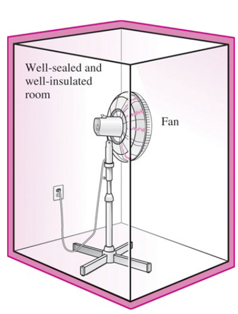
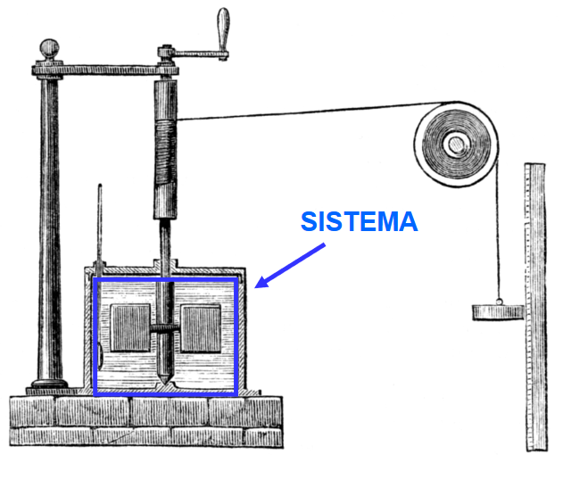
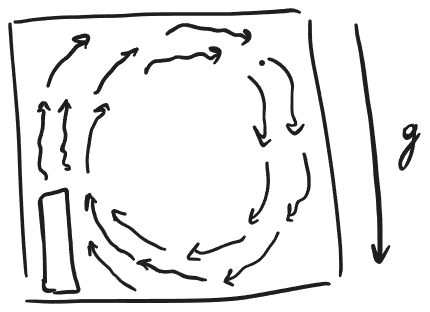

# Lezione 3

Condizioni per l'equilibrio termodinamico:

- se $P_{S.T} > P_{A}$ + contorno mobile $\implies$ scambio di lavoro meccanico
	- il contorno mobile permette scambio di energia
- se $T_{S.T}>T_A$ + contorno conduttore $\implies$ flusso di calore
	- un contorno conduttore permette lo scambio di calore
- se $\mu_{i_{S.T.}}> \mu_{i_A}$ +contorno permeabile $\implies$ flusso di massa di i, dove i e' la specie chimica
	- un contorno permeabile permette scambi di massa

### Descrizione di un sistema termodinamico

X$_{S.T.}$ = $\{M_1,M_2,\cdots,M_n,V,P_1(t),P_2(t),\cdots,P_n(t)\}$ 

Le proprieta' dipendono dalla scopo e dall'uso. Esistono poche proprieta' indipendenti al livello macroscopico.

Le proprieta' indipendenti sono le proprieta' che descrivono completamente un stato di equilibrio.

La **Legge di Gibbs**: V = C - F + 2, e' un equazione utile per trovare il numero di variabili indipendenti. 

La cosa piu' importante da ricordare e' che le fasi, **F**, sono diverse degli stati di aggregazioni. Per esempio il carbonio ha come fasi diamante e graffite, o come altro esempio il ghiaccio puo' avere 9 fasi diverse. In generale gli stati di aggregazione sono un sottoinsieme delle fasi.

## Processi/Trasformazioni

Gli stati di equilibrio vengono portati in equilibrio da processi/trasformazioni

X$_{S.T.1}$ = $\{M_1,M_2,\cdots,M_n,V_1,P_1(t),P_2(t),\cdots,P_{n(t)\}}\rightarrow X_{S.T.2} = \{M_1,M_2,\cdots,M_n,V_2,P_1(t),P_2(t),\cdots,P_n(t)\}$
Durante una trasformazione almeno una grandezza intensiva deve cambiare, in questo esempio il volume cambio se il contorno e' mobile. 

### Trasformazioni quasi-statiche

Un sistema quasi-statico mantiene stati di equilibrio al suo interno.
Per esser quasi-statico la propagazione delle perturbazioni deve esser almeno 1 grado piu' grande della velocita' di de-equilibrazioni causata da questa perturbazioni.

### Processi Globalmente Reversibili

Condizioni necessarie:

1. Tutte le trasformazioni sono quasi-statiche
2. Sistema ed ambiente sono in mutuo equilibrio

se ci sono trasformazioni e' impossibilie che ci sia un mutuo equilibrio perche' se ci fosse un disequilibrio per una trasformazione l'unico mdo che sarebbe possibile che sarebbe possibile la reversibilita' e' se il disequilibrio fosse infinitesimale.

## Energia

<! Diagramma con i pezzi nelle camere>

In questi casi, dato che il sistema e' chiuso, e l'energia entra nel sistema la energia totale del sistema deve aumentare continuamente e per effetto la temperatura nel sistema deve aumentare.

### Mulinello di Joule

<! Diagramma del molinello>

In questo caso il sistema e' il contenitore di acqua. L'energia del sistema non cambia prima e dopo il calo della massa, perche' alla inizio e alla fine la ventola e' ferma, questo indica che L $\neq \Delta E_{p}+ \Delta E_c$ .

La conservazione dell'energia viene rispettata solo se si ipotizza che energie oltre l'energia meccanica esistono. Usando questo ragionamento si trova che L = $\Delta U$.

$U$ : energia interna del sistema

Allora si puo' scrivere che $\Delta E_{TOT} = \underbrace{\Delta E_{p} + \Delta E_{c} + \Delta U}_{\text{PATRIMONIO ENERGETICO DEL SISTEMA}} = L$  
In questo caso $\Delta E_{p} \rightarrow 0$ e $\Delta E_{c}\rightarrow 0$
### Forme di Energia

- Energia totale: l'energia totale e' la somma delle energie microscopiche e  macroscopiche del sistema.
- Energie macroscopiche: $E_{p}$ e $E_c$ , queste sono energia che il sistema possiede rispetto ad un punto di riferimento come uno 0 o una velocita' nulla.
- Energie microscopiche: queste energie sono relative a strutture e gradi di attivita' microscopiche

$U$ : somma delle energie microscopiche

#### Tipo di Energia Interna
##### Tipi di Movimento delle Particelle
- Vibrazionale
- Traslazinonale
- Cinetica Rotazionale
- Spin
Queste sono movimenti che hanno effetto sull'energia sensibile del sistema, cioe' la energia associata ai movimenti microscopici
##### Tipi di Energia

Energia termica: sensibile + latente
Energia interna: sensibile + latente + chimica + nucleare

###### Energia Sensibile

Questa energia e' legata all'energia cinetica delle molecole, il movimento sopra sono quelli che definiscono questa energia.

###### Energia Latente

Questa e' l'energia associata allo stato di aggregazione, cioe' le forze intermolecolari che si rompono e formano con il cambio di stato di aggregazione. 
La media di questa energia e la energia sensibile insieme e' la temperatura.
###### Energia Chimica

Questa e' l'energia nei legami tra gli atomi di una molecola.

###### Energia nucleare

Energia dentro all'atomo stesso, le forze forti e deboli che tengono insieme le particelle sub-atomiche.

Con un cambio della energia sensibile non si cambia la natura delle molecole, invece con un cambio dell'energia chimica e nucleare la natura delle molecole cambia.

$\Delta E_{TOT} = \underbrace{\Delta E_{p} + \Delta E_{c} + \Delta U}_{\text{PATRIMONIO ENERGETICO DEL SISTEMA}} = \text{SCAMBI DI ENERGIA ATTRAVERSO IL CONTORNO}$
Gli scambi di energia si riconoscono solo se occorrono attraverso il contorno.

Se il sistema e' formo nello spazio allora $\Delta E_p$ e $\Delta E_c$ = 0, questo e' importante perche' non ci importa sapere l'energia totale del sistema solo il cambio di energia che riusciamo a calcolare.

Le energie dinamiche sono le energie scambiate attraverso il contorno, nella termodinamica queste energie cambiano vengono chiamata lavoro e calore e cambiano l'energia interna del sistema. Se questo scambio di energia occorre a caso di un disequilibrio di temperature, l'energia scambiata viene chiamata calore, invece in ogni altro caso l'energia scambiata viene chiamata lavoro.

Importante sapere che piu' grande e' $\Delta T$, piu' grande e' $\dot{Q}$ .

$q = \frac{Q}{t} [\frac{kJ}{kg}]$
$Q = \dot{Q}\cdot \Delta t  [kJ]$ 
$Q = \int^{t_2}_{t_{1}}\dot{Q}\Delta t [kJ]$
$\dot{Q} = \frac{dQ}{dt} \frac{[J]}{[s]} = [W]$ , $\ddot{Q} = \frac{d^2Q}{dt^2}$

### Storia del Calore

- Teoria Cinetica
- Calore: energia associata al movimento caotico di atomi e molecole
- Conduzione
- Convezione
	- Trasferimento di calore tra solido e liquido. Un trasferimdo di calore per convezione significa di particelle nei campi gravitazionali perche' il riscaldamento cambia la densita dell'area intorno, questo significa che in un campo gravitazionale e' impossibile che l'aria sia immobile se viene riscaldata per convezione.
<! Diagamma convezione>

- Irraggiamento
	- Non serve materia come conduzione e convezione perche' il calore e' trasmesso attraverso onde e fotoni, quindi e' l'unico modo per trasferire calore nel vuoto.

### Lavoro

Il lavoro e' l'energia associata all'azione di una forze che provoca uno spostamento

Il calore usa la convenzione naturale dei segni, cioe' l'energia entrante e' positiva e l'energia uscente e' negativa. Per il lavoro e' l'opposto perche' in ingegneria lo scopo e' di estrarre il lavoro quindi il lavoro uscente dal sistema e' lavoro positivo e il lavoro entrante e' negativo.

Il lavoro e il calore sono energia dinamiche quindi i loro elementi infinitesimali non usano d ma il $\delta$ nella integrazione. Cioe' $\int^{2}_{1} \delta W = W_{12}$ e' come si scrive e non $\int^{2}_{1} dW = W_{12}$, questo e' perche' due processi possono usare energie diverse ed arrivare allo stesso punto se il grafico di scambio di energia non rappresenta lo scambio bene

<! Diagramma grafico>

In questo caso l'area nera e rosse sono diverse, pero' si arriva allo stesso punto, questo e' fisicamente impossibile pero' si puo' spiegare se si aggiungesse l'asse della temperatura, si vedrebbe che le temperature sono diverse pero' perche' il diagramma e' solo PV sono uguali e il diagramma sembra impossibile.

### Lavoro vs. Potenza

Il lavoro e' l'energia che si scambia nel sistema, invece la potenza e' la velocita' con cui questa energia viene scambiata. Se 5kJ di lavoro sono trasferiti in 2 secondi e 2 ore, il lavoro nei due processi e' lo stesso ma la potenza e' molto diversa.

## Primo Principio della Termodinamica

Enunciato: Energia non puo' esser creata ne distrutta solo trasmessa.

La conseguenza di questo teorema sono i bilanci energetici/termodinamici

### Bilancio di Energia

$\Delta E_{TOT} = \Delta E_{p} + \Delta E_{c} + \Delta U = Q - L_{PdV} - L_{\text{meccanica}} + L_{\text{EL}} + L_{\text{CHIMICA}} + L_{\text{NUCLEARE}}$  
$L_{PdV}$ e $L_{\text{meccanica}}$ sono sottratti perche' sono positivi se il lavoro e' uscente quindi se il lavoro fosse aggiunto il lavoro interno aumenterebbe. Questa e' una convenzione, se potrebbe usare l'altra convenzione ma nel caso ingegneristico ha senso e quindi si sottrae invece di sommare.

In un sistema "FERMO" e semplificato si trova che: 

$\Delta E_{TOT} = \Delta U = Q - l_{PdV} - L_{\text{MECC}}$ 

## Rendimento

Il rendimento e' la percentuale di energia spesa che si converti in energia utile. Il rendimento si trova con l'equazione: Efficienza$= \frac{\text{Energia effettiva}}{\text{Energia spesa}}$

<! Se importano le caldaie si puo' leggere alla fine del pdf>