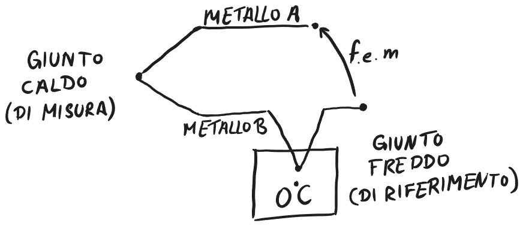
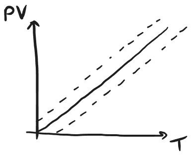

# Lezione 4 - Principio 0 della Termodinamica (Definizione della Temperatura)

Data: 20-09-23

Un equilibrio termico, meccanico e chimico creano l'equilibrio termodinamico. Se questa proprieta' sono omogenee nel sistema intero allora il sistema e' in equilibrio.

## Equazione di Stato

Un equazione di stato e' un equazione che e' funzione delle variabili indipendenti del sistema. Esistono per sistemi semplificati e semplici.

La forma implicita di un equazione di stato e' $f(x,y,z) = 0$, due variabili sono indipendenti e l'altra e' dipendente dalle altra due. E' uguale a zero perche' il sistema e' in equilibrio quindi non c'e' cambio.

<! Diagramma chiuso rigido, impermeabile>

A,B,C con equilibrio caratterizzati da
$$\underbrace{(x,y)}_{A};\underbrace{(x',y')}_{B};\underbrace{(x'',y'')}_{C}$$
se A e C in equilibrio termico $\implies \exists f_{AC}$ tale che $f_{AC}(x,y,x'',y'') = 0$
se B e C in equilibrio termico $\implies \exists f_{BC}$ tale che $f_{BC}(x',y',x'',y'') = 0$
$$f_{AC}\neq f_{BC}$$
$y'' = g_{AC}(x,y,x'') = y'' = g_{BC}(x',y',x'') \implies g_{AC} = g_{BC}$

Se due sistemi A,B sono in equilibrio termico con C allora A e B sono in equilibrio termico secondo la variabile $y''$

$$
\begin{align*}
g_{AC}(x,y,x'') &= h_{A}(x,y) \cdot k(x'')\\
g_{BC}(x',y',x'') &= h_{B}(x,y) \cdot k(x'')\\
T_{A} &= T_{B}
\end{align*}
$$
Temperature termodinamica di A e B che sono in equilibrio.

## Grandezze Termometriche 
Le grandezze termometriche sono le proprieta' dipendenti da T, possono esser misure direttamente e precisamento con bassa incertezza di misura.

Un termoscopio e' cosa viene usato per rilevare grandezze termodinamiche. Un termoscopio diventa un termometro quando e' dotato di scala di temperature + converzione da grandezza termometrica a temperatura.

### Grandezze

- Volume - > $\underbrace{T = T(V)}_{\text{Questa e' una equazione di stato}}$ per elementi come Hg e composti come l'etanolo, pentano e toluene c'e' una correlazione. L'equazione $V = V_o(1+\alpha t + \beta t^2)$, dove per Hg, $\alpha = 1,8\times10^{-4}\cdot C^{-1}$ e $\beta = 5\times10^{-8}\dot C^{-2}$. t minuscolo e' la temperature in gradi celsius.
- Pressione - > $T = T(P)$ questo e' usato in termometri a gas e.g. He, con l'equazione $T = a+ bP +cP^2$ 
- F.E.M - > $T = T(f.e.m)$ - Termocoppie
<! Diagramma termocoppia>

- Termoresistenza - > $T = T(R)$ questi sono materiali che cambiano a carte resistenze hanno temperature specifiche.

I termometri a irradiazione sono usati per temperature > 1600$^oC$

## Scale Pratiche di Temperatura

| $^oC$ | $^oF$ |
| ----- | ----- |
| 0     | 32    |
| 100   | 212   |

t($^oC$) = $[t(^oF)-32]$
t($^oF$) = $t(^oC)\cdot1,8 + 32$

## Standard Internazionale base della temperatura

Il STI-90 o ITS-90 (Scala Termometirca Internazionale o Internazional Temperature Scale) - > Questa scala e' basata su 17 punti fissi

|                        |      | K         | $^oC$                 |
| ---------------------- | ---- | --------- | --------------------- |
| He-3                   | Pv-T | 0,65-3,2K | -272,50 % 269,50      |
| Punto triplo di H$_2$  |      |           |                       |
| $''$   N               |      |           |                       |
| " O$_2$                |      |           |                       |
| " Ar                   |      |           |                       |
| " Hg                   |      | 234,3156  | -38,83444 $\pm$ 0,2mK |
| " H$_2$O               |      | 273,16K   | 0,01 $\pm$ 0,1mK      |
| Punto di Fusione di Ga |      |           |                       |
| " In                   |      |           |                       |
| " Sn                   |      |           |                       |
| " Zn                   |      |           |                       |
| " Al                   |      |           |                       |
| " Ag                   |      |           |                       |
| " Au                   |      |           |                       |
| " Cu                   |      | 1357,77   | 1084,62 $\pm$ 2,5mK                      |

## Equazione di stato esplicito

Un esempio puo' esser $f(P,V,T)$ dove P puo' dipendere da V e T, V puo' dipendere da P e T, e T puo' dipendere da P e V

### Costante del Gas 

La equazione di stato per i gas ideali e' $PV = nRT$, R e' stata derivata dal grafico di PV vs. T per alcuni gas, la media degli inclini e' stata presa come il costante universale dei gas ideali.

<! Diagramma gas ideale>

L'unico problema con il costante universale dei gas ideale e' che il gas ideale non esiste. Il gas costante anche se non funziona perfettamente puo' esser usato per approssimate molto bene, la approssimazione migliore per P basse e T alte, ma cose' alto e cose' basso cambia da gas in gas.

Se si prende $N = \frac{M}{M_m}$ si puo' scrivere PV = NRT come PV = $\frac{M}{M_m}$RT, facendo $\frac{R}{M_m}$ si ha R$^*$$[\frac{J}{kgK}]$ che e' il costante del gas specifico. Dividendo R la massa molare e si trova il valore.

Ora si ha PV = MR$^*$ T, se si divide per M si ha $\frac{V}{M} = v^*$, questo e' il volume massico che e' l'inverso dalla densita'. Finalmente si ha $\frac{P}{\rho} = R^*T$

Dato che F$_p$ = Mg = $\rho$Vg, si trova che all'aumentare di T, $\rho$ diminuisce e percio' diminuisce il peso dell'unita' di volume dell'aria.

## Definizione di Temperatura e Entropia

Dato $\Delta E_{TOT} = \Delta E_p + \Delta E_c + \Delta U \rightarrow$ Flusso di energia attraverso il contorno

Se il sistema e' fisso allora $\Delta E_p = 0 e \Delta E_c = 0$
$\implies \Delta U = Q - L_{PdV} + \Phi_{M_i}$ 

Dove $\Phi_{M_i}$ e' il flusso di massa, se contorno e' permeabile

Per i cambiamenti infinitesimali si ha:
$$dU = \delta Q - \delta L_{PdV} + \delta\Phi_M$$

f(U,x,y) = 0 e' la forma implicita della funzione di stato di una sistema semplice.

Se M e' fissata allora la funzione esplicita' puo' esser U = U(T,V) o U = U(P,T) o anche U = U(T,P), se invece M non e' fissata allora puo' esser U = U(M,V,T)

### Interazioni energetiche

#### Interazione Energetica del Lavoro

Interazione energetica per variazione di volume, cioe' lo scambio energetico per variazione di volume ha l'equazione:

$$$\delta L = PdV \rightarrow$$In questa equazione la pressione e' una grandezza intensiva Pa = $\frac{N}{m^2}$ mentre il volume e' una grandezza estensiva $[m^3]$

#### Interazione di massa

L'interazione energetica di massa o lo scambio di energia attraverso uno scambio di massa segue l'equazione:

$$\delta \Phi_M = \mu_i \cdot dN_i$$
In questa equazione $\mu_i [\frac{J}{mol}]$ e' una grandezza intensiva mentre $dN_i [mol]$ e' una grandezza estensiva. 

Queste equazioni si possono riscrivere come:

$$\delta L = PdV \rightarrow dV = \frac{1}{p} \cdot \delta L$$ Dove $\frac{1}{p}$ e' il fattore intergrante del lavoro

Di nuovo:

$$\delta M_i = \mu_i \cdot dN_i \rightarrow dN_i = \frac{1}{\mu_i} \cdot \delta \Phi_{M_i}$$
Dove $\frac{1}{\mu_i}$ e' il fattore integrante.

#### Interazione di Temperatura

Per ultimo si have che $$\delta Q = TdS$$
$dS$ e' il cambio infinitesimale della entropia. Di nuovo questa equazione puo' esser cambiata a:

$$dS = \frac{1}{T}\cdot\delta Q$$
Dove $\frac{1}{T}$ e' il fattore integrante del calore.

Un spostamento generalizzato ($dX$) occorre solo se esistono un fattore di integrazione e uno spostamento impreciso che possono trovarlo.

### Definizione della Temperatura

Mettendo tutto insieme si ha:

$$dU = \delta Q - \delta L = \delta Q - PdV$$
P e V sono variabili indipendenti allora U = U(T,V) e' equazione di stato dipendente da T e V.

 Si trova che $dU = (\frac{\partial U}{\partial T})_V dT + (\frac{\partial U}{\partial V})_T dV$
Riorganizzando si ha che $$\delta Q = (\frac{\partial U}{\partial T})_V dT + (\frac{\partial U}{\partial V})_T dV + PdV$$
<mark class="hltr-orange">Cosa succede se il sistema ha pareti adiabatiche</mark>?

Se il sistema ha pareti adiabatiche $\delta Q = 0 = (\frac{\partial U}{\partial T})_V dT + (\frac{\partial U}{\partial V})_T dV + PdV = 0$

Si puo' scrivere: $(\frac{\partial U}{\partial T})_V dT + [(\frac{\partial U}{\partial V})_T + P] \cdot dV = 0$

$(\frac{\partial U}{\partial T})_V dT = - [(\frac{\partial U}{\partial V})_T + P] \cdot dV$ 

$(\frac{\partial T}{\partial V})_{\delta Q = 0} = \frac{-(\frac{\delta U}{\delta V})_T + P}{(\frac{\partial U}{\partial T})_V} \rightarrow f(T,V)$

La soluzione a f(T,V) e' una famiglia di curve dove S = S(T,V) = cost, questo si puo' spiegare perche' dato che $\delta Q = 0$ a causa della pareti adiabatiche si ha che $dS = 0$. Inoltre in questo caso Q dipende da T e V, ma il lavoro rapporte e' lineare quindi Q non cambia anche se T e V cambiano.

Tutto questo ci diche che durante trasformazioni adiabatiche $\delta Q = 0$ e percio' $dS = 0$, e S e' funzione di stato.

Se prima avevamo U = U(T,V) ora si puo' scrivere anche che U = U(S,V) o U = U(S,T)

Allora $dU = (\frac{\partial U}{\partial S})_{V}\cdot dS + (\frac{\partial U}{\partial V})_S \cdot dV$ e' un modo complicato per scrivere $dU$. Ora avendo scritto la definizione di $dU = \delta Q - PdV$  che si puo' riscrivere come $\delta Q = dU + PdV$ 

$\delta Q$ = $\underbrace{(\frac{\partial U}{\partial S})_{V}\cdot dS + (\frac{\partial U}{\partial V})_S \cdot dV}_{dU} + PdV$ = $\underbrace{(\frac{\partial U}{\partial S})_{V}\cdot dS}_{dS = 0\text{quindi tutto 0}} + \underbrace{[(\frac{\partial U}{\partial V})_S + P] \cdot dV}_{\delta Q = 0\text{quindi si devono cancellare}}$

Perche' la seconda parte bisogna che si cancelli allora $(\frac{\partial U}{\partial V})_S = -P \rightarrow P = -(\frac{\partial U}{\partial V})$ Questa e' la definizione della pressione, il negativo del cambio dell'energia interna rispetto al cambio del volume.

Si ha che: : 
$$
\begin{align*}
\delta Q &= \underbrace{(\frac{\partial U}{\partial S})_S}_{||} \cdot S\\
\delta Q &= \:\:\:\:\:TdS
\end{align*}
$$
Tutto questo $\implies T = (\frac{\partial U}{\partial S})_V$ che e' la definizione della temperatura.temperatura.temperatura