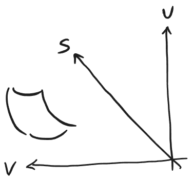
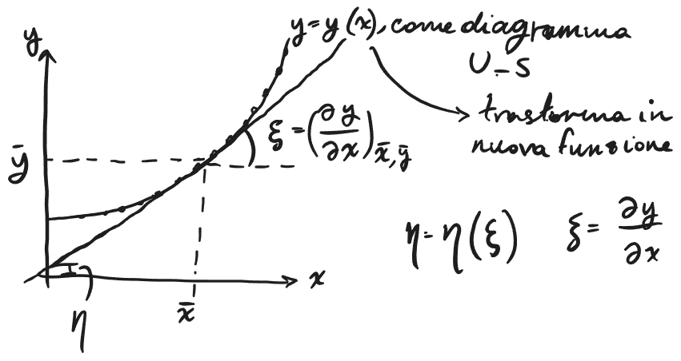
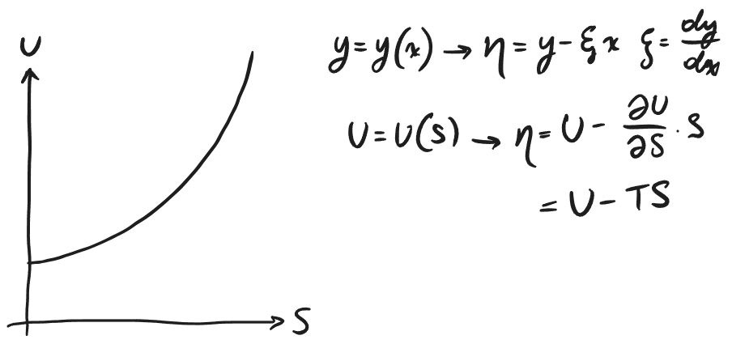
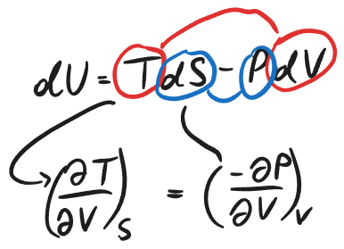
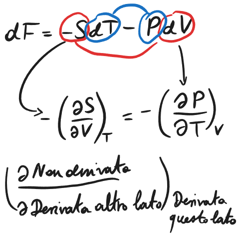

# Lezione 6 - Calcolo Termodinamico

[Questo articolo sara' molto utile](https://it.wikipedia.org/wiki/Potenziale_termodinamico)

Sistemi semplificati e semplici, con trasformazioni quasi-statiche, fanno relazioni fondamentali per le proprieta' del sistema.

$$U = U(S,V,N_i)\text{ e }S = S(U,V,N_i)$$
Queste relazioni fondamentali in forma energetica e entropica sono le equazioni si stato con cui possiamo calcolare $U,S$ e altre grandezze indipendenti da cui $U\:e\:S$ dipendono.

<!Diagramma superfice>

Dato che il nostro sistema evolve per trasformazioni quasi-statiche, la funzione delle trasformazioni e' continua e per cio' si puo' prendere la derivata.

$$(\frac{\partial U}{\partial S})_{V,N_i} = T \rightarrow \text{pendenza di U rispetto a S}$$
$$(\frac{\partial U}{\partial V})_{S,N_i} = P\rightarrow \text{pendenza di U rispetto a V}$$
$$
\begin{equation}
\left\{
    \begin{array}{lr}
        T = (\frac{\partial U}{\partial S})_{V,N_i} = T(S,V,N_i)\\
        P = -(\frac{\partial U}{\partial V})_{S,N_i} = P(S,V,N_i)\\
        \mu_i = (\frac{\partial U}{\partial N_i})_{S,V} = \mu_i(S,V,N_i)
    \end{array}
\right\} \longrightarrow \small{\text{n + 2 equazioni di stato}}
\end{equation}$$

## Relazione di Eulero

<!Diagramma>

Il sistema intero ha energia uguale a $\lambda$ volte l'energia dei sottoinsiemi.

Dato che $\lambda$ e' variabile possiamo derivare per $\lambda$

$$(\underbrace{\frac{\partial U_A}{\partial S_A}}_{T_A})_{V_A,N_{Ai}}(\underbrace{\frac{\partial S_A}{\partial \lambda}}_{\underbrace{S_A = \lambda S}_{(\frac{\partial S_A}{\partial \lambda}) = S}})+(\underbrace{\frac{\partial U_A}{\partial V_A}}_{(-P_A)})_{S_A,N_{Ai}}(\underbrace{\frac{\partial V_A}{\partial \lambda}}_{\underbrace{V_A = \lambda V}_{(\frac{\partial V_A}{\partial \lambda}) = V}})+(\underbrace{\frac{\partial U_A}{\partial N_{Ai}}}_{\sum_i\mu_{Ai}})_{V_A,S_A}(\underbrace{\frac{\partial N_{Ai}}{\partial \lambda}}_{\underbrace{N_{Ai} = \lambda N_i}_{(\frac{\partial N_{Ai}}{\partial \lambda}) = N_i}}) = U(S,V,N_i)$$

### Equazione di Eulero in forma Energetica:

$$U = TS - PV + \sum_i\mu_iN_i$$
Le grandezze intensive (P,T,$\mu_i$) che avevano il sottoscritto A, non lo hanno piu' perche' sono intensive non importa se stiamo parlando del sistema o uno dei sottosistemi saranno uguali.

### Equazione di Eulero Entropica:

Invece di derivare da $U_A(S_A,V_A,N_i) - \lambda U(S,V,N_i)$ usiamo l'equazione $S_A(U_A,V_A,N_i) - \lambda S(U,V,N_i)$:

$$(\underbrace{\frac{\partial S_A}{\partial U_A}}_{\frac{1}{T}})_{V_A,N_{Ai}}(\underbrace{\frac{\partial U_A}{\partial \lambda}}_{U})+(\underbrace{\frac{\partial S_A}{\partial V_A}}_{\frac{P}{T}})_{U_A,N_{Ai}}(\underbrace{\frac{\partial V_A}{\partial \lambda}}_{V})+(\underbrace{\frac{\partial U_A}{\partial N_{Ai}}}_{\frac{-\mu_{i}}{T}})_{V_A,S_A}(\underbrace{\frac{\partial N_{Ai}}{\partial \lambda}}_{N_i}) = S(U,V,N_i)$$

Queste equazioni legano le n+2 equazioni di stato a punti di equilibrio. Cioe' questa equazione trova ogni variable ad un punto di stato.

## Relazione di Gibbs-Duhem

Partendo da $U = U(S,V,N_i)$ <- rappresentazione della superfice dell'equilibrio.

Facendo la differenziale stiamo provando a capire di quanto cambia la energia se si fa cambi infinitesimali dall'equilibrio.

$$\text{⎊ } dU = \left(\frac{\partial U}{\partial S}\right)_{V,N_i}dS + \left(\frac{\partial U}{\partial V}\right)_{S,N_i}dV + \sum_i\left(\frac{\partial U}{\partial N_i}\right)dN_i$$
$$ = TdS - PdV + \sum_{i=1}^n\mu_idN_i$$
Questa equazione rappresenta la interdipendenza tra le variabili durante movimenti infinitesimi dall'equilibrio. La equazione ha anche n+3 grandezze estensive e n+2 grandezze intensive.

Eulero in forma energetica: U = TS - PV + $\sum_i\mu_iN_i$

### Differenziamo:

Differenziando la equazione di eulero in forma energetica
$$\text{⊛ }dU = TdS + SdT - PdV - VdP + \sum_i\mu_idN_i+\sum_iN_id\mu_i$$
Facendo la sottrazione:
$$\text{⎊ - ⊛} = SdT - VdP + \sum_iN_id\mu_i = 0$$
Questa e' chiamata la equazione Gibbs-Duhem in forma energetica, equazione spiega la interdipendenza tra le n+2 grandezze estenive(una riduzione da prima perche' non c'e' piu' U), o invece tra le n+2 grandezze intensive.

Useremo questa equazione per ricavare altre grandezze.

<!Diagramma calcoli>

L'obbiettivo e' di ricreare la relazione fondamentale in tutte e due le forme.

$$
\begin{equation}
\left\{
    \begin{array}{lr}
        U = U(S,V,N_i)\\
        S = S(U,V,N_i)
    \end{array}
\right\} \longrightarrow \small{\text{perchè dopo possiamo fare calcoli}}
\end{equation}$$

Si vuole cambiare S e U per grandezze misurabili, cosi the equazioni sono calcolabili.

## Trasformata di Legendre

Variabili estensiva $\implies$ 1 o 2 variabili intensive
La trasformata di Legendre ci permette di cambiare variabili estensive come $U$ o $S$ in 1 o 2 variabili intensive. 

Un esempio teorico di Legendre è:
<!Diagramma Legendre>

$\forall(\bar{x},\bar{y}) \rightarrow \bar{y} = \eta + \xi\bar{x}\rightarrow \eta = y -x\xi$

Un esempio numerico:
<!Diagramma>

I due diagrammi riportano la stessa informazione, bisogna applicare solo una anti-trasforma per ritornare alla forma iniziale, ma molte volte e' utile le trasformata.

Questo processo non funziona se la equazione e' costante o una retta, perche' la funzione si degrada, cioe' il valore $\eta$ è perso.

Una semplificazione concettuale della trasformazione e':
$$\underbrace{ \eta }_{ \text{nuova} } = \underbrace{ y }_{ \text{originale} } - \underbrace{ \xi }_{ \substack{\text{nuova}\\\text{variabile}} } \cdot \underbrace{ x }_{ \substack{\text{vecchia}\\\text{variabile}} }$$
Qui si vede cosa si fa con le variabile durante una trasforma di Legendre.
## Potenziali Termodinamici (Applicazione di Legendre)

<!Diagramma U-S>

### Energia Libera di Helmholtz (F)

Se applichiamo la trasforma di Legendre per sostituire S, ricaviamo la energia libera di Helmhortz(F), cioè: F = F(T,V,$N_i$)

La funzione e' uguale alla funzione della energia interna ma la unica differenza è che la trasforma è stata applicata.

Applicando Legendre si trova che:
$$F = U- T\cdot S$$
con:
$$T = \left(\frac{\partial U}{\partial S}\right)_{V,N_i} \text{ dove } \xi = \left(\frac{\partial y}{\partial x}\right)_{\bar{x},\bar{y}} \rightarrow \text{ per sistema chiuso}$$
Differenziando $F$ si ha:
$$dF = dU - SdT + TdS = \underbrace{TdS - PdV}_{dU} - TdS - SdT$$
Per cio:
$$dF = -PdV - SdT$$

Per una trasformazione isoterma $dF = -PdV$, invece per una trasformazione isocora $dF = -SdT$

### Entalpia (H)

Se applichiamo la trasforma di Legendre per sostituire V invece, ricaviamo la entalpia (H), cioe: H = H(S,P,$N_i$)

$H = H(S,P,N_i) = U + PV$ con $P = \left(\frac{\partial U}{\partial V}\right)_{S,N_i}$

Differenziando troviamo:

$$dH = dU + PdV + VdP = \underbrace{TdS - PdV}_{dU} + PdV + VdP + \sum_i\mu_idN_i$$Per cio':
$$dH = TdS + VdP + \sum_i\mu_idN_i$$
Per sistemi chiusi, e non reagenti $dN_i$ = 0, quindi si cancella.

Se una trasformazione isobara occorre $\rightarrow dH = TdS$ che è $\delta Q$.

### Energia Libera di Gibbs (G)

Di nuovo applicando Legendre, pero' sia su S che V, troviamo la energia libera di Gibbs (G), che è: $G = G(T,P,N_i)$

$G = G(T,P,N_i) = U - T\cdot S + P\cdot V = H - T\cdot S$

Differenziando si ha:
$$dG = dH - TdS + SdT = \underbrace{TdS + VdP}_{dH \text{ x sistema chiuso}} - TdS - SdT = VdP - SdT$$
Si trova che:
$$dG = VdP - SdT$$

## Teorema di Schwartz $\rightarrow$ da Analisi

Per $f = f(x,y)$ quando le derivate parziali prime sono continue allora:
$$\frac{\partial^2f}{\partial x\partial y} = \frac{\partial^2f}{\partial y\partial x}$$
Le derivate parziali seconde miste sono uguali.

Applicando alla termodinamicoa

U = U(S,V,$N_i$) funzione di stato dipende da n+2 variabili.

$$\begin{equation}
n+2\left\{
    \begin{array}{lr}
        \frac{\partial^2 U}{\partial S\partial V};\frac{\partial^2 U}{\partial S\partial N_1};\dots;\frac{\partial^2 U}{\partial S\partial N_n} \:(n+1)\\
        \frac{\partial^2 U}{\partial V\partial S};\frac{\partial^2 U}{\partial V\partial N_1};\dots;\frac{\partial^2 U}{\partial V\partial N_n}\:(n+1)\\
        \frac{\partial^2 U}{\partial N_1\partial S};\frac{\partial^2 U}{\partial N_1\partial V};\dots;\frac{\partial^2 U}{\partial N_1\partial N_n}\:(n+1)\\
        \vdots\\
        \frac{\partial^2 U}{\partial N_n\partial S};\frac{\partial^2 U}{\partial N_n\partial V};\dots;\frac{\partial^2 U}{\partial N_n\partial N_{n-1}}\:(n+1)
    \end{array}
\right\}
\end{equation}$$
Ci sono (n+1)(n+2) derivata second parziali miste

Dato Schwarz ci sono $\frac{(n+1)(n+2)}{2}$ relazioni di uguaglianza.

Le derivate prime di U sono T,P e $\mu_i$ che sono continue in un sistema semplificato.

## Relazioni di Maxwell

Queste relazioni valgono per un sistema chiuso e reagente $\implies N_i$ costante $\rightarrow dN_i = 0$
### $I^a$ Relazione di Maxwell

U = U(S,V) senza $N_i$ perche' e' costante $\rightarrow \frac{\partial^2U}{\partial S\partial V} = \frac{\partial^2 U}{\partial V\partial S}$ per Th. di Schwarz

Prendendo dalla parte finale si ha la prima relazione di Maxwell:

$$\left(\frac{\partial T}{\partial V}\right)_S = -\left(\frac{\partial P}{\partial S}\right)_V$$

Per derivare facilmente:
<!Diagramma>

### $II^a$ Relazione di Maxwell

Prendendo $F = F(T,V)$, per il teorema di Schwarz:
$$\frac{\partial^2 F}{\partial T\partial V} = \frac{\partial^2 F}{\partial V\partial T}$$
Troviamo che:
$$\frac{\partial F}{\partial T} = 0 \text{ e } \frac{\partial F}{\partial V} = -P$$
E la 2$^a$ relazione di Maxwell:
$$-\left(\frac{\partial S}{\partial V}\right)_T = -\left(\frac{\partial P}{\partial T}\right)_V$$
Per derivate piu' facilmente:
<!Diagramma>

### $III^a$ Relazione di Maxwell

Prendendo $H = H(S,P)$, per il teorema di Schwarz si ha:
$$\frac{\partial^2 H}{\partial S\partial P} = \frac{\partial^2 H}{\partial P\partial S}$$
Applicando a $H(S,P)$ troviamo:
$$\left(\frac{\partial T}{\partial P}\right)_S = \left(\frac{\partial V}{\partial S}\right)_P$$

Questi diagrammi non sono la base per la applicazione ma rendono la interpretazione molto piu' facile.
<!Diagramma>

### $IV^a$ Relazione di Maxwell

Prendendo $G = G(T,P)$, applicando il teorema di Schwarz troviamo la quarta relazione di Maxwell:
$$\left(\frac{\partial V}{\partial T}\right)_P = - \left(\frac{\partial S}{\partial P}\right)_T$$
Come ultimo la semplificazione dei calcoli:
<!Diagramma>

