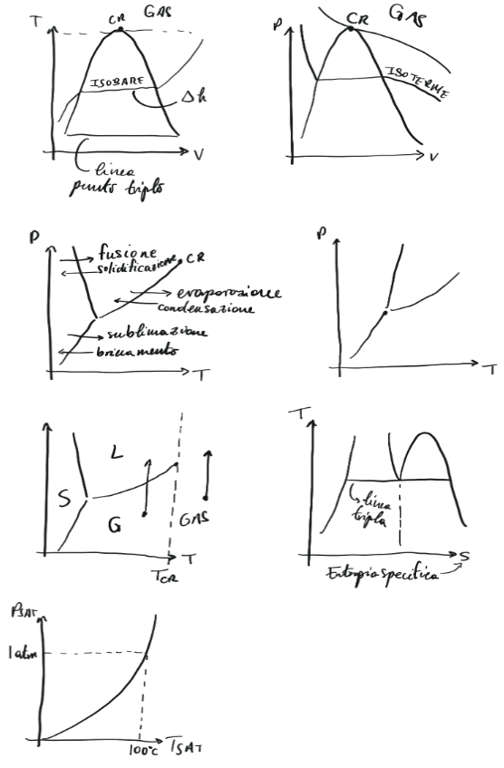
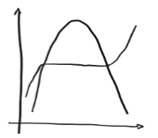
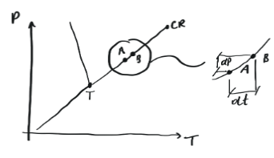
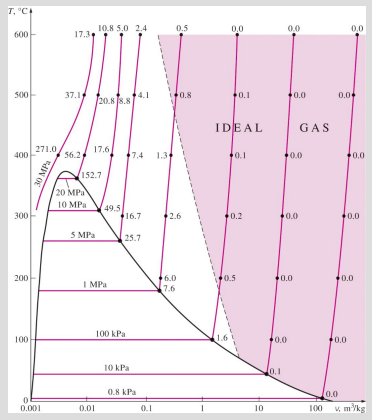
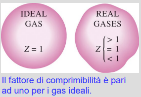
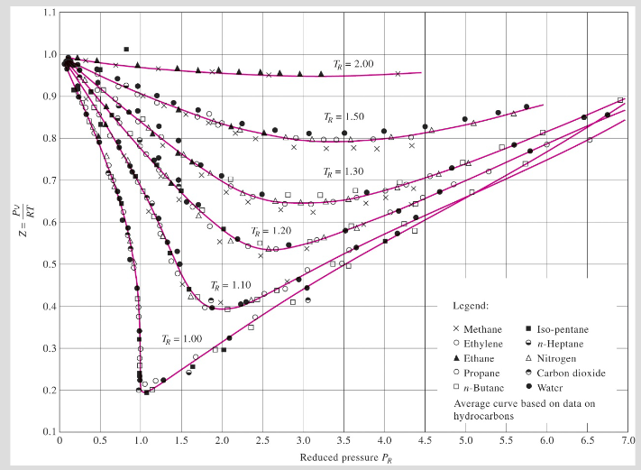
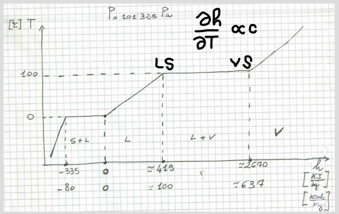
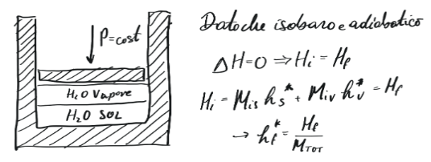

# Lezione 10 - Gas, Solidi e Liquidi Ideali

## Ripasso

La differenza tra un vapore un gas è che il vapore durante compressione isoterma può esser portata a stato liquido invece i gas essendo dopo $T_{CR}$ anche se sono compressi in processi isotermi non possono diventare liquidi.

### Zona Miscele Sature

Le regola della leva per grandezze intensive (V,U,h,S)

$h^{*} = (1-X)\cdot h^{*}_{LS}+X\cdot h^{*}_{VS}$

$X = \frac{M_{VS}}{M_{TOT}} \to h_{M}= h^{*}_{LS}+X\cdot\lambda$

$\lambda = h^{*}_{VS}-h^{*}_{LS}$

$X = \frac{h^{*}_{M} - h^{*}_{LS}}{h^{*}_{VS}-h^{*}_{LS}}$

## Liquidi Sottoraffreddati
Pero liquidi sottoraffreddati e vapori sorriscaldati ci servono tabelle a due entrate.

Per i liquid sottoraffreddati la dipendenze rispetto T è molto più forte della dipendenza da P.

Quindi per ogni proprietà y (cioè v,u o h, y è solo un simbolo rappresentativo):

$y \cong y_{f@T}$

Cioè il valore di v,u o h per ogni T può esser approssimato al valore del liquido saturo a quella temperatura, se il componente è liquido sottoraffreddato.

$h^{*}_{L_{SAT}} = h^{*}_{LS} + v_{\tiny{LS}}(P-P_{SAT})$

$v_{\tiny{LS}} = \frac{1}{\rho}$ per $H_{2}O$ è $\simeq 1\cdot10^{-3} \frac{kg}{m^{3}}$
Dato che è molto piccolo, vediamo che non avrà molto effetto.

Trattando liquido sottoraffreddati come liquidi saturi, si fanno errori molto piccoli e quindi è quello che faremo.

## Regola di Gibbs delle Fasi

$$f=\underbrace{ r }_{ componenti }+2-\underbrace{ M }_{ fasi }$$

$f$ è il numero di fasi indipendenti che possono esser variate e rimanere in equilibrio.

### Dimostrazione della Regola

Un sistema con $r$ componenti ed $M$ fasi in equilibrio termodinamico. Ricordiamo che l'equilibrio termico è un equilibrio termico, meccanico e chimico.

#### Equilibrio Termico

$\underbrace{ T' }_{ \substack{\text{T di}\\\text{fase 1}} } = \underbrace{ T'' }_{  \substack{\text{T di}\\\text{fase 2}} } = T''' = \dots = T^{\tiny{(M)}} \:\} M-1$ equazioni per M variabili

#### Equilibrio Meccanico

$P' = P'' = P''' = \dots = P^{\tiny{(M)}} \:\}$ M-1 equazioni di M variabili

#### Equilibrio Chimico

$$\left\{\begin{align}
&\mu_{1}' = \mu_{1}'' = \mu_{1}''' = \dots = \mu_{1}^{\tiny{(M)}} \\
&\vdots \\
&\mu_{r}' = \mu_{r}'' = \mu_{r}''' = \dots = \mu_{r}^{\tiny{(M)}}
\end{align}\right\}\substack{\text{M-1 equazioni in M variabili}}$$

r + 2 componenti

Che generano $(M-1)(r+2)$ equazioni soddisfatto da $M(r+2)$ variabili che con Gibbs-Duhem (equivalenza per cui possiamo scalare le variabili di 1) diventa $M(r+1)$

$(M-1)(r+2) \leq M(r+1)$

se = si determinano le soluzioni a priori.

$\cancel{ Mr } + 2M - r - 2 \leq \cancel{ Mr }+M$

$2M - M \leq r + 2 \to M \leq r + 2$
$M$ sono le fasi di equilibrio che devono esser minori delle r+2 fasi.

$f = r+2 -M$

per $H_{2}O \to r=1$

f = 3 - M

- se M = 1 $\implies$ P e T indipendenti
- se M = 2 $\implies$ P e T dipendenti $P_{SAT} \leftrightarrow T_{SAT}$ 
- se M = 3 $\implies$ P = 0,611 kPa e T = 0,01$^o$C

Durante la transizione di fase $\partial P$ e $\partial T$ = 0, quindi $c_{p}\to \infty$, $\alpha_{\tiny{P}}\to \infty$ e $K_{\tiny{T}} \to \infty$

$c_{p} = T\left( \frac{ \partial S }{ \cancelto{ 0 }{ \partial T } } \right)_{P} = \infty$ con $ds \neq 0$
$\alpha_{\tiny{P}} = \frac{1}{v}\left( \frac{ \partial v }{ \cancelto{ 0 }{ \partial T  }} \right)_{P} = \infty$ con $dv \neq 0$
$K_{\tiny{T}} = -\frac{1}{v}\left( \frac{ \partial v }{ \cancelto{ 0 }{ \partial P } } \right)_{T} = \infty$ con $dv \neq 0$

## Equazione di Clapeyron-Clausius

Ricavando da P e T

Si può collegare la pendenza a $\left( \frac{ \partial P }{ \partial T } \right) = f(\lambda,r,\theta)$ al calore latente. Dove $\lambda$,r e $\theta$ sono i calore latenti della molecola.

Prendiamo un punto per semplicità tra L e V.

Dato che è in equilibrio:

$\mu'(T,P) = \mu''(T,P)$

$dP = P_{A}-P_{B} \to dT = T_{A}-T_{B}$
$d\mu' = \mu'_{B} - \mu'_{A} = d\mu'' = \mu_{B}'' - \mu_{A}''$

Gibbs-Duhem ci da:

$d\mu' = v'dP - s'dT$ e $d\mu'' = v''dP - s''dT$
$v'dP - s'dT = v''dP - s''dT$

$(v''-v')dP = (s''-s')dT$ e $\frac{ dP }{ dT } = \frac{s''-s'}{v''-v'}\cdot \frac{T}{T}$

se $s'' = s_{\tiny{VS}},\: s' = s_{\tiny{LS}}, \: T = T_{\tiny{SAT}}, \: v'' = v_{\tiny{VS}},\text{e } \: v' = v_{\tiny{LS}}$

Allora per la evaporazione:
$$\frac{ dP }{ dT } = \frac{\lambda}{(v_{\tiny{VS}}^{*}-v_{\tiny{LS}}^{*})}\cdot \frac{1}{T_{\tiny{SAT}}}$$
Per la sublimazione (solido -> vapore):
$$\frac{ dP }{ dT } = \frac{\theta}{(v_{\tiny{LS}}^{*}-v_{\tiny{S}}^{*})}\cdot \frac{1}{T_{\tiny{SAT}}}>0 $$
Per la fusione (solido -> liquido)
$$\frac{ dP }{ dT } = \frac{r}{(v_{\tiny{LS}}^{*}-v_{\tiny{S}}^{*})}\cdot \frac{1}{T_{\tiny{FUS}}}\lessgtr 0$$
per $H_{2}O \to v_{\tiny{S}}^{*} > v_{\tiny{LS}}^{*}$ e r = 335$\frac{kJ}{kg}$
$<0$ se $v_{\tiny{S}}^{*} > v_{\tiny{LS}}^{*}$ come $H_{2}O$
$>0$ se $v_{\tiny{LS}}^{*} < v_{\tiny{S}}^{*}$ come $CO_{2}$

## Gas Ideali -> se P$_{\text{basso}}$ e T$_{\text{alto}}$

Anche il vapore può esser trattato come gas ideale.

Punti sono la percentuale se si trattasse come gas ideale, peggiora vicino a $T_{\tiny{CR}}$

A P = 10kPa ($H_{2}O_{\tiny{(g)}}$) può esser trattato come gas ideale.

Nell'atmosfera $P_{\tiny{H_{2}O}} < 19kPa$ quindi può esser trattato come gas ideali. Infatti ogni gas nell'atmosfera può esser trattato come gas ideale, significa che l'aria la consideriamo come gas ideale.

## Determinazione se gas ideale

$Z =$ fattore di comprimibiltà

per 1 mole di gas ideali si ha che $PV = RT$

$Z$ è definito, $Z = \frac{PV}{RT} = \frac{V_{attuale}}{V_{ideale}}$

La pressione ridotta è $P_{\tiny{R}} = \frac{P}{P_{\tiny{CR}}}$
La temperatura ridotta è $T_{\tiny{R}} = \frac{T}{T_{\tiny{CR}}}$

Volume specifico pseudo-ridotto -> $V_{\tiny{R}} = \frac{V_{attuale}}{RT_{\tiny{CR}}/P_{\tiny{CR}}}$

Ogni valore ridotto è la magnitudine della proprietà rispetto al punto critico di quella proprietà.

Tutti gli aeriformi hanno lo stesso comportamento a pari $T_{\tiny{R}}$ e $P_{\tiny{R}}$

Tutti i gas seguono le isoterme ridotte.

Il massimo scostamento dal gas ideale è al punto critico, questo spiega perché le percentuali di deviazione vicino al punto critico erano più elevate.

Tutti gli aeriformi dove $P_{\tiny{R}} = \frac{P}{P_{\tiny{CR}}}\leq 0,2$ indipendente da T può esser considerato come gas ideale.

Tutti gli aeriformi dove $T_{\tiny{R}} = \frac{T}{T_{\tiny{CR}}}\geq 2$ indipendente da P sono esser considerati come gas ideali.

L'ultimo punto si può vedere graficamente, come ogni punto sopra la curva più alta.

### Equazione di Van der Walls

$\left( P+\frac{a}{V^{2}} \right)(v-b) = RT$

La equazione di Van der Walls attacca le imperfezioni e interazioni tra le molecole che causano deviazioni nel risultato. Ci sono altre equazioni più precise.

--- 

## Solidi e Liquidi Ideali

I solidi e liquidi ideali sono indilatabili e incomprimibili.

$\alpha_{\tiny{P}} = \frac{1}{V}\left( \frac{ \partial V }{ \partial T } \right)_{\tiny{P}} = 0$
$K_{\tiny{T}}= -\frac{1}{V}\left( \frac{ \partial V }{ \partial P } \right)_{\tiny{T}} = 0$

$c_{\tiny{p}} = c_{\tiny{v}} + \frac{\alpha_{\tiny{P}}^{2}\cdot V\cdot T}{K_{\tiny{T}}} \implies c_{\tiny{p}} = c_{\tiny{v}}$ per solidi e e liquidi ideali

per $H_{2}O$ $c_{\tiny{p}}= c_{\tiny{v}}= c = 4186,8 \frac{J}{kg\cdot K} = 1 \frac{kcal}{kg\cdot K} \times H_{2}O$ liquido

per ghiaccio c = 0,5 $\frac{kcal}{kg\cdot K}$

Per solidi e liquidi ideali:
Diciamo che dipendono solo da T perché l'effetto di P non è molto grande
$du = cdT$ e $ds = c \cdot \frac{dT}{T}$
$\implies u = u(T)$ e $s= s(T)$

Questo si può vedere quando:$$\begin{align}
h = u + Pv \to dh &= du + Pdv + vdP = Tds - Pdv + Pdv + vdP \\
&= Tds + vdP = \boxed{cdT + vdP} = dh
\end{align}$$
Nel caso della acqua, c = 4186,8$\frac{J}{kg\cdot K}$ mentre $v$ che $=\frac{1}{\rho}$ è uguale a $1\times10^{-3}$ . Questi sono 6 gradi di differenza, molto alta, quindi diciamo che dipendono solo da T.

Quindi invece di scrivere $dh = cdT + vdP$, scriviamo $dh = cdT$ perché non è abbastanza diverso per avere effetto sui nostri calcoli. Se invece ci fosse un isoterma, allora dovremmo considerare $vdP$ anche se non ha effetti molto grandi.

### Relazioni Approssimate per Sostanze Pura

Solo per solidi e liquidi ideali, se no tabelle.

Per questi calcoli <u>usiamo il punto critico come punto di riferimento</u>.

$dh = \delta Q = vdP$ e $ds = \frac{\delta Q}{T}$

Nei calcoli stiamo trovando il calore specifico per una sostanza rispetto al punto triplo attraverso una trasformazione isoterme e una trasformazione isobara.

Per l'acqua c = 1 $\frac{kcal}{kg \cdot K} \cong 4,186 \frac{kJ}{kg \cdot K}$

<u>Calore latente di solidificazione</u>:

${r \cong 80 \frac{kcal}{kg}}$ = 335 $\frac{kJ}{kg}$

### Equazione per i liquidi

<u>Tutto questo per dire:</u>

Usiamo il punto tripoli come riferimento per liquidi diversi da liquido saturo.

Troviamo che:

$\boxed{h_{\tiny{L}}^{*} = c_{\tiny{L}}(T_{\tiny{L}}-T_{\tiny{O}})}$

Dove $c_{\tiny{L}}$ é il calore specifico del liquido, $T_{\tiny{L}}$ è la temperatura del liquido e $T_{\tiny{O}}$ è la temperature di riferimento/ del punto triplo.

Quindi per l'acqua che ha $T_{\tiny{O}}$ a $\approx 0$ significa che il l'entalpia è $c \cdot T$

Troviamo anche che:

$\boxed{s_{\tiny{L}}^{*} = c \ln \frac{T_{L}}{T_{o}}}$

Qui prendiamo la temperature assoluta perché è una relazione che quindi ci verrebbero dei numeri anomali se non prendessimo la temperature assoluta.

### Equazione per i solidi

Ricordiamo da sopra che r è il calore latente di solidificazione, a priori quindi sappiamo che dobbiamo togliere questo calore rispetto al punto triplo.

Troviamo allora che:

$\boxed{h^{*}_{\tiny{S}} = -r + c_{\tiny{S}}(T_{\tiny{S}}-T_{\tiny{O}})}$

Invece la entropia:

$\boxed{s_{\tiny{S}}^{*} = -\frac{r}{T_{\tiny{O}}}+c_{\tiny{S}}\ln \frac{T_{\tiny{S}}}{T_{\tiny{O}}}}$

## Diagramma T-h

Sapendo queste equazione possiamo ricavare il diagramma T-h:

La pendenza di S è il doppio della pendenza a L, questo è perché $\frac{ \partial h }{ \partial T } \propto c$. Nell'acqua come abbiamo visto prima c$_{\tiny{S}}$ è .5 invece c$_{\tiny{l}}$ è 1. 

