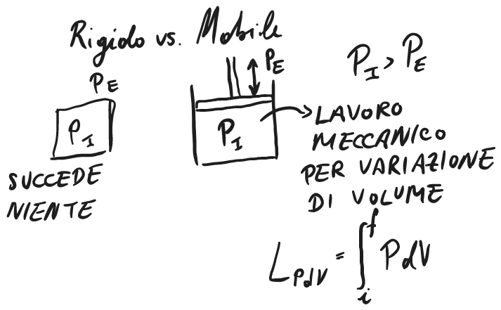

---

creation_date: 2023-09-13 16:06
tags: []
parent: 
child: 
share: true
---
# Lezione 1 - Introduzione

## Libri Consigliati

Y.Cengel - Termodinamica e Trasmissione del Calore
J.H.Lienhard - A Heat Transfer Textbook
Casagrande.G - Esercizi di Fisica Tecnica

## Esame

7 MCQ (+3 per 7/7, 0 per 6/7, -3 per 5/7, insufficienza in ogni altro caso)
Esercizi: 2
- 1 Termodinamica (15)
- 1 Trasmissione del Calore (15)

Punteggio Max : 33

## Fisica Tecnica e Storia

La fisica tecnica e' lo studio della termodinamica per la produzione di energia.

Tutte le evoluzioni fino al 1700 erano evoluzioni pratiche che non avanzarono la teoria e comprensione umana della termodinamica.

Dal 1800 si inizia a studiare la teoria.

- Carnot -> Ideo la macchina ideale e l'idea del rendimento
- Kelvin -> Creo uno standard della temperatura, e ideo il $2^o$ principio della termodinamica.
- Joule -> Scopri la equivalenza tra lavoro e calore, e spiego' i concetti di energia meccanica e energia interna ad una sistema.
- Clausius -> Spiego' i processi reversibili e irreversibili e la funzione entropica.
- Gibbs -> Scopri' l'idea dell'equilibrio nelle sostenze eterogenee, creo' le rappresentazioni grafiche che usiamo ancora d'oggi e utilizzo' i simboli E,S,T,V,P per prevedere la spontaneita' di una transformazione.

$$
\text{Practica/Tecnica} \rightarrow \text{Formalizzazione di teoremi di base}
$$
La termodinamica ha molte definizioni per si puo' generalizzare a delle osservazioni macroscopica che sono il risultato di cambiamento al livello microscopico.

T -> misura della energia cinetica media
P -> Quantita' di moto delle particelle

## Termodinamica

La termodinamica e' definita come "lo studio dei sistemi termodinamici".

Un sistema termodinamico e' uno spazio dove spesso le proprieta' del contorno sono piu' importanti di cio' che racchiude interno.

Il sistema e ambiente costituiscono insieme una sistema (composto) detto Universo.

Secondo Principio delle Termodinamica: $\delta S_{\tiny{S.T}} + \delta S_\tiny{A} = \delta S_\tiny{U}

Termodinamica: studia macroscopicamente un sistema soggetto a scambio di energia.

Trasmissione del calore: studia il trasporto dell'energia data dalla differenza in temperatura.

Un sistema termodinamica e' un insieme di costituenti non soggetti a forze che dipendono da coordinate di altri costituenti esterni al sistema e definito da:
1. tipo e natura dei costituenti;
2. parametri caratterizzanti forze esterne (volume, campo
elettrico, magnetico o gravitazionale); Ma in questo corso il campo elettromagnetico e gravitazionale non saranno considerati.
3. natura delle forze interne;
4. natura vincoli interni.

### Sistema( __Semplificato__ )

Una sistema semplificato non e' soggetto a forze di massa(gravitazionale o elettromagnetica) o di superfice (tensione superficiale) e non e' reagente (assente di reazioni chimche e nucleari)

Puo' esser delimitato da diversi tipi di contorno:

| APERTO -c'e' scambio di massa       | o   | CHIUSO - non c'e' scambio di massa |
| ----------------------------------- | --- | ---------------------------------- |
| Rigido                              | o   | Mobile                             |
| Permeabile                          | o   | Impermeabile                       |
| Conduttore(diatermico o diatermano) | o   | Isolante(Adiabatico)                                   |

Un sistema e' detto isolato se e' chiuso, rigido e isolante

### Sistema ( __Semplice__ )

Una porzione i materia chimicamente e fisicamente omogenea ed isotropa e' un sistema termicamente semplice.

Due sistema semplici creano un sistema composto

Una sostanza pura  e' un sistema in cui la composizione chimica e' omogenea.