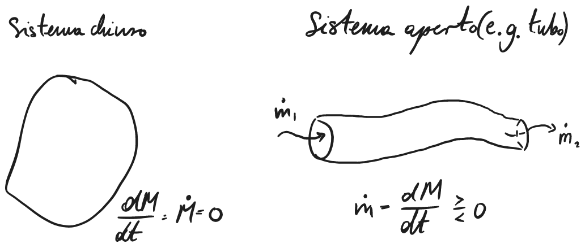
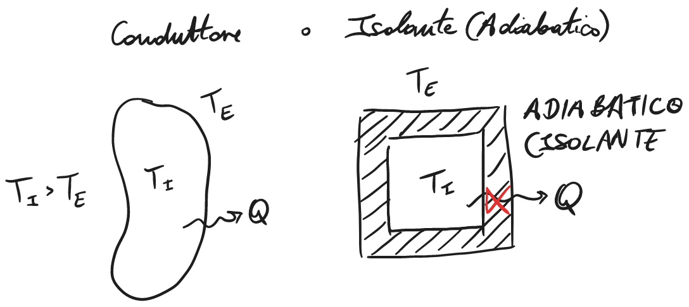
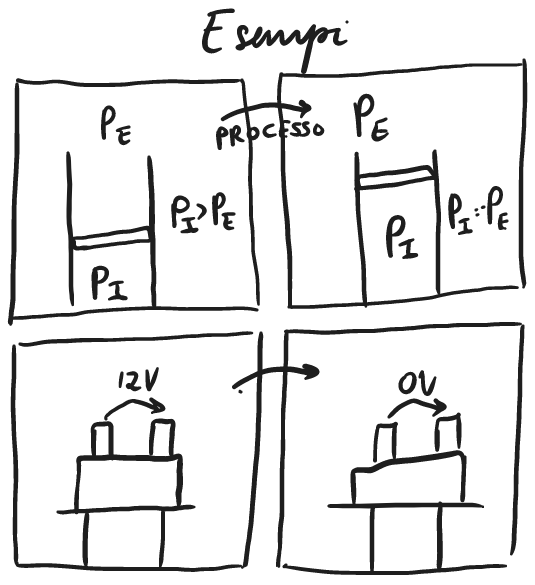
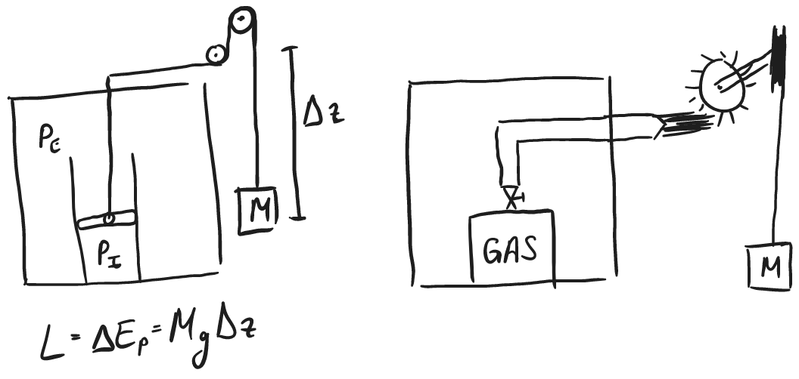
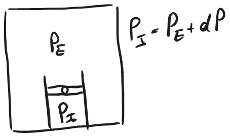
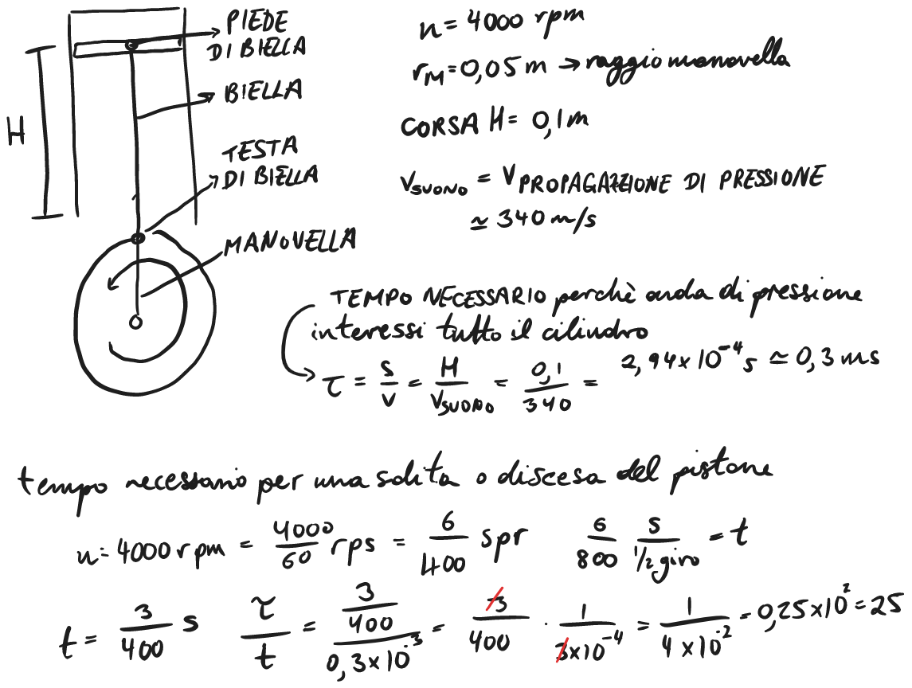

# Lezione 2

## Ripasso Ultima Lezione

Nel caso generale, uno spazio termodinamico e' uno spazio limitato dove le proprieta' del contorno sono piu' importanti

Per definire A (spazio termodinamico) servono:
- Natura e tipo di costituenti, e.g. $N_1(t)$,$N_2(t)$,...,$N_n(t)$
- Parametri caratterizzanti forze esterne(massa)
- Natura delle forze interne (volume -> somma del volume all'interno dello spazio)
- Natura vincoli interni

Come e' scritto:

A = { $N_1(t)$,$N_2(t)$,...,$N_n(t)$,V,$F_i$ }

Non si sa mai la energia assoluta mi si puo' approssimare con delle energie di riferimento

### Tipi di Sistemi

#### Chiuso o Aperto

<! Diagramma sistema chiuso e aperto>
{: .center }

### Tipi di Contorni
#### Rigido o Mobile ($\Delta$P)

<! Diagramma >
{: .center }

Un contorno rigido non permette il movimento delle particelle per permette il sistema a ritornare in equilibrio, invece un contorno mobile si puo' deformare per permette il sistema a raggiungere equilibrio con l'ambiente. Di solito e' associato con una disuguaglianza di pressione(P)
#### Conduttore o Isolante ($\Delta$T)

<! Diagramma >
{: .center }

Un contorno conduttore permette la trasmissione di calore o elettricita' per permettere il sistema a raggiungere un equilibrio, invece un contorno isolate intrappola il calore e potenziale elettrico nel sistema termodinamico.

#### Permeabile o Impermeabile($\dot{M}$)

Un contorno permeabile permette lo scambio di massa e flusso di materia dentro e fuori dal sistema, nei liquidi il potenziale chimico viene considerato per lo spargimento dei fluidi.

### Sistema Semplice

Un sistema semplice e' un sistema fisicamente e chimicamente omogeneo e isotropo, i sistemi semplici sono anche sistemi puri, ma dove le sostanze pure sono chimicamente omogenee i sistemi semplici lo sono anche fisicamente.

## Grandezze fisiche macroscopiche

Un sistema termodinamico puo' esser descritto da un numero di grandezze fisiche macroscopiche che riferiscono al sistema complessivo, e.g. massa, volume, pressione, temperatura e energia.
### Proprieta'

Le proprieta' sono grandezze fisiche che con una procedura posso esser stabilite in un istante del tempo. Non tutte le grandezze fisiche sono proprieta' del sistema, per esempio la velocita' media attraverso un intervallo di tempo non e' un proprieta' ma la velocita istantanea lo e', perche' la  velocita' media non si puo' determinare in un istante e occorre misurarla durante un intervallo di tempo.

## Tipi di Proprieta' Termodinamiche

### Grandezze Intensive

Le grandezze intensive non sono estensive, cioe' non dipendono dalla massa, quindi se un sistema in equilibrio e' suddiviso idealmente queste rimarebbero uguali. 

- Temperatura $[K][^oC]$ - Flusso del calore
- Pressione $[Pa][bar][atm][at]$ - Flusso del Lavoro Meccanico - 1 Pa = $\frac{1N}{1m^2} * \frac{m}{m}$ = 1 $\frac{J}{m^3}$ 
- Potenziale chimica ($\mu _i$) $[\frac{J}{mol}]$ - Flusso di massa

La differenza di queste proprieta' rispetto all'ambiente serve perche' lo scambio occorra anche se il contorno lo permette.

### Grandezze Estensive

Le grandezze estensive sono grandezze fisiche che dipendono dalla massa.

- M $[kg]$
- V $[m^3]$
- N $[mol]$
- E $[J]$ -> $E_k = \frac{1}{2} mv^2$ o $E_p = mgz$ o U (energia interna)

### Grandezze Specifiche

- Massa Volumica o densita' $[\frac{kg}{m^3}]$ - $\rho$
- Volume massico $[\frac{m^3}{kg}]$ - v
- Energia specifica $[\frac{J}{kg}]$ - e$^*$ 
- Energia interna molare $[J/mol]$ - e o u

## Stato Termodinamico

A(t) = { $N_1(t)$,$N_2(t)$,...,$N_n(t)$,V, $P_1(t)$, $P_2(t)$ ,..., $P_n(t)$, }

Dove $N_k$ sono i moli di ogni specie chimica, si potrebbe usare anche massa.

Per definire un sistema completamente bisogna definire tutte le proprieta' indipendenti nel sistema.

L'independenze di una proprieta' dipende dalla stato di aggregazione delle specie chimiche nel sistema.

## Stato di equilibrio (macroscopico) di un sistema

Si arriva ad uno stato di equilibrio quando un sistema ha omogeneita' e invarianza temporale.

Un sistema in stato di equilibrio e' ben definito se tutte le proprieta' termodinamiche indipendenti hanno valori ben assunti.
La equazione di stato aiuta a determine il numero di proprieta' indipendenti nel sistema: (Regola di Gibbs)
$$ V = C - F + 2 $$
Dove: V = # di proprieta' indipendenti , C = # di componenti/ specie chimiche e F = # di fasi nel sistema.

## Processi / Trasformazioni

I processi termodinamici sono processi che portano un sistema da uno stato iniziale ad uno stato finale, e i passi intermedi sono trascurabili. 

### Tipi di Processi

#### Processo Spontaneo

Un processo spontaneo evolve spontaneamente **senza interazione con altri sistemi**. 

<! Esempi >
{: .center }
In questo esempio il pistone viene spinto in alto spontaneamente dalla differenza in pressione, il processo non genera lavoro. La batteria si scarica spontaneamente per ritornare in equilibrio con l'ambiente. La valvola permette che il gas esca per equilibrare la pressione.

#### Processo Meccanico

L'unico effetto esterno e' sempre rappresentabile con la variazione di quota di un grave in un campo gravitazionale, cioe' il lavoro generato e' sempre rappresentabile e calcolabile dal movimento di una massa. I processi meccanici ricavano energia sfruttano la variazione in energia tra il sistema e l'ambiente.

<! Esempio >
{: .center }

#### Processo Reversibile (globalmente)

Un processo reversibile globalmente esiste se esiste un modo di portare il sistema e ambiente allo stato iniziale senza lasciare trace all'esterno, cioe' senza perdere energia.

<! Esempio >
{: .center }

Un processo reversibile e' perfetto, cioe' non c'e' attrito e attraverso aggiunte infinitesimali il sistema puo' ritornare allo stato iniziale.

I processi spontanei sono irreversibili perche' bisogna usare energia per ritornare allo stato iniziale, ma nell'usare energia si sta cambiando il sistema, percio' non sarebbe lo stesso sistema di quello iniziale.

I processi meccanici sono internamente reversibili.
### Trasformazioni Quasi-Statiche

Una trasformazione quasi-statica e' una processo dove le onde causate da uno spostamento possono propagarsi permettendo il sistema di ritornare in equilibrio prima che il sistema ritorni in disequilibrio, questo a l'effetto di creare un sistema che e' sempre in equilibrio. Percio' si puo' trovare gli stati di equilibrio ad ogni istante permettendoci di fare i calcoli a quegli istanti. 

Per una trasformazione quasi-statica il tempo di trasformazione deve esser maggiore del tempo delle propagazione delle permutazioni interne.

<! Esempio >
{: .center }
La velocita' di propagazione e' 25 volte piu' veloce del pistone, quindi si puo' dire che sia una transformazione quasi-statica.

Le onde viaggiano piu' velocemente del pistone, questo significa che invece di accumularsi davanti al pistone le particelle viaggiano piu' avanti e stabiliscono un nuovo equilibrio.

Le trasformazioni quasi-statiche si chiama internamente reversibili perche', se il sistema interno non sofre dall'attrito, andando da un sistema di equilibrio ad un'altro e indietro non occupa energia, aggiungendoci l'ambiente non e' necessariamente in equilibrio con il sistema quindi la trasformazione e' solamente internamente reversibile.

Una trasformazione e' globalmente reversibile se:

1. Tutte le trasformazioni sono quasi-statiche
2. Il sistema ed ambiente sono in mutuo-equilibrio

(Punto 2)Se per esempio un pistone ha una differenza di pressione con ambiente infinitesimale
