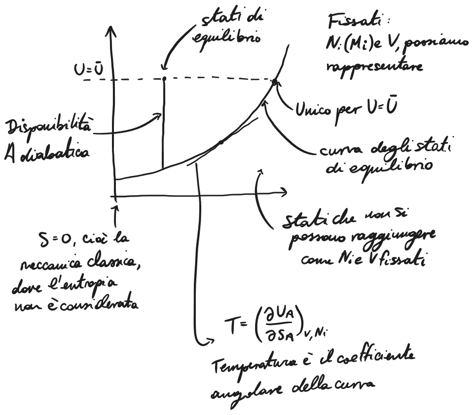
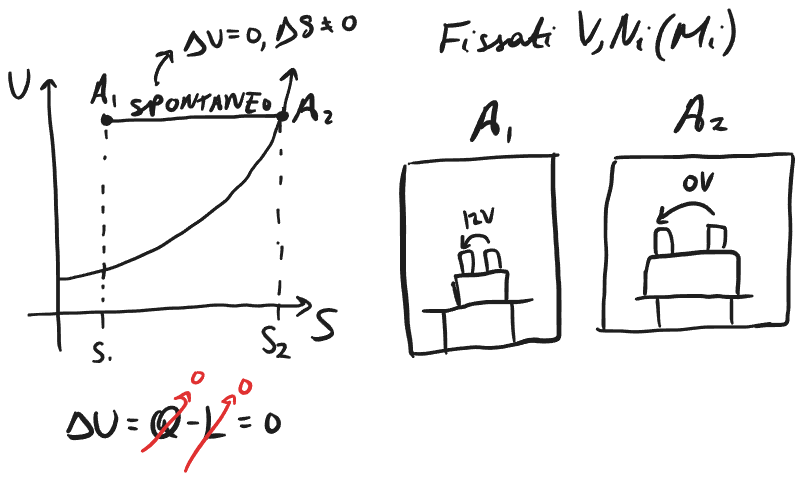
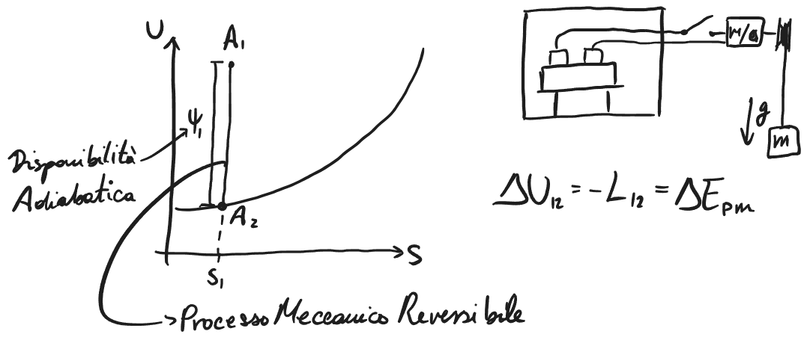
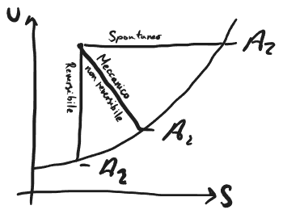
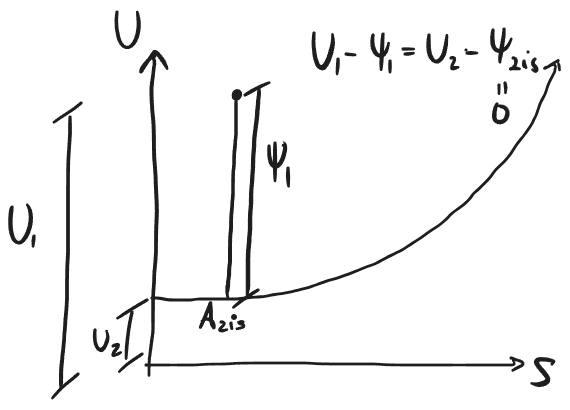
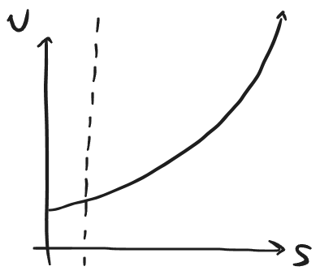
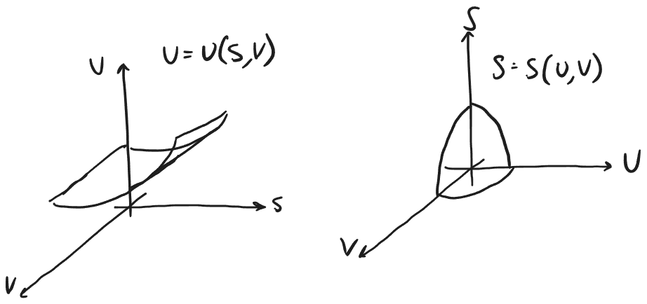
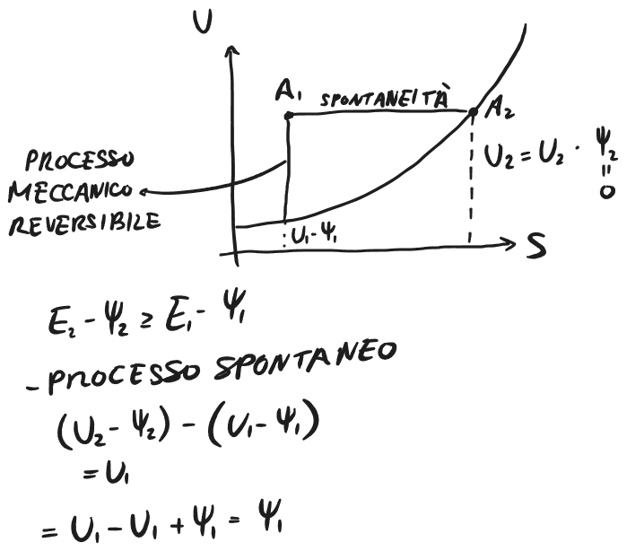
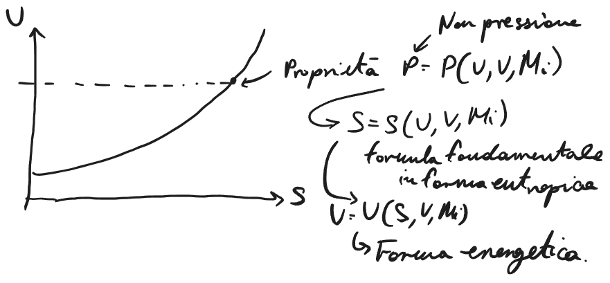

# Lezione 5 - Entropia e Energia Interna

## Ripasso

Abbiamo visto che:
$$\Delta U = Q - L + \Phi_{M_i}$$
All'infinitesimo si ha che:
$$dU = \underbrace{\delta Q}_{\text{per dT}} - \underbrace{\delta L}_{\text{per dP}} + \underbrace{\delta \Phi_{M_i}}_{\text{per }\mu_i}$$
E$_t$ = E$_p$ + E$_c$ + U

Abbiamo detto che:
$\delta L = PdV$ e $\delta \Phi_{M_i} = \mu_i\cdot dN_i$  

E sappiamo anche che:
$\delta Q = TdS$
o scritto in modo diverso:
$dS = \frac{1}{T}\cdot\delta Q$ 
Dove $\frac{1}{T}$ e' il fattore integrante e $dS$ e' uno spostamento generalizzato che chiamiamo entropia. L'entropia e' una funzione di stato estensive. 

Abbiamo trova che per un sistema semplificato e semplice dove il contorno e' adiabatico, per trasformazioni quasi-statiche e dato il contorno adiabatiche $S(V,T) = cost \implies dS = 0$. Cioe' in trasformazioni adiabatiche non c'e' scambio di calore e quindi la entropia non cambia.

<u>RICORDARSI CHE ISOLATO SIGNIFICA CHIUSO,ADIABATICO E RIGIDO</u>
## Diagramma Energia Interna-Entropia

A$_1 = \{M_1,M_2,\dots,M_i,V,P_1,P_2,\dots,P_n\}$
E' una descrizione di un sistema, dove V e' il parametro delle forze esterne e $P_1,P_2,\dots,P_n$ sono le proprieta' indipendenti. <u>$P$ non e' per la pressione ma la proprieta'.</u>

$f(P_1,P_2,\dots,P_n)$ = 0
Se sappiamo tutte le proprieta' indipendenti e una funzione di stato possiamo descrivere completamente come cambiera' il sistema. In generale pero' la funzione di stato non e' nota completamente solo a stati di equilibrio, quindi useremo $PV = nRT$ come base.

A$_2$ viene usato per descrivere il sistema se almeno un paramento di A$_1$ cambia arriva ed arriva a questo nuovo stato di equilibrio.

Scambiando energia si arriva ad successivi nuovi stati di equilibrio A$_n$.

E$_T$ e' funzione di U e S

E$_T$, S se volessimo rappresentare un sistema bisognerebbe un asse per ogni proprieta' dal sistema, per se fissiamo M$_i$ (o N$_i$) e V, le uniche proprieta' che cambiano sono U e S, che possiamo mettere un grafico semplice.

<!Diagramma grafico U-S>
{: .center }
## Secondo Principio

Fra tutti gli stati ben definiti, se fissato anche il valore delle energia interna, esiste solo uno stato di equilibrio.
### Disponibilita' Adiabatica

Negli stati di non equilibrio solo una parte dell'energia e' disponibile per trasferimento attraverso processi meccanici, questa energia e' detta disponibilita' adiabatica. 

Nel grafico U-S la disponibilita' adiabatica e' la differenza in energia tra il sistema descritto e la energia minima che il sistema puo' avere senza cambiare entropia. Per cio' se un sistema e' ad equilibrio la 

### Entropia e Energia

La entropia e' una rappresentazione della parte inutile dell'energia.

L'energia utile non puo' mai aumentare durante un processo meccanico.

## Diagramma per un processo spontaneo

<!Diagramma spontaneo>
{: .center }

Nei processi spontanei non c'e' cambio nella energia interna, per arrivare allo stato di equilibrio tutta la energia utile/ disponibilita' adiabatica viene usata per aumentare l'entropia del sistema.

## Diagramma per un processo meccanico reversibile

<!Diagramma reversibile>
{: .center }

In un processo reversibile tutta le energia utile viene usata come lavoro, per questo la entropia non cambia durante questo processo.

Non si puo' andare sotto perche' non alteriamo i costituenti del sistema, se si andasse sotto si usufruirebbe dell'energie interne del sistema come quelle chimiche e nucleari, facendo si cambia il sistema e le proprieta' e la nostra funzione non sarebbe piu' valida.

E' possibile determinare la reversibilita' di una sistema. Se un sistema e' ideale e reversibile allora $dS = 0$ e tutta la energia disponibile' e' usata.

## Diagramma per processi non ideali

<!Diagramma processo non ideale>
{: .center }

In un sistema non ideale, meno energia e' trasferita rispetto ad un sistema reversibile e c'e' un aumento in entropia. L'entropia agisce come una rappresentazione della energia inutile nel sistema.

<!Diagramma reversibile>
{: .center }

In un processo reversibile le energia massima usabile rimane uguale, cioe' non aumenta la energia inutile per cio' l'entropia.

Se il processo non e' reversibile:
<!Diagramma processo non reversibile>
{: .center }

In un processo meccanica la quota di energia non disponibile aumenta in proporzione all'entropia. Per cio' si puo' scrivere:

$$E_{ND_2} - E_{ND_1} \propto S_2 - S_1$$
Il processo e' meno reversibile per un aumento in S.

## Principi delle Massimi Entropia e della Energia Minima

### Massima Entropia

<!Diagramma>
{: .center }

Tra tutti gli stati con la stessa energia, lo stato in equilibrio e' lo steso con la massima entropia.

### Energia Minima

<!Diagramma>
{: .center }

Tra gli stati con lo stesso S, lo stato ad equilibrio e' lo stato con minima energia.

## Principio di Stato

Tra tutti gli stati con la stessa energia, quantita' di costituenti e volume esiste solo uno stato in equilibrio. Questo significa che il valore di ogni proprieta' del sistema e' solamente determinato dai valori di energia, quantita' di costituenti e volume. Cioe' le proprieta' $P$ hanno l'equazioni di stato:
$$P = P(U,V,M_1,M_2,\dots,M_n)$$
## Relazioni Fondamentali

Dalla relazione dettata dal principio di stato, e dato che S e' un proprieta' di un sistema si ha l'equazione:
$$S = S(U,V,M_1,M_2,\dots,M_n)$$
Detta relazione fondamentale in forma entropica.
Derivando da questa equazione di puo' trovare invece una funzione che descrive la energia di una sistema, cioe':
$$U = U(S,V,M_1,M_2,\dots,M_i)$$
Questa invece detta relazione fondamentale in forma energetica.

Spiegando, dal principio di stato che ci dice che ogni proprieta' e' determinabile e dipendente dalla energia, i costituenti e il volume, e sapendo che S e' una proprieta' del sistema, abbiamo definito la relazione tra S e U,V e M$_i$. Avendo definito la relazione per S, abbiamo trovato una nuova relazione che ci definisce U.

Avendo V e M$_i$ fissi, possiamo dire che $S = S(U)$ e $U = U(S)$, che la base del diagramma.

Invece se V o M$_i$ non fossero fissi (per semplicita', V), si potrebbero creare grafici per descrivere il cambio tra $U$, $S$ e la proprieta'

<!Diagramma>
{: .center }

Per trasformazioni-quasi statiche il sistemi di equilibrio seguono le superfici generate.

## Derivazione di Equazioni

<!Diagramma dopo pausa>
{: .center }

Tutta la disponibilita' adiabatica e' stata degradata in aumento di entropia. Questo significa che il sistema ha raggiunto equilibrio trasformando la disponibilita' adiabatica in calore che aumenta l'entropia e per cio' arrivando all'equilibrio.

<!Diagramma> 
{: .center }

Usando il principio di stato si puo' ricavare $S = S(U,V,M_i)$, da cui si puo' ricavare anche $U = U(S,V,M_i)$. 

Sapendo che per trasformazioni quasi-statiche si seguono le superfici generate dalla variazione nelle variabili, si puo' differenziale $U = U(S,V,M_i)$ intorno allo stato di equilibrio.

Facendo la derivazione si ricava:

$$\begin{align}dU = (\frac{\partial U}{\partial S})&_{V,M_i}dS + (\frac{\partial U}{\partial V})_{S,M_i}dV + (\frac{\partial U}{\partial M_i})_{V,S}dM_i\\dU &= TdS - PdV + \sum_i\mu_idN_i\\dU &= \delta Q - \delta L + \sum_i\delta\Phi_{M_i}\end{align}$$
La ultima equazione e' la stessa equazione che abbiamo visto nelle ultime lezioni, invece la seconda equazione e' nota come Relazione di Gibbs in forma energetica di cui esiste anche una forma entropica derivata da $S=  S(U,V,M_i)$

$$\begin{align}dS = (\frac{\partial S}{\partial U})&_{V,M_i}dU + (\frac{\partial S}{\partial V})_{U,M_i}dV + (\frac{\partial S}{\partial M_i})_{V,U}dM_i\\dS &= \frac{1}{T}dU + \frac{P}{T}dV - \sum_i\frac{\mu_i}{T}dN_i\\\end{align}$$
I piu' e meno vengono dalla Jacobiana della integrazione, che vedremo piu' tardi.

$dS$ e' un misura delle energia non disponibile per conversione in lavoro.

## Caratteristiche della Entropia

La entropia non e' una grandezza misurabile nel mondo reale, si puo' solo calcolare dall'energia, volume e quantita' dei costituenti come detto nel principio di stato.

Di nuovo, l'entropia e' una misura di energia non disponibile alla conversione in lavoro. 

Per un sistema isolato si ha che $\Delta E$ e quindi $\Delta U$ = 0 per ogni trasformazione che avviene al suo interno. E' importante riconoscere che in una sistema isolato, la energia ricavabile come lavoro in un processo meccanico diminuisce. E per cio' si puo' considerare la energia come una somma della energia disponibile e non disponibile:
$$E_{TOT} = E_{DISP.} + E_{NON DISP.}$$
In un sistema isolato che sta evolvendo verso un equilibrio, dato che $\Delta E = 0$, la energia disponibile si converte in parte in energia non disponibile. In un processo spontaneo tutta le energia disponibile si converte in energia non disponibile.

## Bilancio energetico per un sistema chiuso e isolato

Un sistema isolato e' chiuso, adiabatico e rigido, questo significa che non e' scambio di energia di nessun tipo.

$$\Delta U = U_2 - U_1 = 0$$
$$\Delta U = \int_1^2dU = U_2 - U_1 = 0$$
$$\Delta E_{disp} = \int_1^2 dE_{disp} \leq 0 \implies \Delta S = \int_1^2dS = S_2 - S_1 \geq 0$$
Questa ultima equazione significa che se c'e' un cambio nella energia disponibile nel sistema implica un cambio nella entropia. Non c'e' un cambio in $E_{disp}$ e $S$ solo se il sistema e' in mutuo-equilibrio con l'ambiente cioe' il processo e' reversibile.
$$\Delta S_{12} = S_2 - S_1 = S_{IRR}\geq 0$$
$S_{IRR}$ e' la entropia genera da process interni, $S_{IRR}$ = 0 se il processo e' reversibile. Dato che il sistema e' isolato, $\Delta S_{12}$ e' solo il cambio di entropia causato da processi interni al sistema, non ha niente a che fare con il contorno.

### Interpretazione Microscopica

$$S = klog(X_i)$$
k e' la costante di Boltzmann = $1,3806\times 10^-23 J/K$
$X_i$ e' il numero di possibili microstati del sistema termodinamico. Guardando microscopicamente, sono tutti gli stati in cui il sistema puo' essere, piu' aumenta T, piu' aumenta il disordine e per cio' i microstati.
## Bilancio Energetico per un sistema chiuso ma <u>non</u> isolato -> lavoro e calore

Dato che il sistema non e' isolato ma e' lo stesso chiuso, il contorno non permette il flusso di massa ma permette lo stesso il flusso di calore e lavoro.
$$\Delta U = \int_1^2dU = U_2 - U_1 = Q_{1,2\:IN} - L_{1,2\:OUT}$$
$$\Delta S_{12} = \int_1^2dS = S_2 - S_1 = S_{1,2\:IN} + \underbrace{S_{IRR}}_{\text{sempre }\geq 0}$$
<!Diagramma>
{: .center }

S$_{1,2\:IN}$ e' l'energia entropia nella scambia con l'ambiente, positiva se ricevuta.

$S_{IRR} \geq 0$, e' = 0 solo quando e' in mutuo-equilibrio cioe' la trasformazione e' reversibile.
Un sistema isolato ha $\Delta S > 0$ tranne se e' reversibile allora $S_{IRR} = 0$

Se il sistema non e' isolato invece, allora $\Delta S \lesseqgtr 0$, dipendendo da $\Delta S_{1,2}$ e S$_{IRR}$, che sono la entropia ricevuta dall'ambiente e il cambio di entropia a causato da processi interni.

Il secondo principio si considera solo per un sistema isolato.

