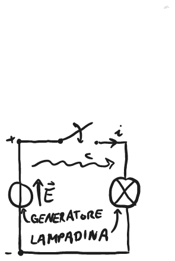

# Lezione 1 - Introduzione alla Ingegneria Elettrica

Per l'esame di Principi, l'esame dipende dal piano di corso.

## Libri Consigliati

- Libro Mauri, Carnedi
- Esercitatorio Mauri, Carnedi

## Esame

L'esame e' tutto scritto composto da 3 esercizi numerici (22 punti) e 2 domande di teoria (8 punti). Gli appelli non saltano al contrario di come scritto nel [piano dettagliato.](https://www11.ceda.polimi.it/schedaincarico/schedaincarico/controller/scheda_pubblica/SchedaPublic.do?&evn_default=evento&c_classe=787490&polij_device_category=DESKTOP&__pj0=0&__pj1=72459438cfd17216af9b3e34da9dcc07)

La calcolatrice e' permesse, programmabile e non programmabile basta che si possa connettere all'internet.

## Elettrotecnica

Volta -> Prima Pila, da dove deriva il Volt, che e' la dimensione della Tensione.
Fino al 1850 non si sapeva come funzionasse la elettricita', ma Maxwell riusci' a spiegarla con le sue equazioni dell'elettrica in forma locale.

1. $\vec{\nabla} \times \vec{E} = \frac{-\partial B}{\partial t}$ (Legge di Faraday)
2. $\vec{D} \times \vec{H} = \vec{J} + \frac{\partial \vec{D}}{\partial t}$ (Legge di Ampere-Maxwell)
3. $\vec{\nabla} \cdot \vec{B} = 0$ (Legge di Gauss, spiega che non ci sono monopoli magnetici)
4. $\vec{\nabla} \cdot \vec{D} = \rho_{\tiny{LIBERA}}$ (Legge di Gauss, spiega che ci sono due tipi di cariche, le positive e negative)
5. $\vec{D} = \epsilon \vec{E}$
6. $\vec{B} = \mu\vec{H}$

$\vec{E}$ = campo elettrico
Le equazioni trovano che $rot(\vec{E})$ dipende da $\vec{B}$
$\vec{B}$ = campo induzione magnetica
$\vec{H}$ = campo magnetico

Nel vuoti si ha $\epsilon_0$ e $\mu_0$, dalle equazioni si trova che $\frac{1}{\epsilon_0 \mu_0} = c^2$

I magneti non possono esser spezzati, perche' creerebbe  monopoli.
### Circuiti/Reti Elettriche

Simboli per i circuiti:
{: .center }

Nell'eletttricita anche se sono le cariche negative sono quelle che sono in flusso, viene rappresentata come carica positiva perche' e' come e' stato scelto secoli fa.

Il generatore o pila e' il generatore della tensione detta anche differenza di potenziale $[V]$ 

i = corrente elettrica = $\frac{dq}{dt}$ $[A]$

Gli elettroni si spostano qualche centimetro all'ora, pero' la spinta causa gli elettroni che escono dall'filo alla velocita' della luce. Si puo' dire che gli elettroni non viaggiano alla velocita' della luca, ma la spinta elettromagnetica causata dal flusso degli elettroni che causa la reazione degli elettroni nel circuito.

La lunghezza delle onde generatre degli elettroni di calcolano con l'equazione:
$\lambda = c \cdot \tau$ dove $\tau = \frac{1}{f}$

Dato un sistema con frequenze abbastanza basse, si puo' calcolare il cambio del sistema  nel corso del tempo, questo e' detto regime quasi-stazionario.
Un'esempio e' l'elettricita' italiana che ha una frequenza di 50 Hz, quindi si puo' vedere quanto cambia. Un regime quasi-stazionario non irradia, invece sistemi non stazionari come i telefoni irradiano, che permette la trasmissione di orde a lunghezze molto grandi.
