# Esercitazione 1

Ci sono molti modi per trovare la risposta ad ogni esercizio.
## Esercizio 1

<!Diagramma problema>
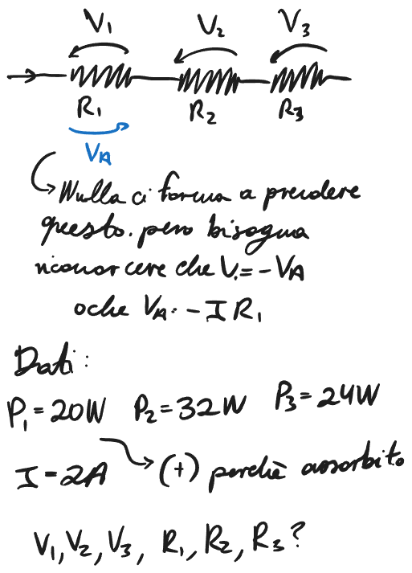

Ricordarsi che la potenza e' positiva, cioe' dissipativa per gli utilizzatori, e' positivo quando e' assorbito. 

<!Risposta esercitazione 1>
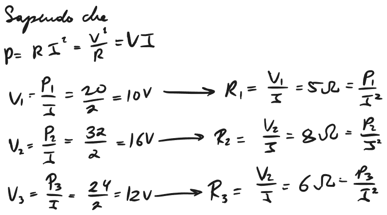

## Esercizio 2

<! Diagramma problema>

<!Diagramma calcoli>
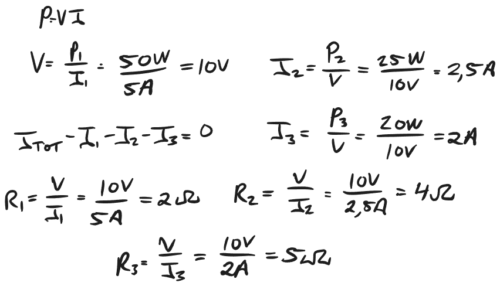

Con un'altro metodo si potrebbe trovare anche R$_1$, per primo e poi trovare il resto e trovare la resistenza di ogni altro con R = $\frac{V^2}{P}$
Ci sono molti metodi:

<!Diagramma metodi>
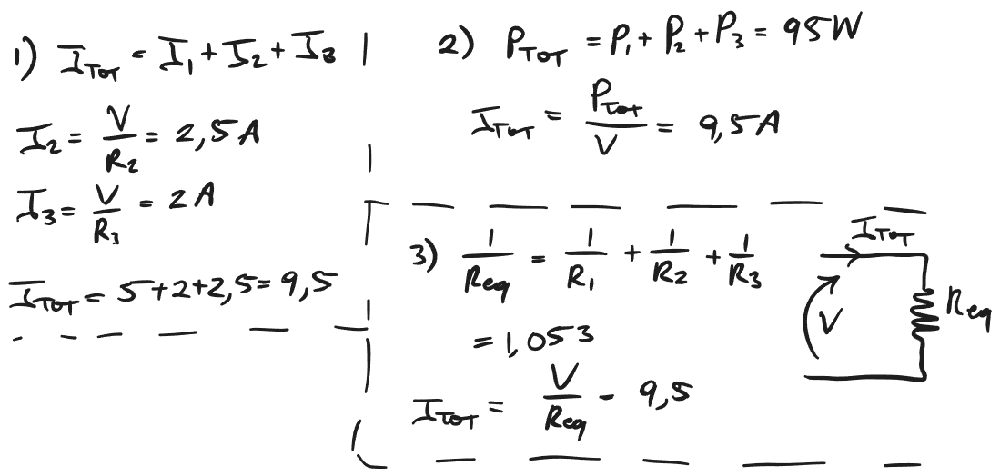
## Esercizio 3

<!Diagramma problema>

<!Diagramma calcoli>
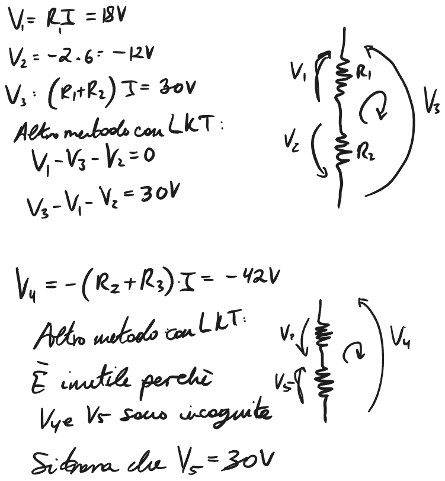

## Esercizio 4

<!Diagramma problema>
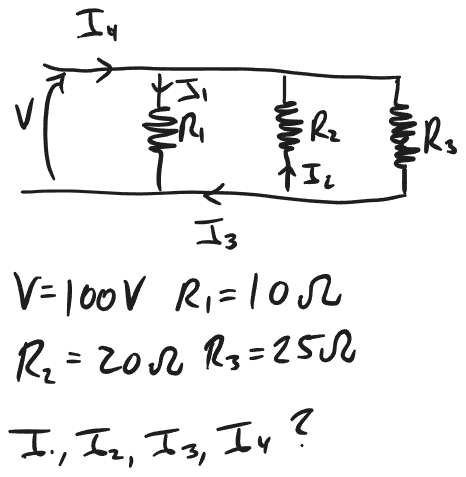

I circuiti si possono modificare per semplificare i calcoli:

<!Diagramma calcoli>
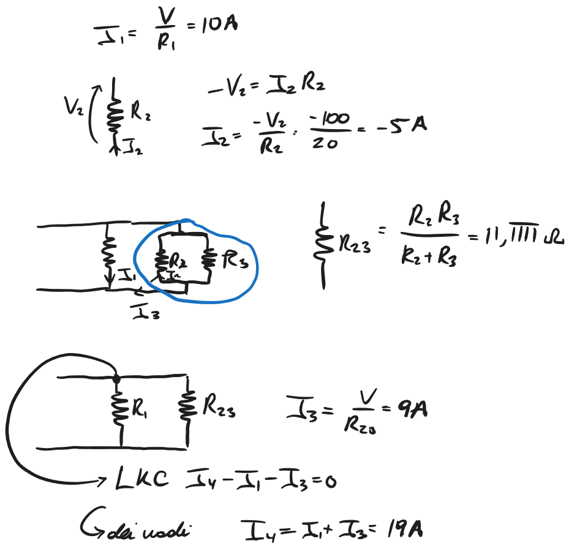

## Esercizio 5

<!Diagramma problema>
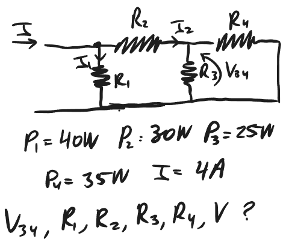

<!Diagramma calcoli>
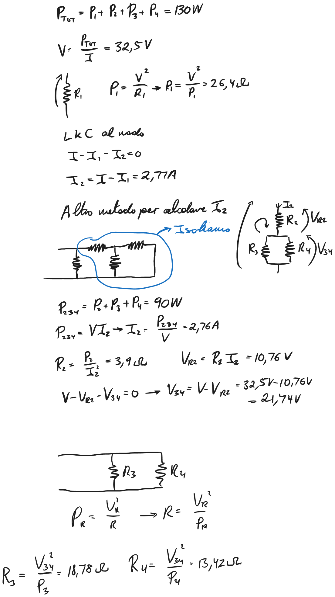

Un altro calcolo e' di isolare una parte del circuito e poi ritornare al circuito iniziale.
## Indipendenza nei circuiti

Ogni parte di un circuito e' risolvibile indipendentemente del resto del circuito se si sa alcuni parametri come P,V e I:
<!Diagramma semplificazione>
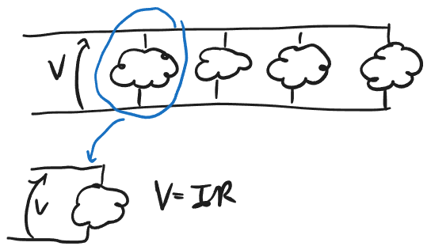
## Esercizio 6

<!Diagramma problema>
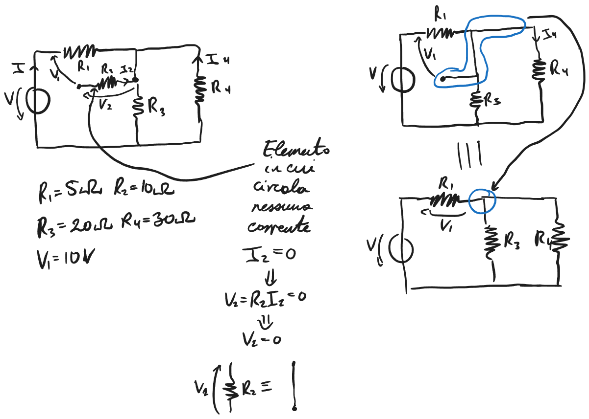

Questo circuito puo' immediatamente essere semplificato e poi possiamo fare i calcoli:

## Semplificazione dei circuiti

Molti circuiti possono esser semplificati come nell'esercizio 6, e alcuni esercizi hanno solo perche' parte completamente risolvibili.

## Partitore di Corrente (Ripasso)

<!Diagramma partitore di corrente>
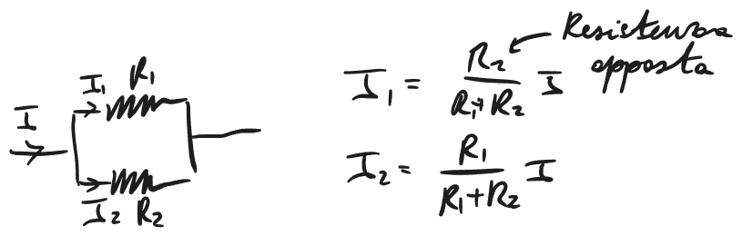

## Ri-inizio esercizio 6

<!Diagramma calcoli>
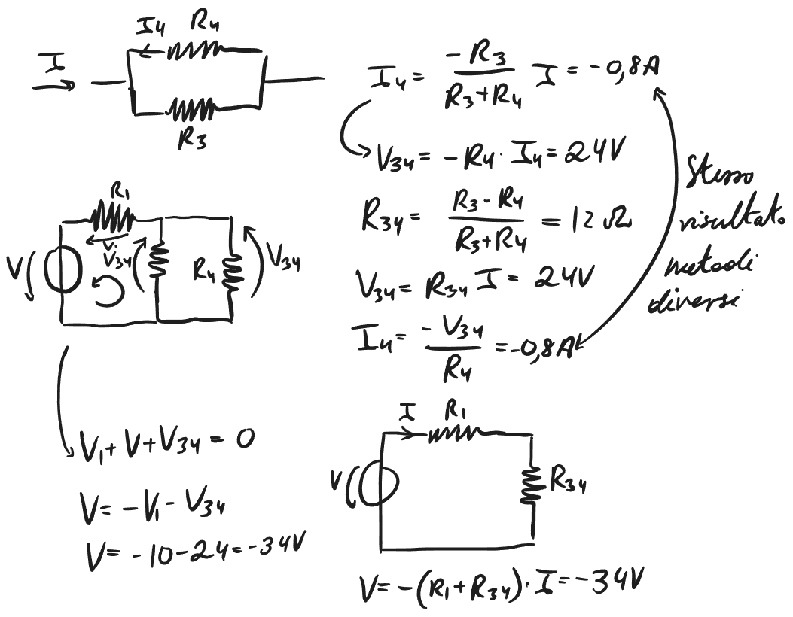

## Esercizio 7

<!Diagramma problema>
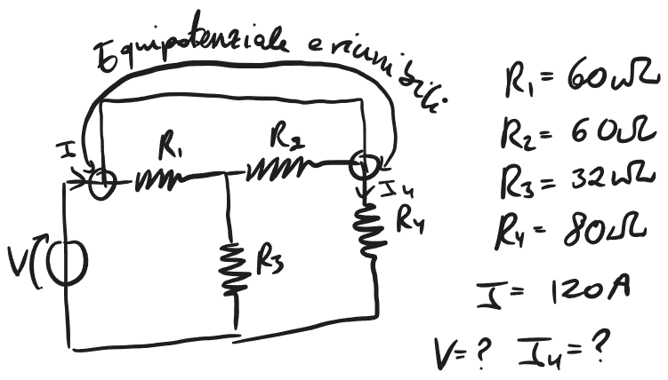

Modificando come disegniamo il circuito, questo ci permette di capire meglio come passa la corrente.

<!Diagramma calcoli>
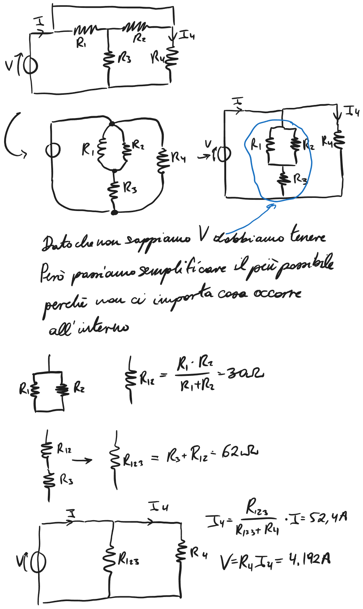
