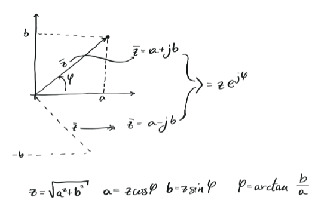
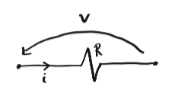
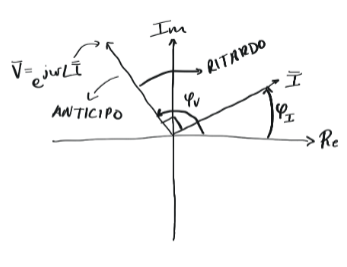
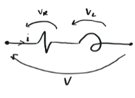

# Lezione 8 - Regime Sinusoidale

La funzione sinusoidale di base:

$v(t)= V_{\tiny{MAX}}\cdot \cos(\omega t+\phi)$
La pulsazione ha equazione: $\omega=2\pi f$

Si usa coseno perche' il risultato proietta sulla asse reale dei numeri complessi invece della asse immaginaria.

Il regime sinusoidale e' utilizzato per analizzare l'induttore e condensatore che avrebbero equazioni differenziali ma riusciamo a mapparlo usando la equazione sinusoidale.

## Applicazione di Fourier 

Applicando Fourier cambiamo le equazione che variano rispetto al tempo in equazioni che variano in termini della frequenza, che possiamo analizzare piu' facilmente.

Troviamo che la tensione rispetto al tempo e':

$$\begin{align}
v(t) &= V_{\tiny{MAX}}\cos(\underbrace{ \omega }_{ 2\pi f } t+\phi) \\
&= \mathrm{Re}(V_{\tiny{MAX}}e^{j(\omega t+\phi)})
\end{align}$$
Questa equivalenza e' grazie alla equivalenza di Eulero, da cui troviamo la parte reale che e' il valore vero.

Data la equivalenza possiamo dire che:

$$\begin{align}
v(t) &= \underbrace{ \mathrm{Re}(\underbrace{ V_{\tiny{MAX}}e^{j(\omega t+\phi)} }_{ \text{Numero complesso} }) }_{ \text{Parte reale di \# complesso} }= V_{\tiny{MAX}}\cos(\omega t+\phi)) \\
 &= \mathrm{Re}(V_{\tiny{MAX}}e^{j\phi}e^{j\omega t})
\end{align}$$

Per conseguenza abbiamo anche la corrente si puo' scrivere:

$$i(t)=I_{\tiny{MAX}}e^{j\phi}e^{ j\omega t }$$
Anche qui per trovare la parte reale scriviamo:

$$i =\mathrm{Re}(I_{\tiny{MAX}}e^{ j\phi_{\tiny{I}} }e^{ j\omega t })$$

## Fasori

I fasori sono la rappresentazione sinusoidale la cui amplitudine, frequenza e fase iniziale sono indipendente del tempo.

$$I_{\tiny{MAX}}e^{ j\phi_{\tiny{I}} } = \overline{I_{\tiny{MAX}}} \rightarrow \text{Fasore Massimo}$$
Il fasore e' la parte piu' importante perche' la ragione che cambia il risultato delle equazioni, questo e' perche', $e^{ j\omega t }$ , ha termini $\omega$ che e' deciso dalla rete elettrica e $t$ che nessuno sceglie. Le uniche cose che si possono ambiare sono la amplitudine, nel caso sopra $A_{\tiny{MAX}}$ e la fase $\phi$ che cambia come agiscono diverse correnti sullo stesso cavo.

Data questa dipendenza, $A_{\tiny{MAX}}$ e $\phi$ sono dette parti caratteristiche del fasore e percio' della funzione sinusoidale rappresentativa.

$$\begin{gather*}
\overline{I_{\tiny{MAX}}} = I_{\tiny{MAX}}e^{ j\phi_{\tiny{I}} }\\
i = \mathrm{Re}(\overline{I_{\tiny{MAX}}}e^{ j\omega t })
\end{gather*}$$

$e^{ j\omega t }$ e' un moltiplicatore comune ad ogni equazioni sinusoidale ma ce lo posiamo dimenticare.

In fine per i conti non useremo la equazioni di eulero ma invece la equazione sinusoidale perche' ci permette di fare i conti piu' facilmente.

Queste equazioni sono solo usate in teoria, in pratica viene usato e useremo il valore efficace e' definito dalla equazione:

$$\text{Valore Efficace}= \underbrace{ \sqrt{ \frac{1}{T} \int _{0}^T V^2\,dT } }_{ \text{Media Quadratica} } = \frac{V_{\tiny{MAX}}}{\sqrt{ 2 }}=V$$

Nella unione europea il valore efficace e' di 220V

Il fasore della 
$$\begin{align}
v(t)&=\sqrt{ 2 }\cdot V \cos(\omega t+\phi) \\
&= \mathrm{Re}(\underbrace{ \sqrt{ 2 }\cdot \underbrace{ V e^{ j\phi } }_{ \overline{V} \rightarrow \text{Fasore} } }_{ \overline{V_{\tiny{MAX}}} \rightarrow \text{Fasore Max} }\cdot e^{ j\omega t })
\end{align}$$

Per il calore attraverso un resistore si ha:

$$\begin{gather}
i = I_{\tiny{MAX}}\cos(\omega t+\phi)\\
\underbrace{ Q }_{ \text{Calore} } = \frac{1}{T}\int _{0}^T p\,dT = \frac{1}{T}\int _{0}^T Ri^2\, dT = RI^2
\end{gather}$$
In questo caso I e' il valore efficace dalla corrente: $I = \sqrt{ \frac{1}{T}\int  i^2\, dT }$

Il valore efficace e' il valore che eroga un circuito a corrente continua che eroga la stessa potenza.

Il valore massimo e' 40% in piu' e il valore efficace e' quello che usiamo per i calcoli.
Come diventano le equazione differenziali nei bipoli usando i fasori.

## Resistenza

$$\begin{gather}
i = \sqrt{ 2 }I \cos(\omega t+\phi_{\tiny{I}})\\
v = Ri = \sqrt{ 2 }RI(\cos(\omega t+\phi_{\tiny{I}}) = \sqrt{ 2 }\cdot V\cdot \cos(\omega t+\phi_{\tiny{V}}))
\end{gather}$$
Scrivendo in termini fasoriali:
$$v= \mathrm{Re}(\sqrt{ 2 }\underbrace{ V\:e^{ j\phi_{\tiny{V}} } }_{_{ \overline{V} }}) = \mathrm{Re}(\sqrt{ 2 } R\underbrace{ I\cdot e^{ j\phi_{\tiny{I}} } }_{ \overline{I} }\:e^{ j\omega t })$$
Troviamo quindi che:
$$\overline{V} = R\overline{I}$$
Allora si puo' scrivere anche che:

$$\overline{I} = \frac{\overline{V}}{R} \implies Re\left( \sqrt{ 2 } \frac{\overline{V}}{R}\cdot e^{ j\omega t } \right) = i(t)$$

## Induttore

I calcoli con le resistenze sono gia' semplici quindi la semplificazione non cambia molto i calcoli, e infatti li complica un'po' di piu'.

Per l'induttore e il condensatore l'uso dei sinusoidali semplifica di molto i calcoli e ci permette di fare i calcoli senza dovere integrare e differenziare.

$$\begin{align}
v = L \frac{di}{dt} &= L\sqrt{ 2 }\cdot I(-\omega \sin(\omega t+\phi_{\tiny{I}})) \\
 &= -\omega L\sqrt{ 2 }\cdot I\sin(\omega t+\phi_{\tiny{I}}) \\
 &= wL\sqrt{ 2 }\cdot I\cos\left( \omega t+\phi_{\tiny{I}}+\frac{\pi}{2} \right)
\end{align}$$
Questa equazione ci fa vedere che negl'induttori la tensione e' $\frac{\pi}{2}$ gradi davanti alla corrente.

Con questa troviamo che:

$$v= \mathrm{Re}(\sqrt{ 2 }\:V \cdot \underbrace{ e^{j\phi_{\tiny{V}}} }_{ \overline{V} }\:e^{ j\omega t })= \mathrm{Re}(\sqrt{ 2 }\omega L\:\:\underbrace{ \underbrace{ Ie^{ j\phi_{\tiny{I}} } }_{ \overline{I} }\: \underbrace{ e^{ j\pi/2 } }_{ \overline{j} } }_{ \overline{V} }\: e^{ j\omega t })$$
$$\boxed{\overline{V}=j\omega L\:\overline{I}}$$

Da questo diagramma vediamo la tensione e' in anticipo rispetto alla corrente, invece la corrente e' in ritardo rispetto alla tensione.

Come visto ad analisi 1, moltiplicando per i aumenta l'angolo di 90 gradi che spiega il ritardo di I rispetto a V. La $\omega L$ è il moltiplicatore delle reattanza, come abbiamo visto prima con la resistenza che in un resistore nel campo complesso agisce come moltiplicatore tra V e I.

Se non e' indicato allora prendiamo i in ritardo rispetto a V.

Se dato:

Sapendo i possiamo trovare $\overline{I}$

$$\overline{V} = \underbrace{ \overline{V_{r}} }_{ R\overline{I} }+\underbrace{ \overline{V_{L}} }_{ j\omega L\overline{I} }$$
$$v = V_{r}+V_{L} = \mathrm{Re}()+\mathrm{Re}() = \mathrm{Re}(+)$$
$$\overline{V}=\overline{V_{r}}+\overline{V_{L}}$$
Dato che la tensione ha numeri complessi, si puo' mappare su un grafico come vettori, su cui si puo' fare la somma vettoriale.

$$\overline{V}= R\overline{I}+j_{\tiny{L}}\omega L\overline{I} = (R + j\omega L)\cdot\overline{I}=\overline{V}$$

Il calcolo operatoriale ci ha permesso di utilizzare l'equazione differenziale per l'induttore e trasformarlo in una funzione algebrica che possiamo usare.

Le reti che usano equazioni algebriche con numeri complessi, non sono vere sono solo una rappresentazione della rete vera dato che i numeri immaginari non esistono in realta.

L'ultima equazione si puo' scrivere come:

$$\overline{V} = \overline{Z}\cdot \overline{I} \rightarrow \text{Legge di Ohm generalizzata}$$
In questo caso $\overline{Z} = (R + j\omega L)$

Questo cambio non ha effetto sul risultato perche' le leggi di ohm e Kirchhoff sono lo stesso valide.

## Notazione per Regimi Alternati

$$\begin{gather}
\omega L \rightarrow X_{\tiny{L}} [\Omega] - \text{Reattanza Induttanza}\\
\overline{Z} \rightarrow \text{Impedenza}\\
\overline{V}=j\omega L\overline{I} = jX_{\tiny{L}}\overline{I}\\
\frac{1}{X} \rightarrow B -\text{ Suscettanza}
\end{gather}$$
